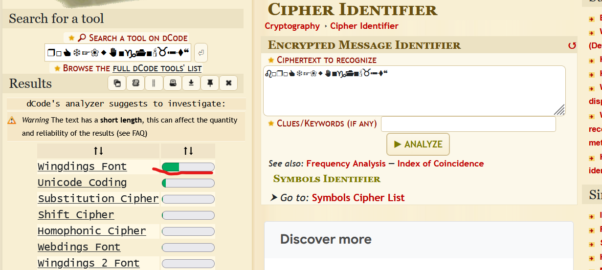
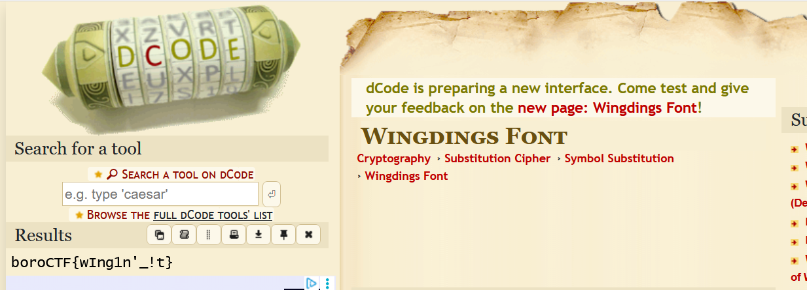

- **Catégorie :** Cryptography / Crypto-pop
    
- **Difficulté :** Easy
    
- **Plateforme :** boroCTF
    
- **Auteur :** Franklin
    

## Description du Challenge

> **Flight** _dark, darker, yet darker._ `♌︎□︎❒︎□︎👍︎❄︎☞︎❀︎⬥︎✋︎■︎♑︎📂︎■︎🕯︎♉︎✏︎⧫︎❝︎`

L'énoncé affiche une étrange série de symboles. La description contient également la phrase mystérieuse : _"dark, darker, yet darker."_

## Analyse & Identification du Cipher

Pour découvrir la nature de ce chiffrement par symboles, la démarche suivante a été appliquée :

1. **Identification :** Utilisation de l'outil [dCode - Cipher Identifier](https://www.dcode.fr/cipher-identifier) afin d'analyser la structure de la chaîne brute.
    
2. **Résultat :** L'analyseur a détecté avec certitude l'utilisation de la police de caractères **Wingdings**.
    

### Le clin d'œil à l'univers d'Undertale

La phrase de description _"dark, darker, yet darker."_ vient confirmer ce résultat. Il s'agit d'une référence directe au personnage **W.D. Gaster** du jeu vidéo _Undertale_, connu pour s'exprimer uniquement à travers cette fameuse police de symboles (**W**ing**D**ings).

## Procédure de Résolution

Après avoir identifié le mécanisme, le décodage a été effectué via l'outil dédié :

1. Se rendre sur la page [dCode - Wingdings Font](https://www.dcode.fr/wingdings-font).
    
2. Entrer la chaîne de symboles : `♌︎□︎❒︎□︎👍︎❄︎☞︎❀︎⬥︎✋︎■︎♑︎📂︎■︎🕯︎♉︎✏︎⧫︎❝︎`.
    
3. Lancer le décodage pour traduire chaque glyphe en son équivalent alphanumérique ASCII standard.
    

## 🏁 Flag

> ****Flag capturé** `boroCTF{wI1ng1n'_!t}`**

## 💡 Leçons à retenir pour Obsidian

- **Reconnaissance visuelle :** La présence de symboles comme des mains (`👍︎`, `☞︎`) ou des signes astrologiques (`♌︎`) est l'empreinte typique des polices de type Wingdings (1, 2 ou 3) et Webdings.
    
- dCode : En cas de doute face à un alphabet étrange ou inconnu, le [Cipher Identifier de dCode](https://www.dcode.fr/cipher-identifier) reste le premier réflexe pour économiser du temps en phase de reconnaissance.
