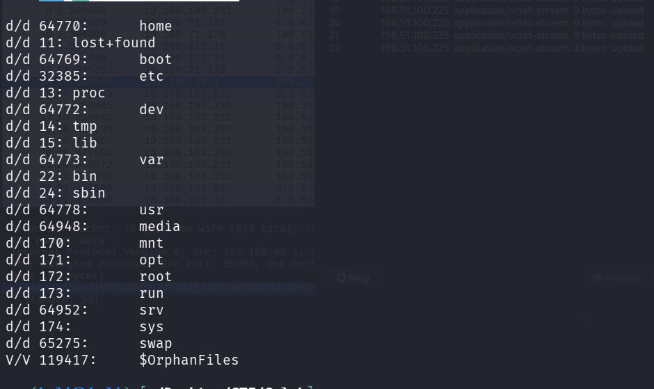
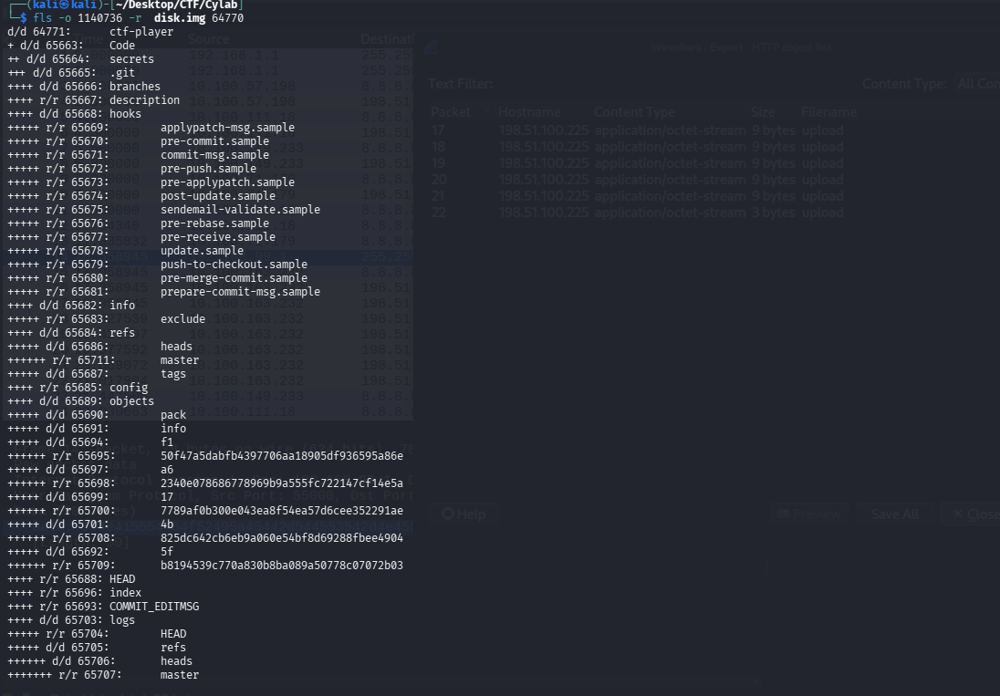
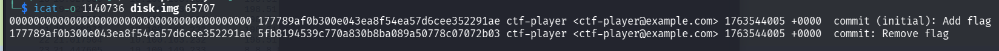
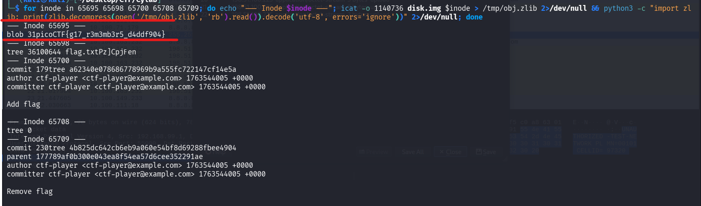

## Métadonnées

- **Catégorie :** Forensics Disk-Analysis Git-Forensics
    
- **Outils :** SleuthKit (`mmls`, `fls`, `icat`), Python (`zlib`)
    
- **Auteur du challenge :** ctf-player
    
- **Flag :** `picoCTF{g17_r3m3mb3r5_d4ddf904}`
    

## Description du challenge

L'objectif est d'analyser une image disque brute (`disk.img`), de cartographier ses partitions, et de récupérer un flag qui a été créé puis supprimé d'un dépôt Git par un utilisateur.

## Étape 1 : Analyse de la table des partitions (`mmls`)

Le fichier fourni est une image disque brute. Une commande `fls` directe échoue car le système ne peut pas déterminer le type de système de fichiers à l'origine du disque. On utilise `mmls` pour inspecter la structure des partitions :

```bash
mmls disk.img
```

### Résultat :

```text
DOS Partition Table
Offset Sector: 0
Units are in 512-byte sectors

      Slot      Start        End          Length       Description
000:  Meta      0000000000   0000000000   0000000001   Primary Table (#0)
001:  -------   0000000000   0000002047   0000002048   Unallocated
002:  000:000   0000002048   0000616447   0000614400   Linux (0x83)
003:  000:001   0000616448   0001140735   0000524288   Linux Swap / Solaris x86 (0x82)
004:  000:002   0001140736   0002097151   0000956416   Linux (0x83)
```

> 📌 **Analyse :** Le disque contient 3 partitions. La troisième partition (Slot 004), typée Linux, commence au secteur **`1140736`**. C'est elle qui abrite le système de fichiers racine (`/`) recherché.

## 📁 Étape 2 : Exploration récursive du système de fichiers (`fls`)

On interroge la troisième partition en spécifiant l'offset du secteur de début (`-o 1140736`). L'analyse du répertoire racine nous aiguille vers le dossier `home` (Inode : `64770`).

```
fls -o 1140736  disk.img
```



On lance une inspection récursive sur ce dossier :

```bash
fls -o 1140736 -r disk.img 64770
```

### Structure découverte :

```
d/d 64771:      ctf-player
+ d/d 65663:    Code
++ d/d 65664:   secrets
+++ d/d 65665:  .git
++++ d/d 65689: objects
+++++ d/d 65694:        f1
++++++ r/r 65695:       50f47a5dabfb4397706aa18905df936595a86e
+++++ d/d 65697:        a6
++++++ r/r 65698:       2340e078686778969b9a555fc722147cf14e5a
+++++ d/d 65699:        17
++++++ r/r 65700:       7789af0b300e043ea8f54ea57d6cee352291ae
+++++ d/d 65701:        4b
++++++ r/r 65708:       825dc642cb6eb9a060e54bf8d69288fbee4904
+++++ d/d 65692:        5f
++++++ r/r 65709:       b8194539c770a830b8ba089a50778c07072b03
++++ d/d 65703: logs
+++++ r/r 65704:        HEAD
+++++ d/d 65705:        refs
++++++ d/d 65706:       heads
+++++++ r/r 65707:      master
```



L'utilisateur possède un dépôt Git caché nommé `secrets`. On note la présence de plusieurs objets compressés stockés dans `.git/objects/`.

##  Étape 3 : Analyse des journaux Git (`icat`)

Pour reconstituer l'historique des actions de l'utilisateur, on extrait le contenu du fichier de log de la branche principale (`.git/logs/refs/heads/master`), correspondant à l'inode **`65707`** :

```
icat -o 1140736 disk.img 65707
```

### Contenu du journal :

```
0000000000000000000000000000000000000000 177789af0b300e043ea8f54ea57d6cee352291ae ctf-player <ctf-player@example.com> 1763544005 +0000  commit (initial): Add flag
177789af0b300e043ea8f54ea57d6cee352291ae 5fb8194539c770a830b8ba089a50778c07072b03 ctf-player <ctf-player@example.com> 1763544005 +0000  commit: Remove flag
```

> 💡 **Scénario Forensic :** L'utilisateur a ajouté le flag dans le commit initial (`177789af...`), puis a tenté de faire disparaître ses traces dans un second commit en supprimant le fichier (`5fb81945...`).



## Étape 4 : Décompression des objets et capture du Flag

Les données Git ne sont pas stockées en texte clair mais sont compressées individuellement à l'aide de l'algorithme **zlib**. Tenter de lire directement les fichiers d'objets avec `icat` produit des caractères corrompus.

Puisque nous avons la liste de tous les fichiers présents dans `.git/objects/`, nous exécutons une boucle Bash couplée à un script "one-liner" Python pour extraire et décompresser à la volée tous les inodes des objets du dépôt :

```bash
for inode in 65695 65698 65700 65708 65709; do 
    echo "--- Inode $inode ---"
    icat -o 1140736 disk.img $inode > /tmp/obj.zlib 2>/dev/null && \
    python3 -c "import zlib; print(zlib.decompress(open('/tmp/obj.zlib', 'rb').read()).decode('utf-8', errors='ignore'))" 2>/dev/null
done
```



### Restitution des objets :

L'exécution de la commande nous remonte les données brutes de chaque structure. L'inode **`65695`** (qui correspond physiquement au fichier d'objet `50f47a...` de Git) s'avère être le `blob` d'origine contenant le fichier texte supprimé :

```text
--- Inode 65695 ---
blob 31picoCTF{g17_r3m3mb3r5_d4ddf904}
```

## 🏁 Étape 5 : Format du Flag

Le flag est extrait avec succès de la base de données des objets orphelins de Git.

**Flag :** `picoCTF{g17_r3m3mb3r5_d4ddf904}`

##  Concepts fondamentaux appliqués

### 1. Persistance des objets Git

Dans l'architecture de Git, un fichier validé dans un commit est immuable et stocké sous forme de `blob`. Supprimer un fichier via `git rm` crée un nouveau commit qui ne fait plus référence à ce fichier, mais l'objet initial reste stocké physiquement dans l'historique du répertoire local `.git/objects/`. Tant qu'un ramasse-miettes (`git gc`) n'a pas nettoyé le dépôt, le secret est récupérable.

### 2. Extraction par Inode sans montage

L'utilisation des outils de la suite _The Sleuth Kit_ (`fls`, `icat`) a permis de mener l'enquête directement sur l'image brute sans avoir besoin de monter les partitions sur notre machine Kali Linux, préservant ainsi l'intégrité des métadonnées temporelles et structurelles du système de fichiers.
