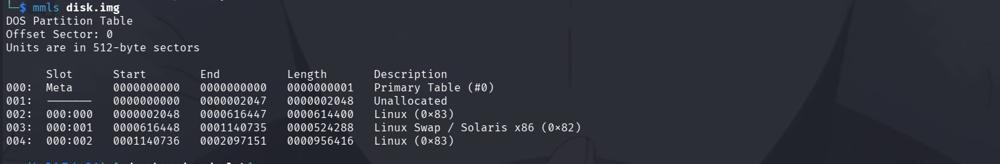
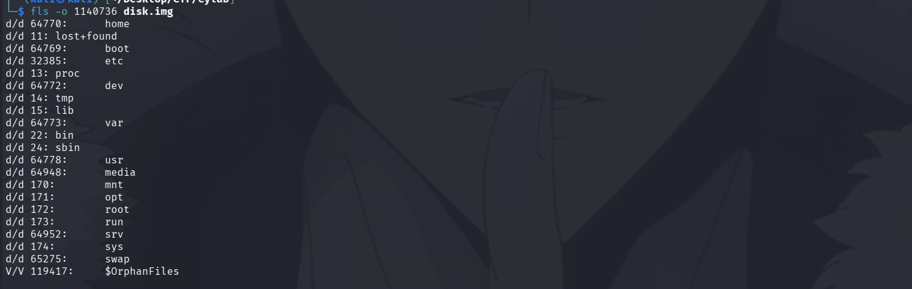

## Forensics Git 2

The agents interrupted the perpetrator's disk deletion routine. Can you recover this git repo?

```
file disk.img 
```

Résultat

```
disk.img: DOS/MBR boot sector; partition 1 : ID=0x83, active, start-CHS (0x2,0,33), end-CHS (0x263,8,56), startsector 2048, 614400 sectors; partition 2 : ID=0x82, start-CHS (0x263,8,57), end-CHS (0x3ff,15,63), startsector 616448, 524288 sectors; partition 3 : ID=0x83, start-CHS (0x3ff,15,63), end-CHS (0x3ff,15,63), startsector 1140736, 956416 sectors
```

Lister les partitions

```
mmls disk.img 
```

Résultat

```
DOS Partition Table
Offset Sector: 0
Units are in 512-byte sectors

      Slot      Start        End          Length       Description
000:  Meta      0000000000   0000000000   0000000001   Primary Table (#0)
001:  -------   0000000000   0000002047   0000002048   Unallocated
002:  000:000   0000002048   0000616447   0000614400   Linux (0x83)
003:  000:001   0000616448   0001140735   0000524288   Linux Swap / Solaris x86 (0x82)
004:  000:002   0001140736   0002097151   0000956416   Linux (0x83)

```

On a une partition intéressante qui est le 004

Lister le contenu

```
 fls -o 1140736 disk.img
```

Résultat 

On a la racine / d'un système Linux

Examiner le contenu de l'utilisateur 

```
fls -r -o 1140736 disk.img 64771
```

Résultat

## Métadonnées

- **Catégorie :** Forensics Disk-Analysis Git-Forensics
    
- **Outils :** SleuthKit (`mmls`, `fls`, `icat`), Python (`zlib`)
    
- **Flag trouvé :** `picoCTF{g17_r35cu3_16ac6bf3}`
    

## Description du challenge

Les agents ont interrompu la routine de suppression du disque du suspect. L'objectif est de reconstituer un dépôt Git altéré afin de retrouver un salon de discussion secret contenant un flag.

## Étape 1 : Cartographie des volumes (`mmls`)

On lance une inspection initiale de la table des partitions du fichier `disk.img` :

```
mmls disk.img
```

La structure révèle une fois de plus que la partition système Linux principale (004) se situe à l'offset de secteur **`1140736`**.



## Étape 2 : Exploration et détection du dépôt Git (`fls`)

En ciblant le dossier de l'utilisateur (`inode 64771`), on extrait récursivement l'arborescence pour localiser l'application en développement `killer-chat-app` :

```
fls -r -o 1140736 disk.img 64771
```



L'arborescence nous montre un dossier `.git/objects/` contenant une vingtaine de sous-dossiers d'objets Git (représentant des commits, des trees et des blobs de données compressés). On remarque également la présence de plusieurs fichiers de logs de discussion numérotés (`1.txt`, `2.txt`, `4.txt`) dans le répertoire de travail, mais le fichier `3.txt` semble manquant en surface.

```
d/d 65663:      Code
+ d/d 65664:    killer-chat-app
++ d/d 65665:   .git
+++ d/d 65666:  branches
+++ r/r 65667:  description
+++ d/d 65668:  hooks
++++ r/r 65669: applypatch-msg.sample
++++ r/r 65670: pre-commit.sample
++++ r/r 65671: commit-msg.sample
++++ r/r 65672: pre-push.sample
++++ r/r 65673: pre-applypatch.sample
++++ r/r 65674: post-update.sample
++++ r/r 65675: sendemail-validate.sample
++++ r/r 65676: pre-rebase.sample
++++ r/r 65677: pre-receive.sample
++++ r/r 65678: update.sample
++++ r/r 65679: push-to-checkout.sample
++++ r/r 65680: pre-merge-commit.sample
++++ r/r 65681: prepare-commit-msg.sample
+++ d/d 65682:  info
++++ r/r 65683: exclude
+++ d/d 65684:  refs
++++ d/d 65686: heads
++++ d/d 65687: tags
+++ r/r 65685:  config
+++ d/d 65689:  objects
++++ d/d 65690: pack
++++ d/d 65691: info
++++ d/d 65695: d7
+++++ r/r 65696:        b4a371ebd23e682ffebc7ec355690fdc94fbd1
++++ d/d 65697: 71
+++++ r/r 65698:        fd2fafcd5ebd62fbf857769c92a91225ab3954
+++++ r/r 65730:        78644433e7cb6da3adf028f1c80d382a18e7b6
++++ d/d 65700: 5e
+++++ r/r 65701:        b896e3ccd51175f66480cdb247fc45f3e8ac2d
++++ d/d 65702: 2c
+++++ r/r 65703:        0a9b2b15dce92f800393d5030c7454efc278ae
++++ d/d 65713: aa
+++++ r/r 65714:        1cc01687b4ec94faf9916c3fc6efd83f23b816
++++ d/d 65715: 6b
+++++ r/r 65716:        1ebe10826d5c1efc58ae475c0a0af10f580b77
+++++ r/r 65726:        f83de540f7d12cc3b683a83d69432e03d84509
++++ d/d 65717: 20
+++++ r/r 65718:        1c707b43219a63c1d3499b29c7d539af079861
++++ d/d 65712: 26
+++++ r/r 65719:        b809e0c41d8421f1126ed3a4eb06ad66e6d90a
++++ d/d 65722: f1
+++++ r/r 65723:        50f0b963ab3ee95ba5656212abd76d7f2fed2e
++++ d/d 65724: d4
+++++ r/r 65725:        666b9472fad7cd75d05b641e402347d9aac605
++++ d/d 65720: 58
+++++ r/r 65727:        27632e046a80a1e0d7b4fc5c7800dd539baeaf
++++ d/d 65731: 22
+++++ r/r 65732:        f7d0c9bd045563ae33bfacfbe46fe406a5b318
++++ d/d 65733: ea
+++++ r/r 65734:        d27e2bd5a0fc22868ffb629a768f82dfcda11c
++++ d/d 65728: e8
+++++ r/r 65735:        0b38b3322a5ba32ac07076ef5eeb4a59449875
++++ d/d 65721: 21
+++++ r/r 65729:        51ef0ccc15aed1ab88e1afdc7484aaeff211c4
++++ d/d 65739: 66
+++++ r/r 65740:        273877d2ff3f51a14473b7200aae5a798ff64f
++++ d/d 65741: a0
+++++ r/r 65742:        c13fe974d95661f24e32bc0d79f54f05ea13c5
++++ d/d 65743: c9
+++++ r/r 65744:        31ae0868411e5f23656a2436e78a4c4699e18c
++++ d/d 65737: 01
+++++ r/r 65745:        533f718556a0e59f1467dae4fa462eed82c2a1
+++ r/r 65688:  HEAD
+++ r/r 65699:  index
+++ r/r 65694:  COMMIT_EDITMSG
+++ d/d 65706:  logs
++++ r/r 65707: HEAD
++++ d/d 65708: refs
+++++ d/d 65709:        heads
++++++ r/r 65710:       master
++ r/r 65692:   server
++ r/r 65693:   client
++ d/d 65704:   logs
+++ r/r 65711:  1.txt
+++ r/r 65705:  2.txt
+++ r/r 65736:  4.txt
```

## Étape 3 : Logique d'investigation de l'historique Git

L'analyse des commits extraits de la base de données nous montre les intentions du suspect :

- **Inode 65735 :** Commit _"Add secret hideout chat log"_ (Ajout du journal du repaire secret).
    
- **Inode 65729 :** Commit _"Remove secret hideout log"_ (Suppression précipitée du journal juste avant l'intervention des agents).
    

Bien que le fichier ait été supprimé de l'arbre de travail actif (et donc invisible via un simple parcours classique ou un montage standard), Git a conservé le contenu brut sous forme d'un objet de type `blob` orphelin.

## Étape 4 : Script de décompression de masse et extraction

Comme le suspect a corrompu ou modifié la routine de suppression, nous contournons l'analyse manuelle des logs en appliquant notre boucle de décompression Python automatique sur l'ensemble des inodes d'objets indexés par `fls` :

```
for inode in 65696 65698 65730 65701 65703 65714 65716 65726 65718 65719 65723 65725 65727 65732 65734 65735 65729 65740 65742 65744 65745; do 
    echo "--- Inode $inode ---"
    icat -o 1140736 disk.img $inode > /tmp/obj.zlib 2>/dev/null && \
    python3 -c "import zlib; print(zlib.decompress(open('/tmp/obj.zlib', 'rb').read()).decode('utf-8', errors='ignore'))" 2>/dev/null
done
```

### Extraction de la mine d'or (Inode 65730) :

Le script extrait avec succès le contenu original du fichier `3.txt` qui avait été supprimé :

```
--- Inode 65730 ---
blob 188Rex: Meet at the old arcade basement for the secret hideout.
Jay: Ask Rusty at the door and use password picoCTF{g17_r35cu3_16ac6bf3}.
Rex: Bring the decoder map so we can plan the route.
```

## 🏁 Étape 5 : Validation du Flag

Le flag se trouvait dans le mot de passe réseau partagé par le suspect "Jay".

**Flag :** `picoCTF{g17_r35cu3_16ac6bf3}`
