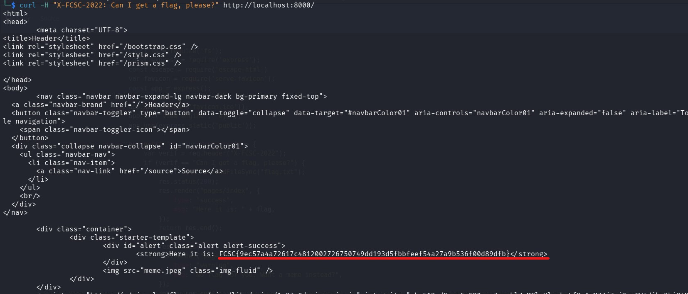

###  Informations sur le Challenge

- **Plateforme :** Hackropole (FCSC 2022)
    
- **Catégorie :** Web
    
- **Difficulté :** Facile / Introduction
    

###  Étape 1 : Analyse initiale

En arrivant sur l'application web via l'adresse `http://localhost:8000/`, un message nous indique poliment :

> **"No flag for you. Want a meme instead?"**

L'application possède un bouton **"Source"** qui nous permet d'accéder directement au code source Node.js/Express de la page d'accueil :

```
app.get('/', async (req, res) => {
    var verif = req.header("X-FCSC-2022");
    if (verif == "Can I get a flag, please?") {
        var flag = fs.readFileSync("flag.txt");
        res.status(200);
        res.render("pages/index", {
            type: "success",
            msg: "Here it is: " + flag,
        });
        return res.end();
    } else {
        // ... Code affichant le mème ...
    }
});
```

### Étape 2 : Découverte de la vulnérabilité

L'analyse du code source montre une condition logique très simple basée sur les en-têtes HTTP de la requête entrante :

1. L'application récupère la valeur de l'en-tête HTTP nommé **`X-FCSC-2022`** et la stocke dans une variable locale appelée `verif`.
    
2. Elle compare cette valeur avec la chaîne de caractères exacte : `"Can I get a flag, please?"`.
    
3. Si la condition est vraie, le serveur lit le fichier `flag.txt` et l'affiche dans le template HTML avec la classe `alert-success`.
    

### Étape 3 : Exploitation (PoC)

Pour valider le challenge, il suffit d'envoyer une requête HTTP `GET` à la racine de l'application en y injectant l'en-tête personnalisé attendu. On réalise cette opération depuis le terminal à l'aide de `curl` et de l'option `-H` :

```bash
curl -H "X-FCSC-2022: Can I get a flag, please?" http://localhost:8000/
```



### 🏁 Résultat & Flag

Le serveur valide la condition et nous retourne le flag au sein du bloc HTML d'alerte :

```
FCSC{9ec57a4a72617c4812002726750749dd193d5fbbfeef54a27a9b536f00d89dfb}
```
