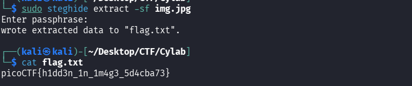

## Métadonnées

- **Catégorie :** Steganography Forensics
    
- **Outils :** file base64 steghide
    
- **Flag :** `picoCTF{h1dd3n_1n_1m4g3_5d4cba73}`
    

---

## 💬 Description du challenge

> _You’re given a seemingly ordinary JPG image. Something is tucked away out of sight inside the file. Your task is to discover the hidden payload and extract the flag._

---

## Étape 1 : Analyse initiale de l'image

On commence par inspecter les propriétés de base de l'image avec la commande `file`.

```bash
file img.jpg
```

### Résultat :

```text
img.jpg: JPEG image data, JFIF standard 1.01, aspect ratio, density 1x1, segment length 16, comment: "c3RlZ2hpZGU6Y0VGNmVuZHZjbVE9", baseline, precision 8, 640x640, components 3
```

> 📌 **Anomalie repérée :** La commande `file` extrait directement une chaîne suspecte présente dans le champ **comment** (commentaire) de l'image : `c3RlZ2hpZGU6Y0VGNmVuZHZjbVE9`. Cela ressemble fortement à du Base64.

---

## Étape 2 : Double décodage Base64

### 1. Premier décodage (L'indice)

On décode le commentaire trouvé pour comprendre ce qu'il cache :

```
echo "c3RlZ2hpZGU6Y0VGNmVuZHZjbVE9" | base64 -d
```

### Résultat :

```
steghide:cEF6endvcmQ=
```

L'indice nous indique deux choses cruciales :

1. L'outil à utiliser est **`steghide`**.
    
2. Le mot de passe requis est lui-même encore encodé en Base64 (`cEF6endvcmQ=`).
    

### 2. Deuxième décodage (Le mot de passe)

On extrait le mot de passe en clair :

```bash
echo "cEF6endvcmQ=" | base64 -d
```

### Résultat :

```text
pAzzword
```

Le mot de passe pour l'extraction est donc : **`pAzzword`**.

---

## Étape 3 : Extraction du payload caché (`steghide`)

Maintenant que nous avons l'outil et la clé, nous extrayons le fichier dissimulé dans les pixels de l'image.

On peut passer le mot de passe directement en argument avec l'option `-p` :

```bash
steghide extract -sf img.jpg -p pAzzword
```

### Résultat :



L'outil confirme qu'un fichier nommé `flag.txt` a été extrait avec succès.

---

## 🏁 Étape 4 : Lecture du Flag

Il ne reste plus qu'à afficher le contenu du fichier extrait.

```bash
cat flag.txt
```

### Résultat :

```
picoCTF{h1dd3n_1n_1m4g3_5d4cba73}
```

---

##  Mémo de Stéganographie : L'outil Steghide

**`steghide`** est un grand classique des challenges de stéganographie sur les images (`.jpg`, `.bmp`) et les fichiers audio (`.wav`, `.au`).

Contrairement à d'autres outils comme `binwalk` (qui cherchent des fichiers collés à la fin d'un autre), `steghide` utilise un algorithme de substitution qui cache les bits du fichier secret directement **à l'intérieur** des données de l'image (en modifiant subtilement la couleur des pixels), le rendant invisible à l'œil nu.

### Commandes utiles à retenir :

- **Vérifier si un fichier contient des données cachées (sans les extraire) :**
    
    ```bash
    steghide info img.jpg
    ```
    
- **Extraire en spécifiant le mot de passe en ligne de commande :**
    
```
    steghide extract -sf <fichier_hote> -p <mot_de_passe>

```
