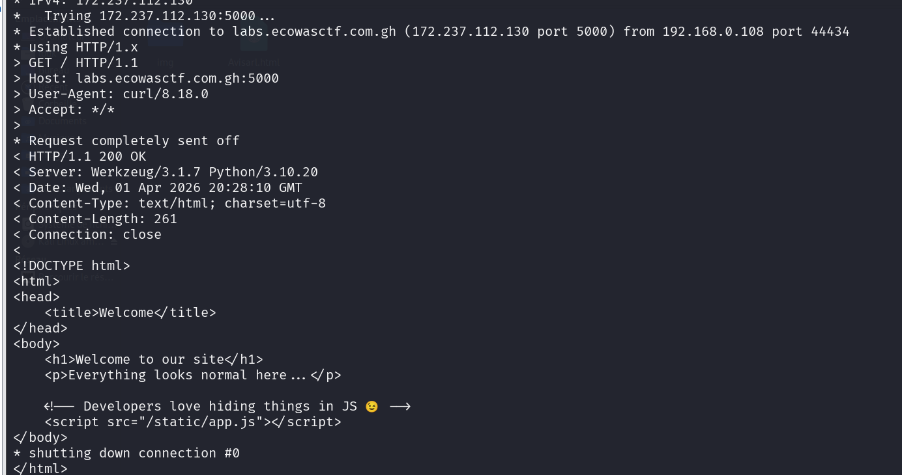
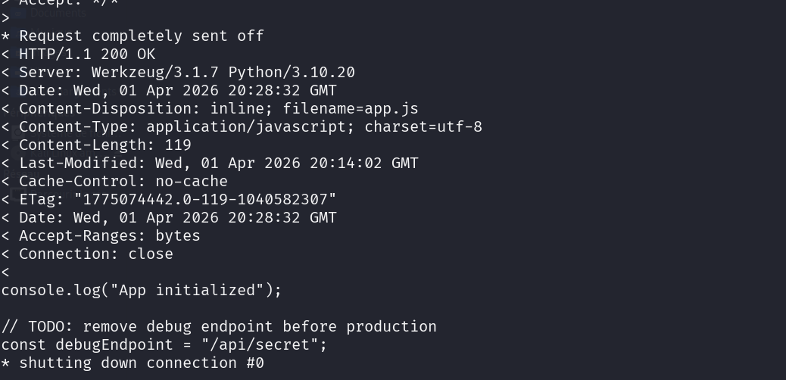
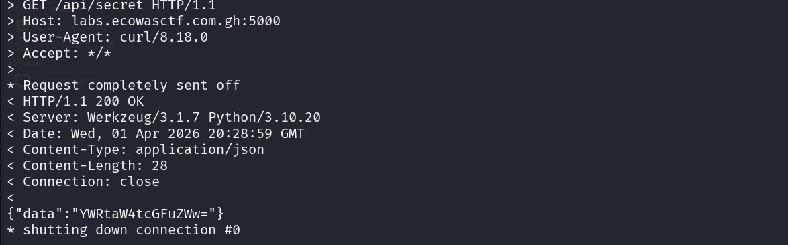
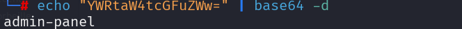
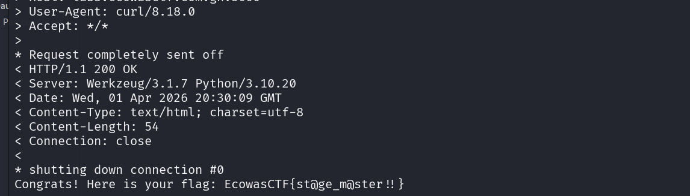

##### Catégorie ; Web 
Outils: curl

Etape 1- Accéder à la page 

```
curl -v http://labs.ecowasctf.com.gh:5000/
```


On voit dans le code source un commentaire qui dit que le developpeur aime caché les choes 
Et dans notre cas on vois un fichier js ( Javascript ) donc on va accéder a ce fichier 

Etape 2- Accéder a ce fichie r
```
curl -v http://labs.ecowasctf.com.gh:5000/static/app.js
```


Boom on a un api intéressant : Le **/api/secret**

Etape 3- Accéder a api/secret 
```
curl -v http://labs.ecowasctf.com.gh:5000/api/secret 
```



On a un contenu JSON qui a été encodé en base64, on va le decoder et voir le contenu 

Commande : 
```
echo "YWRtaW4tcGFuZWw=" | base64 -d

```


On constate que le message est admi-panel , ce qui nous indique qu'il y  a un endpoint admin-panel 

Etape 4 - Accéder au panel admin 
```
curl -v http://labs.ecowasctf.com.gh:5000/admin-panel
```


### Flag : 
```
EcowasCTF{st@ge_m@ster!!}
```
