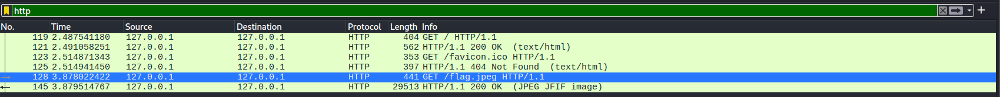
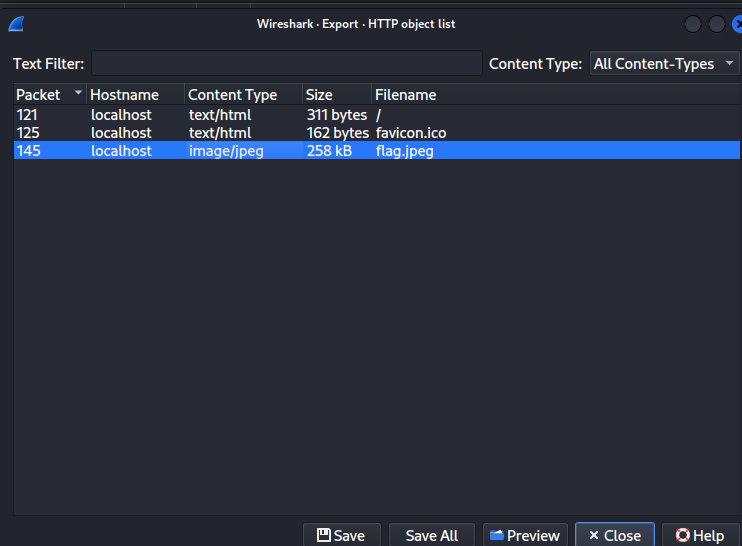

## Description du Challenge

> **Description :** What secrets can be found in this capture file? I wonder.
> 
> **Fichier :** `capture.pcapng` **Auteur :** sohamster

L'objectif de ce challenge est d'analyser une capture de trafic réseau (`.pcapng`) afin d'y déceler des informations ou des fichiers sensibles qui y auraient transité.

##  1. Analyse du Trafic avec Wireshark

Pour débuter l'investigation, nous ouvrons le fichier de capture avec **Wireshark**, l'analyseur de protocoles de référence.

```
wireshark capture.pcapng
```

En observant la liste des paquets, on constate la présence de différents protocoles, notamment du trafic **DNS** et **HTTP**.

> **Rappel Théorique :** Le protocole HTTP (version 1.1 et antérieures) transmet les données en clair sur le réseau. Si un utilisateur télécharge un fichier via un site non chiffré (`http://`), l'intégralité du contenu du fichier (les octets bruts) se retrouve encapsulée dans les paquets TCP du trafic réseau.

Pour épurer la vue et se concentrer sur les transferts web, nous appliquons le filtre d'affichage suivant dans la barre de recherche supérieure :

```text
http
```

Cette manipulation permet d'isoler une ligne particulièrement intéressante : une requête `GET /flag.jpeg` suivie d'une réponse du serveur `HTTP/1.1 200 OK`, confirmant que l'image contenant potentiellement le flag a bien été transférée avec succès.



## 2. Extraction du Fichier (Export Objects)

Plutôt que de reconstituer manuellement les flux TCP octet par octet, Wireshark intègre une fonctionnalité puissante permettant de réassembler et d'extraire automatiquement les fichiers ayant transité via des requêtes HTTP.

### Procédure d'extraction :

1. Dans le menu supérieur de Wireshark, naviguer vers : **File** ➔ **Export Objects** ➔ **HTTP...**
    
2. Une liste de tous les fichiers mis en cache dans le trafic s'affiche.
    
3. Repérer la ligne correspondant au fichier `flag.jpeg`.
    
4. Sélectionner le fichier et cliquer sur **Save** pour l'enregistrer dans le répertoire de travail.
    



## 🏁 3. Capture du Flag

Une fois l'image `flag.jpeg` extraite et enregistrée sur notre machine Kali Linux, il suffit de l'ouvrir pour lire le flag incrusté visuellement sur le fichier d'origine.

```
open flag.jpeg
```


**Flag récupéré :**

```
utflag{fun_image}
```

**_3ch0 training_**
