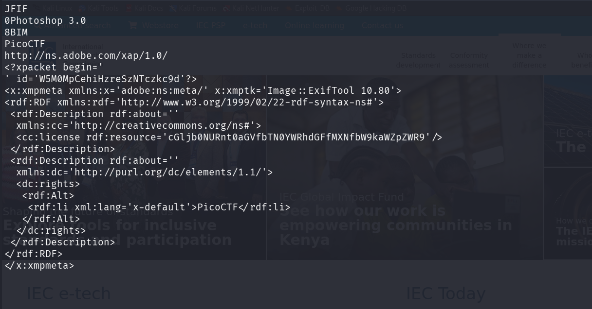

## Métadonnées

- **Catégorie :** Forensics Metadata
    
- **Outils :** file strings less base64
    
- **Flag :** `picoCTF{the_m3tadata_1s_modified}`
    

##  Étape 1 : Analyse préliminaire du fichier

On vérifie le type de fichier avec la commande `file`.

```bash
file cat.jpg
```

### Résultat :

```text
cat.jpg: JPEG image data, JFIF standard 1.02, aspect ratio, density 1x1, segment length 16, baseline, precision 8, 2560x1598, components 3
```

Il s'agit d'une image JPEG standard contenant des blocs d'en-tête JFIF applicatifs.

## 🕵️ Étape 2 : Inspection des en-têtes textuels (`strings` & `less`)

Pour analyser le début du fichier sans saturer le terminal avec les données binaires des pixels, on extrait les chaînes imprimables en redirigeant le flux dans le pagineur `less`.

```bash
strings cat.jpg | less
```

### Résultat :



Dans les premières lignes du fichier, on découvre un bloc de métadonnées au format **XMP (Adobe Extensible Metadata Platform)**. À l'intérieur des balises RDF, l'attribut `cc:license` contient une chaîne suspecte encodée en **Base64** :

```
<rdf:Description rdf:about='' xmlns:cc='http://creativecommons.org/ns#'>
  <cc:license rdf:resource='cGljb0NURnt0aGVfbTN0YWRhdGFfMXNfbW9kaWZpZWR9'/>
</rdf:Description>
```

## Étape 3 : Décodage de la charge utile

On isole la chaîne Base64 trouvée dans le bloc de licence pour la décoder en clair.

```bash
echo "cGljb0NURnt0aGVfbTN0YWRhdGFfMXNfbW9kaWZpZWR9" | base64 -d
```

### Résultat :

```text
picoCTF{the_m3tadata_1s_modified}
```

## 🏁 Étape 4 : Capture du Flag

**Flag :** `picoCTF{the_m3tadata_1s_modified}`

## Mémo Forensics : Les blocs XMP dans les images

Le format **XMP** est une norme créée par Adobe pour intégrer des métadonnées standardisées (XML) directement à l'intérieur des fichiers (JPEG, PDF, PNG).

- Contrairement aux données EXIF classiques (qui stockent des valeurs figées comme la date ou le modèle d'appareil photo), le XMP permet d'intégrer des structures complexes comme des licences, des historiques de modification Photoshop, ou des informations de copyright.
    
- **Astuce d'analyse :** Utiliser `strings | less` est le meilleur moyen d'inspecter manuellement ces blocs XML car ils se situent toujours au début du fichier binaire, juste après le marqueur magique `FF D8`.
