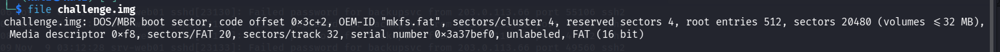
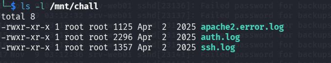
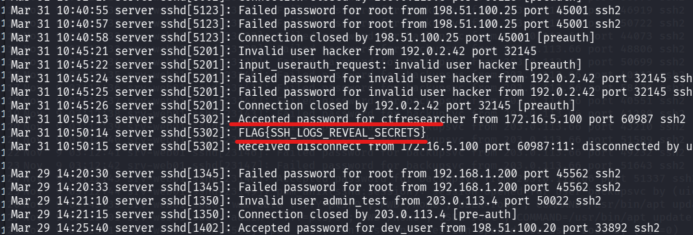

## 📌 Aperçu du Challenge
- **Nom :** Inspecteur, venez !
- **Catégorie :** Inforensique
- **Niveau :** Intermédiaire
- **Fichier :** `challenge.img`
- **Flag :** `FLAG{SSH_LOGS_REVEAL_SECRETS}`

---

## Step 1 : Identification et analyse du fichier image

On commence par analyser le type du fichier `challenge.img` fourni avec l'outil `file` :

```bash
file challenge.img
````

**Résultat :**

```
challenge.img: DOS/MBR boot sector, code offset 0x3c+2, OEM-ID "mkfs.fat", sectors/cluster 4, reserved sectors 4, root entries 512, sectors 20480 (volumes <=32 MB), Media descriptor 0xf8, sectors/FAT 20, sectors/track 32, serial number 0x3a37bef0, unlabeled, FAT (16 bit)
```

L'image correspond à un système de fichiers au format **FAT16** de 32 Mo.


##  Step 2 : Montage du système de fichiers

Pour examiner les fichiers contenus dans cette image disque, on crée un point de montage et on monte l'image avec un périphérique _loop_ :

```bash
sudo mkdir -p /mnt/chall
sudo mount -o loop challenge.img /mnt/chall
cd /mnt/chall
ls -la
```

**Fichiers identifiés :**

- `apache2.error.log`
    
- `auth.log`
    
- `ssh.log`
    


## Step 3 : Inspection des logs et extraction du Flag

En lisant le contenu des fichiers de journalisation avec la commande `cat *`, on passe en revue les connexions serveur.

Dans le fichier `ssh.log`, une session retient l'attention :

```
Mar 31 10:50:13 server sshd[5302]: Accepted password for ctfresearcher from 172.16.5.100 port 60987 ssh2
Mar 31 10:50:14 server sshd[5302]: FLAG{SSH_LOGS_REVEAL_SECRETS}
Mar 31 10:50:15 server sshd[5302]: Received disconnect from 172.16.5.100 port 60987:11: disconnected by user
```

> **Flag**
> 
> **`FLAG{SSH_LOGS_REVEAL_SECRETS}`**


## 🧹 Nettoyage de l'environnement

Après extraction du flag, on démonte proprement l'image disque :

```bash
cd ~
sudo umount /mnt/chall
```

## 🔒 Notions Clés

> **A retenir**
> 
> - **Montage d'images de systèmes de fichiers :** La commande `mount -o loop` permet d'accéder directement au contenu d'une image disque sous Linux.
>     
> - **Traçabilité des journaux (Logs) :** Les fichiers de log SSH (comme `auth.log` ou `ssh.log`) enregistrent les événements de session, les tentatives d'authentification ainsi que certaines sorties ou commandes associées aux utilisateurs.
>
