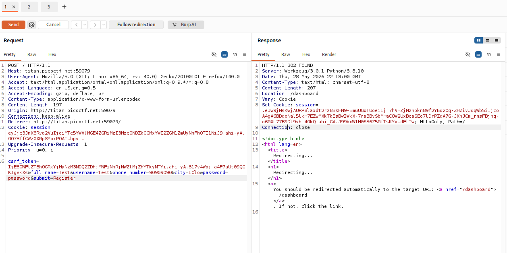
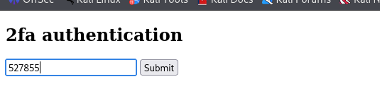
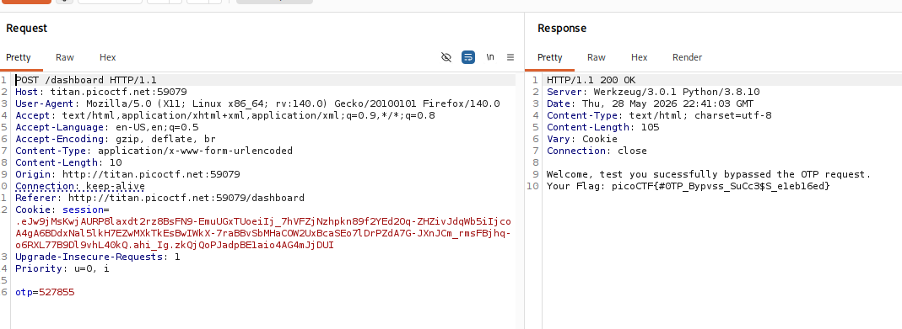

## 💬 Description du challenge

L'objectif de ce challenge est d'apprendre à utiliser l'outil **Burp Suite** pour intercepter et analyser les requêtes HTTP. L'application web propose un formulaire d'enregistrement nécessitant une validation par un code de vérification à double facteur (OTP / MFA). Une mauvaise configuration dans la gestion des sessions permet de récupérer le code secret sans accès au canal de communication légitime (SMS/Email).

## 🔌 Étape 1 : Interception de la requête avec Burp Suite

1. À l'accès au site, nous faisons face à un formulaire d'enregistrement demandant plusieurs informations (`full_name`, `username`, `phone_number`, `password`, etc.).
    
2. Avant de soumettre le formulaire, nous activons l'interception dans l'onglet **Proxy** de Burp Suite (`Intercept is ON`).
    
3. Nous soumettons le formulaire. La requête est bloquée par Burp Suite.
    
4. Nous effectuons un clic droit sur la requête interceptée et l'envoyons vers l'outil **Repeater** (`Ctrl + R`).
    

## 🕵️‍♂️ Étape 2 : Analyse du Cookie de Session (Information Leakage)

En simulant l'envoi de la requête dans le **Repeater** (bouton _Send_), nous analysons la réponse HTTP du serveur. On remarque la présence d'un en-tête `Set-Cookie` contenant un jeton de session Flask :

```
Set-Cookie: session=.eJw9jMsKwjAURP8laxdt2rz8BsFN9-EmuUGxTUoeiIj_7hVFZjNzhpkn89f2YEd2Oq-ZHZivJdqWb5iIjcoA4gA6BDdxNal5lkH7EZwMXkTkEsBwIWkX-7raBBvSbMHaCOW2UxBcaSEo7lDrPZdA7G-JXnJCm_rmsFBjhq-o6RXL77B9Dl9vhL40kQ.ahi_GA.J99bxW1M0S56Z5RfTsKYvUdFlTw
```



La structure du cookie (commençant par un point et encodée) indique des données sérialisées. Nous isolons la première partie du cookie (la charge utile) :

```
eJw9jMsKwjAURP8laxdt2rz8BsFN9-EmuUGxTUoeiIj_7hVFZjNzhpkn89f2YEd2Oq-ZHZivJdqWb5iIjcoA4gA6BDdxNal5lkH7EZwMXkTkEsBwIWkX-7raBBvSbMHaCOW2UxBcaSEo7lDrPZdA7G-JXnJCm_rmsFBjhq-o6RXL77B9Dl9vhL40kQ
```

## Étape 3 : Décodage de la Session avec CyberChef

Nous soumettons cette chaîne dans **CyberChef**. L'utilisation de la fonction **Magic** détecte automatiquement une recette combinant du **Base64** et une compression **Zlib Inflate**.

### Contenu décompressé de la session :

```
{
  "city": "LOlo",
  "csrf_token": "179aee0a8ddb32737446d8c1ab6dc5fe26aa9256",
  "full_name": "Test",
  "otp": "527855",
  "password": "password",
  "phone_number": "90909090",
  "username": "test"
}
```

> ⚠️ **Faille Critique de Logique :** Le serveur génère le code OTP de validation côté backend mais commet l'erreur de le renvoyer et de le stocker directement dans la session de l'utilisateur (`"otp":"527855"`), le rendant accessible à n'importe quel attaquant capable de lire le cookie.

## 🏁 Étape 4 : Contournement du MFA et Capture du Flag

1. Dans Burp Suite, nous retournons sur l'onglet **Proxy** et cliquons sur **Forward** pour laisser passer la requête d'origine et afficher la page de validation OTP sur notre navigateur.
    
2. L'application nous demande le code de vérification à 6 chiffres.
    
3. Nous saisissons la valeur découverte en clair dans notre cookie : **`527855`**.
    



Le code est validé avec succès par le serveur et le flag s'affiche sur l'écran final.



**Flag :** `picoCTF{#0TP_Bypvss_SuCc3$S_e1eb16ed}`

## Concepts clés

### 1. Rôle du Proxy et du Repeater (Burp Suite)

Le **Proxy** permet de capturer à la volée le trafic entre le navigateur et le serveur afin de l'inspecter ou de le modifier avant sa transmission. Le **Repeater** est indispensable pour rejouer une même requête plusieurs fois en modifiant ses paramètres (en-têtes, cookies, corps) sans avoir à remplir le formulaire à chaque tentative dans le navigateur.

### 2. Données Sensibles dans les Sessions Côté Client (Client-Side Sessions)

Les frameworks web comme Flask stockent par défaut les informations de session dans un cookie stocké chez le client. Bien que ce cookie soit signé de manière cryptographique pour empêcher sa modification (falsification), il n'est **pas chiffré**. Les données qu'il contient sont simplement encodées et compressées, ce qui signifie que toute information secrète (comme un mot de passe temporaire ou un code OTP) y est visible en clair par l'utilisateur.
