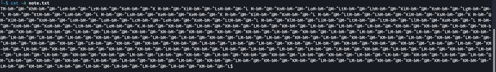
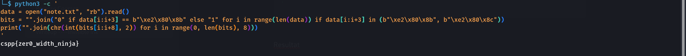

| Info       | Détail         |
| ---------- | -------------- |
| Plateforme | csplusplus     |
| Catégorie  | Stéganographie |
| Difficulté | Hard           |
| Auteur     | 3ch0           |

---

## 1. Description

> Some characters are invisible: zero-width spaces and non-joiners take up no space but still exist in the text, smuggling a whole message between the letters you can see.
> This innocent note hides the flag in zero-width characters (U+200B = 0, U+200C = 1), 8 bits per byte, placed after each visible character.

**Fichier fourni :** `note.txt`

**Ce que l'énoncé nous apprend déjà :**
- Le message est caché avec des caractères Unicode de largeur nulle.
- `U+200B` (Zero-Width Space) = bit `0`
- `U+200C` (Zero-Width Non-Joiner) = bit `1`
- 8 bits = 1 octet = 1 caractère du flag

---

## 2. Reconnaissance

### 2.1 Lecture simple du fichier

```bash
cat note.txt
```

```text
There is nothing to see in this innocent little note.
```

À l'œil nu, le texte semble anodin : les caractères cachés ne s'affichent pas dans le terminal.

### 2.2 Affichage des caractères non imprimables

L'option `-A` de `cat` (équivalent de `-vET`) rend visibles les caractères non imprimables.

```bash
cat -A note.txt
```



On observe deux séquences qui se répètent après chaque lettre visible :

| Notation `cat -A` | Octets UTF-8 | Caractère Unicode | Nom                         | Bit |
|-------------------|--------------|-------------------|-----------------------------|-----|
| `M-bM-^@M-^K`     | `E2 80 8B`   | `U+200B`          | Zero-Width Space (ZWSP)     | `0` |
| `M-bM-^@M-^L`     | `E2 80 8C`   | `U+200C`          | Zero-Width Non-Joiner (ZWNJ)| `1` |

> **Pourquoi cette notation ?** `cat -A` affiche les octets ≥ 0x80 avec le préfixe `M-` (bit de poids fort) et les caractères de contrôle avec `^`. Ainsi `0xE2` → `M-b`, `0x80` → `M-^@`, `0x8B` → `M-^K`.

---

## 3. Analyse

Contrairement au challenge Snow, qui cache les données avec des espaces et tabulations en fin de ligne, ici le message est dissimulé grâce à des **caractères Unicode invisibles** insérés entre les lettres.

Le principe de décodage :
1. Lire le fichier en binaire.
2. Parcourir les octets et ne garder que les séquences `E2 80 8B` et `E2 80 8C`.
3. Convertir chaque ZWSP en `0` et chaque ZWNJ en `1`.
4. Regrouper les bits par paquets de 8 et convertir chaque octet en caractère ASCII.

---

## 4. Exploitation

### 4.1 Script de décodage (one-liner)

```bash
python3 -c '
data = open("note.txt", "rb").read()
bits = "".join("0" if data[i:i+3] == b"\xe2\x80\x8b" else "1" for i in range(len(data)) if data[i:i+3] in (b"\xe2\x80\x8b", b"\xe2\x80\x8c"))
print("".join(chr(int(bits[i:i+8], 2)) for i in range(0, len(bits), 8)))
'
```

### 4.2 Explication du script

```python
ZWSP = b"\xe2\x80\x8b"   # U+200B -> 0
ZWNJ = b"\xe2\x80\x8c"   # U+200C -> 1

data = open("note.txt", "rb").read()   # lecture en binaire

bits = ""
for i in range(len(data)):
    bloc = data[i:i+3]                 # fenêtre de 3 octets
    if bloc == ZWSP:
        bits += "0"
    elif bloc == ZWNJ:
        bits += "1"

flag = ""
for i in range(0, len(bits), 8):       # découpage en octets
    flag += chr(int(bits[i:i+8], 2))   # binaire -> caractère

print(flag)
```

### 4.3 Résultat



---

## 5. Flag

```text
cspp{zer0_width_ninja}
```

---

## 6. Ce qu'il faut retenir

- Un texte « normal » peut transporter des données invisibles : toujours inspecter un fichier suspect avec `cat -A`, `xxd` ou `hexdump -C`.
- Les caractères de largeur nulle (`U+200B`, `U+200C`, `U+200D`, `U+FEFF`) sont couramment utilisés en stéganographie textuelle et en watermarking.
- Outils utiles pour ce type de challenge : CyberChef, `stegsnow` (pour la variante espaces/tabulations), ou un simple script Python.

---

*Rédigé par 3ch0*
