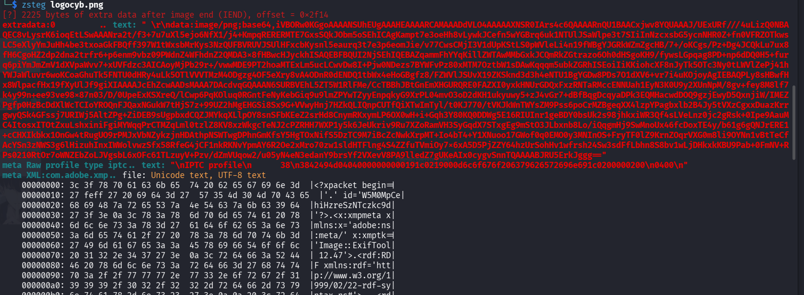
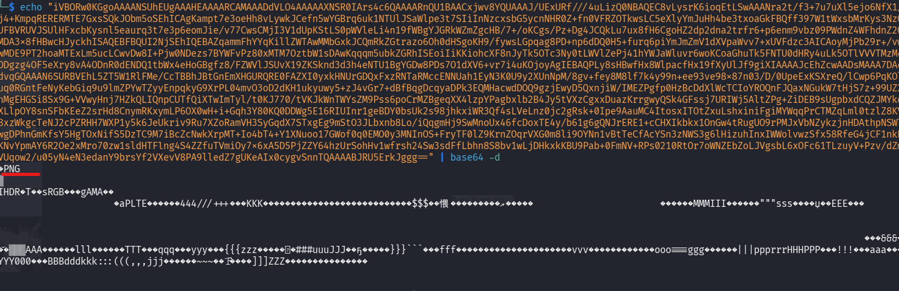
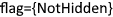

## 📌 Aperçu du Challenge
- **Plateforme :** Cyberini CTF
- **Catégorie :** Stéganographie
- **Concept :** Données cachées après le marqueur de fin de fichier (IEND)
- **Flag :** `NotHidden`

---

## 🔍 Analyse et Méthodologie

1. **Identification du fichier :**
   Vérification du format réel du fichier avec la commande `file` :
```bash
   file logocyb.png
   # Résultat : PNG image data, 165 x 45, 8-bit/color RGBA, non-interlaced
```

2. **Extraction des données cachées :**
    
    L'analyse des métadonnées (exiftool) ne donnant rien, on utilise `zsteg`, un outil spécialisé pour extraire les données cachées dans les PNG/BMP (LSB, données extrinsèques, etc.) :

    ```bash
    zsteg logocyb.png
    ```
    
    L'outil détecte **2225 bytes of extra data after image end (IEND)** et affiche une chaîne de caractères correspondant à une URI de données en Base64 : `data:image/png;base64,iVBORw0KGgoAAAANSUhEUg...`


##  Exploitation

La chaîne base64 trouvée correspond au code source d'une autre image PNG. On décode cette chaîne pour recréer le fichier caché.



**Commande de décodage :**

```bash
echo "iVBORw0KGgoAAAANSUhEUg...[TRONQUÉ]...ErkJggg==" | base64 -d > output.png
```

On vérifie le fichier généré :

```bash
file output.png
# Résultat : output.png: PNG image data, 113 x 17...
```

En ouvrant `output.png`, le flag apparaît en clair sur l'image : **`NotHidden`**.



## 🔒 Notions Clés

> **A retenir**
> 
> - **Chunk IEND :** La structure d'un fichier PNG se termine toujours par le bloc `IEND`. Tout ce qui est ajouté après est ignoré par les afficheurs d'images standards, ce qui en fait une excellente cachette.
>     
> - **Outils indispensables :** `strings`, `binwalk` et `zsteg` sont les premiers outils à lancer pour vérifier la présence de données concaténées à la fin d'une image.
>     
> - **CyberChef :** L'outil en ligne du GCHQ est l'alternative parfaite pour décoder rapidement du Base64 et afficher le rendu de l'image ("Render Image") sans passer par la ligne de commande.
>
