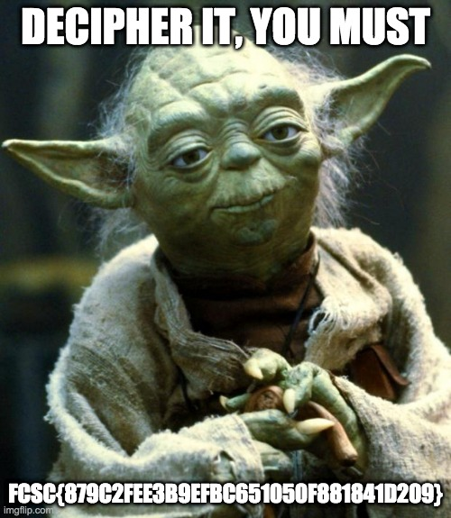

### 1. Description du Challenge

Le but est de transformer un fichier binaire chiffré (`.enc`) en une image lisible (`.jpg`).

- **L'obstacle :** Ce n'est pas du texte, c'est une image. Tu ne peux pas juste "print" le résultat, tu dois sauvegarder le résultat dans un fichier `.jpg`.
    
- **Le mode CTR (Counter) :** Contrairement au CBC, le mode CTR transforme un chiffrement de bloc en un **chiffrement de flux**. Il utilise l'IV (ici nul) comme compteur qui s'incrémente à chaque bloc.

Nom du fichier : flag.jpg.enc

---

### 2. Notions de Base : Le mode CTR

En mode CTR, la clé et l'IV servent à générer une suite de nombres "aléatoires" (le _keystream_). Ce keystream est ensuite **XORé** avec ton fichier.

- **IV nul :** Cela signifie que le compteur commence à `00000000000000000000000000000000` (16 octets de zéro).
    
- **Propriété miroir :** En mode CTR, l'algorithme de chiffrement et de déchiffrement est **exactement le même**.
    

---
##### NB : Le rôle de IV dans le mode CBC et CTR 

Le comportement de l'IV change radicalement selon le "mode" d'AES que tu utilises :

- **En mode CBC :** L'IV reste effectivement "fixe" pour le premier bloc, puis il est remplacé par le résultat du bloc précédent.
    
- **En mode CTR (ton challenge) :** L'IV sert de **valeur de départ à un compteur**.

	---
	
### 3. Résolution (Le Script Python)

Puisque c'est un fichier image, on va lire les octets du fichier `.enc` et écrire les octets déchiffrés dans un nouveau fichier.

```
from Crypto.Cipher import AES
from Crypto.Util import Counter

# 1. Configuration des données fournies
key = bytes.fromhex("00112233445566778899aabbccddeeff")
# L'IV est nul, donc le compteur commence à 0
# Un IV de 128 bits (16 octets) à zéro
ctr = Counter.new(128, initial_value=0)

# 2. Initialisation du moteur AES en mode CTR
cipher = AES.new(key, AES.MODE_CTR, counter=ctr)

# 3. Lecture du fichier chiffré
try:
    with open("flag.jpg.enc", "rb") as f_in:
        encrypted_data = f_in.read()

    # 4. Déchiffrement
    decrypted_data = cipher.decrypt(encrypted_data)

    # 5. Sauvegarde du résultat en image
    with open("flag_recovered.jpg", "wb") as f_out:
        f_out.write(decrypted_data)
        
    print("[+] Déchiffrement terminé ! Vérifie le fichier flag_recovered.jpg")

except FileNotFoundError:
    print("[-] Erreur : Le fichier flag.jpg.enc n'est pas dans le même dossier.")
```

**Image décodé :** 



### Flag 🚩: 

```
FCSC{879C2FEE3B9EFBC651050F881841D209}
```
