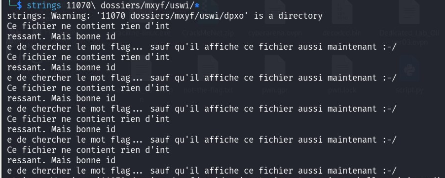
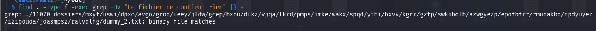
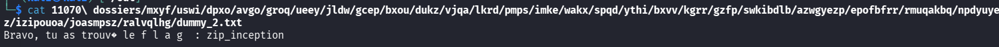

## 📌 Aperçu du Challenge
- **Nom :** Les mille et un dossiers (`11070_dossiers.zip`)
- **Objectif :** Retrouver le flag dissimulé au fond d'une arborescence géante contenant plus de 11 000 sous-dossiers et de nombreux fichiers leurres.
- **Indice :** *Faire des double-clics n'est pas forcément la meilleure idée...*
- **Flag :** `zip_inception`

---

## Step 1 : Analyse de l'Arborescence

Après décompression de l'archive `11070_dossiers.zip`, on se retrouve avec un dossier racine nommé `11070 dossiers` contenant une multitude de sous-dossiers imbriqués.

Tenter de naviguer manuellement dans les dossiers ou d'utiliser un explorateur de fichiers graphique est irréaliste en raison du volume de données.

---

##  Step 2 : Filtrage Automatisé via CLI

La plupart des fichiers leurres (*dummy files*) contiennent le même message récurrent :
> *"Ce fichier ne contient rien d'intéressant. Mais bonne idée de chercher le mot flag... sauf qu'il affiche ce fichier aussi maintenant :-/"*



L'objectif est d'isoler le **seul fichier qui ne contient PAS cette chaîne de caractères** parasite.

### Commande de Recherche (Find + Grep) :

```bash
find . -type f -exec grep -Hv "Ce fichier ne contient rien" {} +
````

**Explication des options :**

- `find . -type f` : Recherche tous les fichiers ordinaires dans l'arborescence.
    
- `-exec ... {} +` : Exécute la commande `grep` sur les fichiers trouvés par lots.
    
- `grep -H` : Affiche le chemin complet du fichier qui correspond.
    
- `grep -v` : Inverse la recherche (sélectionne ce qui **ne contient pas** la chaîne demandée).
    

## Step 3 : Extraction du Flag

La commande `grep -v` isole un fichier binaire/texte spécifique situé au bout d'une très longue chaîne de sous-dossiers :

`./11070 dossiers/mxyf/uswi/.../ralvqlhg/dummy_2.txt`

En lisant ce fichier spécifique (en pensant à échapper l'espace du dossier racine avec `\` ou avec des guillemets) :

```bash
cat "11070 dossiers/mxyf/uswi/dpxo/avgo/groq/ueey/jldw/gcep/bxou/dukz/vjqa/lkrd/pmps/imke/wakx/spqd/ythi/bxvv/kgrr/gzfp/swkibdlb/azwgyezp/epofbfrr/rmuqakbq/npdyuyez/izipouoa/joasmpsz/ralvqlhg/dummy_2.txt"
```

**Résultat :**

```
Bravo, tu as trouvé le f l a g  : zip_inception
```


## 🔒 Notions Clés

> **A retenir**
> 
> - **Gestion des espaces dans les chemins Bash :** Lorsqu'un dossier contient un espace, il faut entourer le chemin de guillemets (`"dossier avec espace/fichier"`) ou échapper l'espace avec un antislash (`dossier\ avec\ espace/fichier`).
>     
> - **Inversion de recherche avec `grep -v` :** Quand un challenge inonde le système de faux positifs contenant une phrase précise, `grep -v` permet d'exclure cette phrase pour ne garder que le fichier discordant.
