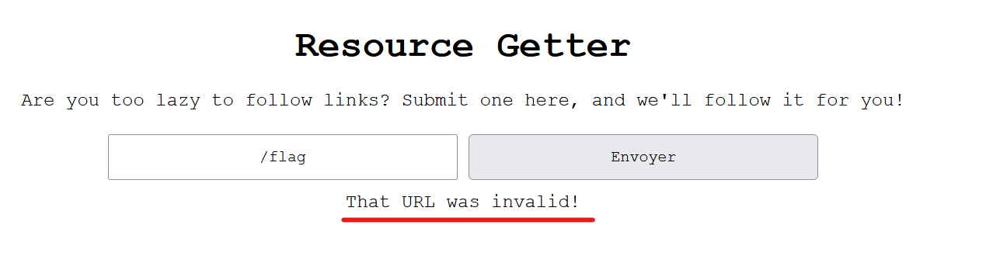
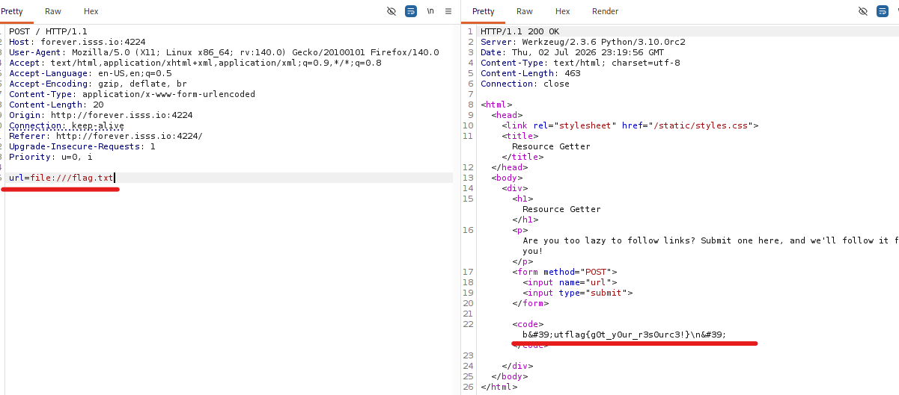
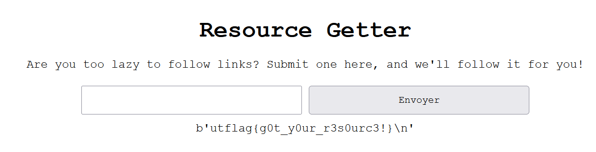

1- Local File Inclusion( LFI ).

## 📝 Description du Challenge

> **Description :** I'm usually too lazy to fetch my own URLs, so I made this cool webapp to do it for me. My flag is stored locally on my computer, so you shouldn't be able to find it. In fact I'm so sure that you can't find it, that I'll tell you the filepath: `/flag.txt`
> 
> **URL :** `http://forever.isss.io:4224`
> 
> **Auteur :** mattyp

L'énoncé nous donne directement le chemin absolu du flag sur le serveur (`/flag.txt`) tout en nous indiquant que l'application a pour but de récupérer le contenu d'une URL à notre place.

##  1. Analyse & Détection de la Faille

En accédant à la plateforme, nous faisons face à un champ de saisie qui nous demande une URL pour en afficher le contenu.

> **Rappel Théorique :** Une vulnérabilité **LFI (Local File Inclusion)** classique se manifeste généralement via des paramètres de requêtes (ex: `?page=about.php` ou `?file=welcome`). Cependant, lorsque l'application demande une URL complète, le comportement s'apparente également à une **SSRF (Server-Side Request Forgery)**, où le serveur effectue une action vers une ressource interne.

Mes premiers tests :

1. Tenter d'entrer directement le chemin absolu `/flag.txt` ou `http://localhost:4224/flag.txt`.
    
2. Résultat : L'application renvoie une erreur du type _Invalid URL_.
    

L'application backend (qui s'avère être du Python, comme le montre le formatage des données par la suite) attend strictement un format d'URL valide avec un protocole (**URI Scheme**). Entrer un simple chemin local brise le parseur.



## 2. Exploitation (Le protocole `file://`)

Pour contourner cette restriction, il faut exploiter les protocoles acceptés par le client HTTP du serveur. Si le développeur n'a pas mis en place de liste blanche (whitelist) limitant l'application aux protocoles `http://` et `https://`, nous pouvons utiliser le protocole **`file://`**.

Ce protocole est spécifiquement conçu pour désigner des fichiers locaux sur le système de fichiers de la machine.

### Formulation du Payload

Pour cibler la racine du système et atteindre `/flag.txt`, nous construisons l'URL suivante :

```
file:///flag.txt
```

_(Note : Les deux premiers slashes appartiennent au protocole `file://`, le troisième indique la racine `/` du système Linux)._



## 🏁 3. Capture du Flag

En soumettant le payload, le serveur traite l'URI, ouvre le fichier en local sur son disque et nous affiche son contenu brut à l'écran :

```python
b'utflag{g0t_y0ur_r3s0urc3!}\n'
```

Le `b''` confirme que le script Python backend a lu le fichier sous forme de chaînes d'octets (_bytes_) avant de nous le renvoyer.



**Flag récupéré :**

```text
utflag{g0t_y0ur_r3s0urc3!}
```

_Writeup rédigé par Loukouman / Équipe PhishGuard — #_3ch0 training__

Propre, rapide et efficace. La session de nuit porte ses fruits ! On passe au challenge suivant ou tu as un autre binaire à décortiquer ?
