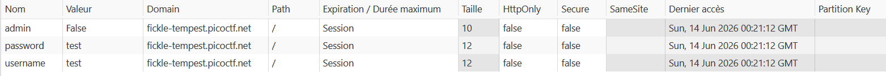
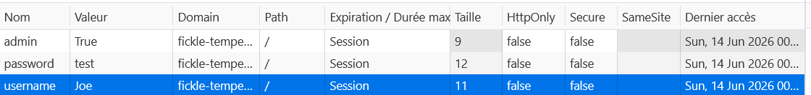
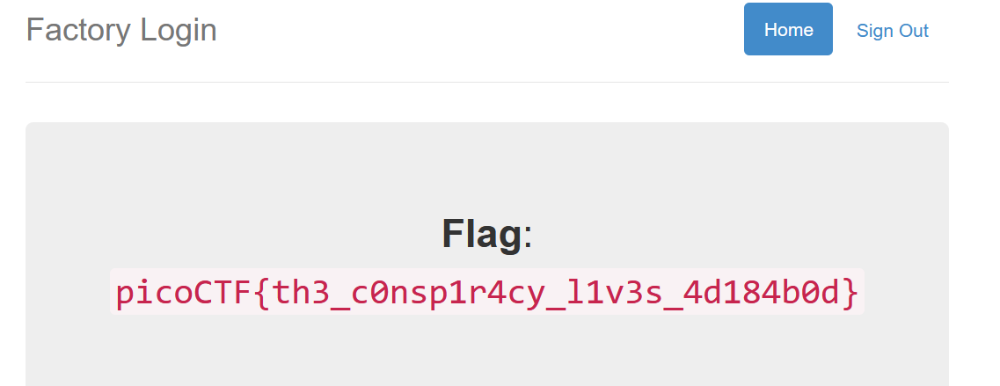

- **Catégorie :** Web Exploitation
    
- **Difficulté :** Easy
    
- **Points :** 100 pts
    
- **Plateforme :** PicoCTF
    
- **Auteur :** bobson
    

## Description du Challenge

L'application web propose une mire de connexion. L'énoncé nous demande de nous connecter en tant que l'utilisateur **`Joe`** pour voir ce que l'usine cache.

L'indice mentionne que le serveur ne semble valider le mot de passe de personne... sauf celui de Joe.

## Analyse & Faille (Broken Authentication)

En testant l'application avec des identifiants arbitraires (ex: `test` / `test`), la connexion réussit systématiquement, mais un message nous indique que nous ne sommes pas autorisés à voir le flag car nous ne sommes pas Joe. En revanche, tenter de se connecter directement avec le nom `Joe` échoue car son mot de passe est vérifié et inconnu.

La faille réside dans la **gestion de session côté client**. Une fois connecté avec un faux compte, le serveur génère des cookies non sécurisés (non signés cryptographiquement) pour identifier l'utilisateur et ses privilèges :

- `username` : Stocke le nom de l'utilisateur en clair (`test`).
    
- `admin` : Stocke un booléen définissant les privilèges (`False`).
    
- `password` : Stocke le mot de passe soumis en clair.
    

Le serveur fait aveuglément confiance aux valeurs de ces cookies renvoyées par le navigateur pour accorder l'accès aux pages restreintes, sans revérifier l'identité côté backend.

## Procédure d'Exploitation

### 1. Connexion initiale

Se connecter avec n'importe quel identifiant tiers pour franchir la page de login et forcer la création des cookies de session.

- **Username :** `test`
    
- **Password :** `test`
    

### 2. Altération des cookies (Cookie Tampering)

1. Ouvrir les **Outils de développement** du navigateur (`F12` ou `Clic droit -> Inspecter`).
    
2. Naviguer vers l'onglet **Application** (Chrome/Edge) ou **Stockage** (Firefox).
    
3. Dans le menu de gauche, dérouler la section **Cookies** et sélectionner l'URL du défi.
    
4. Modifier manuellement les entrées suivantes :
    
    - Remplacer la valeur du cookie `username` par : **`Joe`**
        
    - Remplacer la valeur du cookie `admin` par : **`true`**
        

### 3. Capture du Flag

Rafraîchir la page (`F5`). Le script du serveur lit les cookies altérés, valide l'identité de `Joe` avec le statut `admin` et affiche le flag.

## 🏁 Flag

> ****Flag capturé** `picoCTF{th3_c0nsp1r4cy_l1v3s_4d184b0d}`**

## 💡 Leçons à retenir (Mitigation)

- **Ne jamais faire confiance au client :** Les cookies de session ne doivent jamais stocker des données de privilèges ou d'identité critiques en clair et modifiables de cette façon.
    
- **Mécanismes sécurisés :** Utiliser des jetons de session imprévisibles et stockés côté serveur, ou des jetons signés cryptographiquement comme les **JWT (JSON Web Tokens)** qui deviennent invalides s'ils sont altérés par l'utilisateur.
