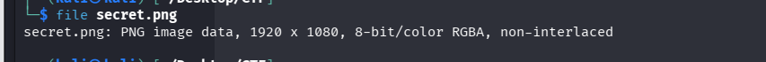
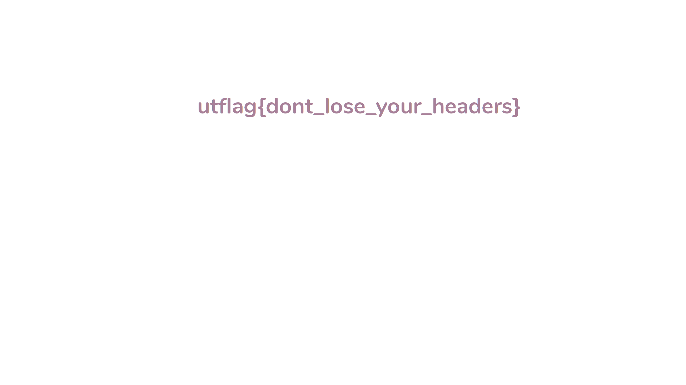

## 📝 Description du Challenge

> **Description :** I think there's something wrong with this file-- it won't open! Maybe you could look at the hexdump of the file and see if there's something wrong there?
> 
> **Fichier :** `secret.png`
> 
> **Auteur :** balex

Le challenge nous présente un fichier nommé `secret.png` qui refuse de s'ouvrir. L'énoncé et le titre nous orientent explicitement vers une analyse du **hexdump** (la structure hexadécimale) pour corriger une corruption des **Magic Bytes**.

##  1. Analyse de la Signature (Magic Bytes)

Lorsque nous tentons d'identifier le type de fichier via la commande standard `file`, le système renvoie une signature générique non reconnue car l'en-tête ne correspond à rien de légitime.

```bash
file secret.png
```

**Résultat :**

```
secret.png: data
```

La mention `data` confirme que les premiers octets sont corrompus. Pour comprendre ce qui bloque, il faut analyser le hexdump avec `xxd` ou `hexeditor` en s'appuyant sur les signatures standards :

### 📌 Table de Référence des File Signatures (Magic Bytes)

|**Format**|**Extension**|**Magic Bytes (Hex)**|**Chaîne ASCII**|
|---|---|---|---|
|**PNG**|`.png`|`89 50 4E 47 0D 0A 1A 0A`|`.PNG...`|
|**JPEG**|`.jpg`|`FF D8 FF`|_(Début Image)_|
|**PDF**|`.pdf`|`25 50 44 46`|`%PDF`|
|**ZIP**|`.zip`|`50 4B 03 04`|`PK..`|
|**ELF** (Linux)|`.bin` / none|`7F 45 4C 46`|`.ELF`|

En inspectant les premiers octets de `secret.png`, on remarque que les octets initiaux spécifiques au format PNG ont été modifiés (ou mis à zéro), tandis que le reste des blocs de métadonnées (comme le marqueur structurel `IHDR`) est resté intact plus loin dans le flux.

## 2. Réparation Hexadécimale

Puisque le nom du fichier et les structures internes pointent vers un format PNG, nous devons restaurer manuellement sa signature normalisée : `89 50 4E 47 0D 0A 1A 0A`.

Nous ouvrons le fichier avec l'éditeur hexadécimal en ligne de commande :

```
sudo hexeditor secret.png
```

_Action : Écriture de la signature hexadécimale correcte sur les premiers octets corrompus du fichier, puis sauvegarde (`Ctrl+O` suivi de `Ctrl+X`)._

Après la modification, la commande `file` confirme que le fichier a retrouvé sa structure légitime :

```
file secret.png
```

**Résultat :**

```
secret.png: PNG image data, 1920 x 1080, 8-bit/color RGBA, non-interlaced
```



## 🏁 3. Capture du Flag

Une fois le fichier réparé, l'image devient parfaitement lisible par le système d'exploitation. Il ne reste plus qu'à l'ouvrir graphiquement pour lire le flag affiché sur le visuel.

```bash
open secret.png
```


**Flag récupéré :**

```
utflag{dont_lose_your_headers}
```

 **_3ch0 training_**
