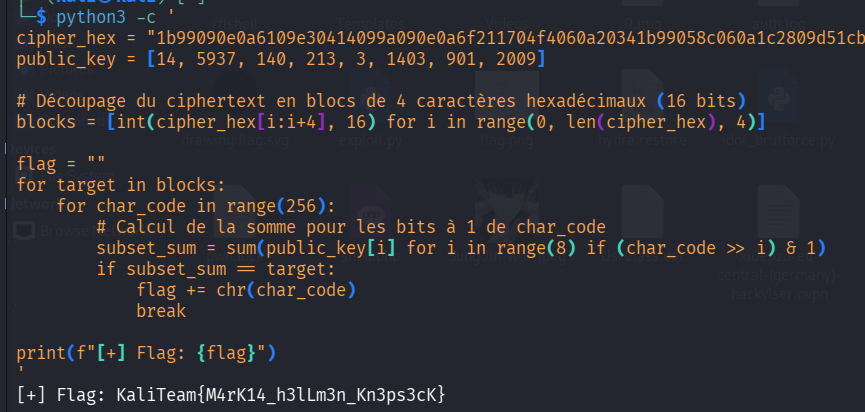

> **Informations du Challenge**
> * **Événement :** Kali Team CTF 2026
> * **Catégorie :** Cryptography
> * **Points :** 100 PTS
> * **Auteur :** F4R3S
> * **Flag :** `KaliTeam{M4rK14_h3lLm3n_Kn3ps3cK}`

---

## 📑 1. Enoncé & Intitule

```text
Behind every great knapsack lies a hidden trapdoor. 
Can you find your way through the super-increasing shadows?

Ciphertext (Hex): 
1b99090e0a6109e30414099a090e0a6f211704f4060a20341b99058c060a1c2809d51cbd0a6104e60a6f1cbd21921c281b9921921cbd090320421cbd203f1b990a72

Public key: 
{14, 5937, 140, 213, 3, 1403, 901, 2009}
````

## 🔍 2. Reconnaissance & Indices (How to spot it)

> **Mots-clés fondamentaux à repérer en CTF**
> 
> - **"Knapsack"** : Fait directement référence au _Problème du sac à dos_ (_Subset Sum Problem_).
>     
> - **"Trapdoor"** : Fait référence à une fonction à sens unique avec porte à piège (_Trapdoor One-Way Function_).
>     
> - **"Super-increasing"** : Caractéristique essentielle de la clé privée du cryptosystème de Merkle-Hellman.
>     
> - **Clé publique sous forme de vecteur** : Une liste de $N$ entiers (ici $N=8$).
>     

Lorsque vous voyez un ensemble d'entiers servant de clé publique et que le ciphertext est composé de sommes de ces entiers, il s'agit **systématiquement du cryptosystème de Merkle-Hellman**.

## 🧠 3. Théorie : Le Cryptosystème de Merkle-Hellman

Le cryptosystème de Merkle-Hellman (1978) est l'un des premiers algorithmes à clé publique. Il repose sur le problème du sac à dos (_Subset Sum Problem_), réputé **NP-complet**.

### A. Le principe de chiffrement

Soit un message clair découpé en caractères (octets de 8 bits).

Pour chaque caractère représenté par ses bits $b_0, b_1, \dots, b_7$ (où $b_i \in \{0, 1\}$) et une clé publique $A = (a_0, a_1, \dots, a_7)$ :

Le ciphertext $C$ associé au caractère est la somme pondérée :

$$C = \sum_{i=0}^{7} b_i \cdot a_i$$

### B. Pourquoi c'est une "Trapdoor" (Porte à piège) ?

- **Problème Difficile (Clé publique $A$)** : Résoudre $C = \sum b_i \cdot a_i$ pour retrouver les bits $b_i$ avec une clé publique quelconque est un problème NP-complet très difficile quand le nombre d'éléments est grand.
    
- **Problème Facile (Clé privée $W$)** : Le propriétaire de la clé possède une suite **super-croissante** $W$ (où chaque élément est plus grand que la somme de tous les précédents : $W_k > \sum_{j=0}^{k-1} W_j$). Une telle suite se résout de façon **gloutonne** (_greedy algorithm_) en $O(N)$.
    
- La clé publique $A$ est générée en masquant $W$ grâce à une multiplication modulaire : $a_i = (W_i \cdot q) \pmod r$.
    

## ⚡ 4. Résolution & Exploitation

> **La vulnérabilité spécifique au Challenge**
> 
> Dans la vraie vie, l'algorithme de Merkle-Hellman a été cassé en 1982 par **Adi Shamir** en utilisant les réseaux euclidiens et l'algorithme **LLL** (_Lenstra–Lenstra–Lovász_).
> 
> Mais dans ce challenge, **la clé publique ne contient que 8 éléments** (`len(public_key) = 8`).
> 
> Un bloc correspond donc à $2^8 = 256$ combinaisons possibles (les valeurs ASCII de `0` à `255`).

Au lieu d'inverser la clé ou de lancer une réduction de réseau LLL, **un simple brute-force local de 256 possibilités par octet résout le problème instantanément**.

### Analyse de la structure du ciphertext :

1. Clé publique : 8 éléments $\rightarrow$ $1$ octet par bloc.
    
2. Somme maximale possible : $\sum A_i = 14 + 5937 + 140 + 213 + 3 + 1403 + 901 + 2009 = 10620$.
    
3. En hexadécimal, $10620_{10} = \text{0x297C}$ (4 caractères hexadécimaux).
    
4. Le ciphertext hexadécimal est donc découpé en tranches de **4 caractères** (16 bits) représentant chacun un caractère du flag.
    

## 💻 5. Script d'Exploitation (Solve Script)

```python
#!/usr/bin/env python3
"""
Challenge: Merkle's Trapdoor (Kali Team CTF 2026)
Category: Cryptography
Author: F4R3S
"""

# Données fournies
cipher_hex = "1b99090e0a6109e30414099a090e0a6f211704f4060a20341b99058c060a1c2809d51cbd0a6104e60a6f1cbd21921c281b9921921cbd090320421cbd203f1b990a72"
public_key = [14, 5937, 140, 213, 3, 1403, 901, 2009]

def solve_knapsack():
    # 1. Découpage du ciphertext en blocs de 4 hex-chars (16 bits)
    blocks = [int(cipher_hex[i:i+4], 16) for i in range(0, len(cipher_hex), 4)]
    
    flag = ""
    
    # 2. Brute-force des 256 possibilités ASCII pour chaque bloc
    for target in blocks:
        found = False
        for char_code in range(256):
            # Calcul du Subset Sum pour le char_code actuel
            subset_sum = sum(public_key[i] for i in range(8) if (char_code >> i) & 1)
            
            if subset_sum == target:
                flag += chr(char_code)
                found = True
                break
                
        if not found:
            flag += "?"
            
    return flag

if __name__ == "__main__":
    flag = solve_knapsack()
    print(f"[+] Flag déchiffré : {flag}")
```

### Exécution :

```bash
$ python3 solve.py
[+] Flag déchiffré : KaliTeam{M4rK14_h3lLm3n_Kn3ps3cK}
```



## 📌 6. Cheat Sheet CTF : Comment réagir aux prochains Knapsacks ?

> **Decision Tree Crypto - Knapsack / Subset Sum**
> 
> 1. **Taille de la clé publique $N \le 16$** :
>     
>     - Brute-force direct ($2^N$ opérations max par bloc).
>         
> 2. **Taille de la clé publique $N \in [16, 40]$** :
>     
>     - Algorithme **Meet-in-the-Middle** ($O(2^{N/2})$).
>         
> 3. **Taille de la clé publique $N > 40$** :
>     
>     - Attaque par réduction de réseau euclidien avec **SageMath** (Matrice de Coster/Laganarias-Odlyzko + Algorithme `LLL()`).
>
