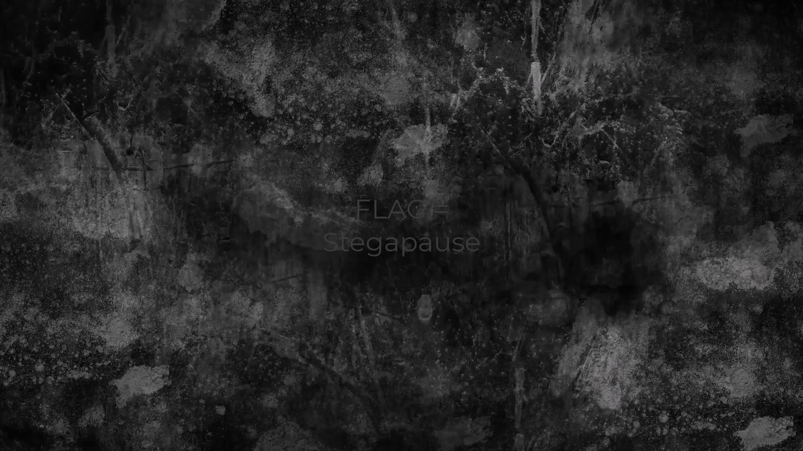

## 📌 Aperçu du Challenge
- **Plateforme :** CTF (Forensics / Multimédia)
- **Catégorie :** Analyse de fichiers vidéo
- **Objectif :** Retrouver une information cachée de manière éphémère dans une vidéo.
- **Flag :** `Stegapause`

---

## 1. Reconnaissance et Analyse des métadonnées
En inspectant le fichier `textures.mp4`, on remarque via les métadonnées un message humoristique laissé dans les commentaires (`Bonjour :-) (ce n'est pas le flag)`), confirmant qu'il faut creuser dans le contenu de la vidéo.

La vidéo a une durée de **5 secondes** à **30 images par seconde**, soit un total de **150 frames**.

## 2. Extraction des frames avec FFmpeg
Puisque l'information visuelle est trop rapide pour être aperçue à l'œil nu, on extrait l'intégralité des images composant la vidéo pour les analyser une par une :

```bash
ffmpeg -i textures.mp4 frame-%04d.png
````

- `-i textures.mp4` : Spécifie le fichier vidéo d'entrée.
    
- `frame-%04d.png` : Génère des images numérotées sur 4 chiffres (`frame-0001.png`, `frame-0002.png`, etc.) au format PNG pour éviter toute perte de qualité.
    

##  3. Découverte du Flag

En inspectant minutieusement le dossier de sortie image par image (ou via un visionnage rapide), on découvre que la **frame 71** contient l'information recherchée affichée en clair :

Le flag est **`Stegapause`**.



##  Notions Clés

> **A retenir**
> 
> - **Stéganographie temporelle :** Cacher un message ou un indice sur une seule frame dans une vidéo (ou un nombre réduit d'images) est une technique classique en forensics.
>     
> - **Maîtrise de FFmpeg :** L'extraction de frames est l'outil indispensable face à un fichier vidéo suspect. Le format `%04d` permet de conserver l'ordre chronologique exact des images pour le tri.
>
