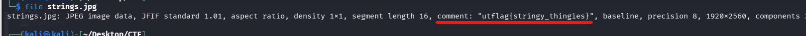

## 📝 Description du Challenge

> **Description :** See if you can find the flag hidden in this picture. Well, I guess it isn't really in the picture, just part of the file.
> 
> **Fichier :** `strings.jpg`
> 
> **Auteur :** balex

L'énoncé nous indique explicitement que le flag n'est pas visible visuellement sur l'image, mais qu'il est dissimulé dans la structure même du fichier informatique. Le titre est un indice direct vers les **métadonnées**.

##  1. Analyse du Fichier & Métadonnées

En Forensique, la première étape face à un fichier inconnu ou suspect est d'analyser son type et les informations textuelles qu'il embarque sans l'ouvrir avec un visualiseur classique.

> **Rappel Théorique :** Les métadonnées sont des données structurées qui décrivent d'autres données (date de capture, modèle d'appareil photo, coordonnées GPS, commentaires de l'auteur). En stéganographie basique, il est fréquent de cacher des informations dans ces champs dédiés.

Pour ce faire, nous utilisons l'outil natif Linux `file` pour obtenir des détails sur le format du fichier, suivi de l'outil de référence `exiftool` pour inspecter l'intégralité des tags EXIF.

### Commande :

```
file strings.jpg
```



Le retour de la commande nous montre directement une chaîne suspecte dans la section réservée aux commentaires du format JFIF :

```
strings.jpg: JPEG image data, ... comment: "utflag{stringy_thingies}", ...
```

## 🏁 2. Extraction et Capture du Flag

Pour confirmer et extraire proprement la donnée sans fioritures, l'analyse via `exiftool` permet d'isoler le champ exact :

```bash
exiftool strings.jpg
```

`[CAPTURE D'ÉCRAN : Terminal Kali Linux avec la commande exiftool mettant en évidence la ligne Comment]`

Dans les résultats retournés, le champ **Comment** contient notre précieux sésame :

```text
Comment                         : utflag{stringy_thingies}
```

_Note alternative : Vu le nom du fichier (`strings.jpg`), une simple commande `strings strings.jpg | grep utflag` aurait également extrait le flag en quelques millisecondes en analysant les chaînes de caractères imprimables du binaire._

**Flag récupéré :**

```
utflag{stringy_thingies}
```

**_3ch0 training_**
