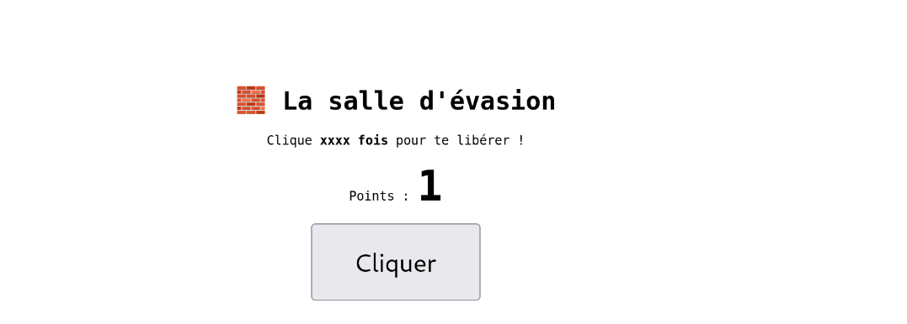
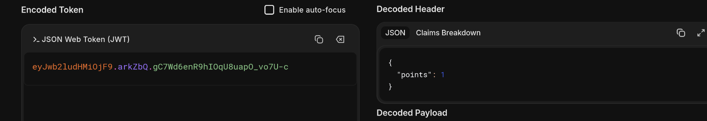
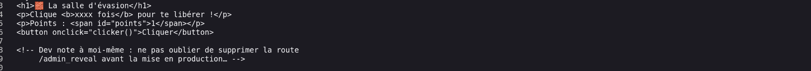
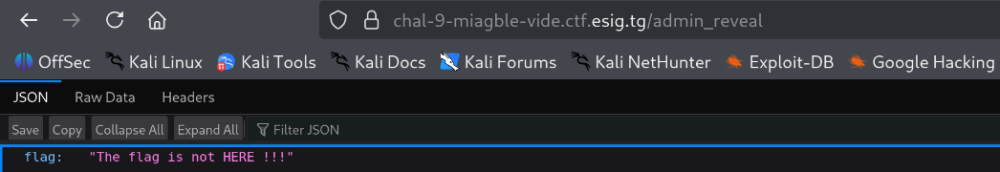
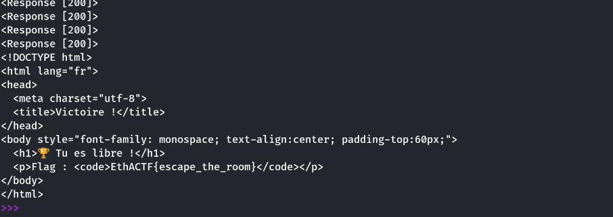

### 📌 Description
> **Miagble vidé** (Web · easy). "Bienvenue dans la petite salle d'évasion ! Règle affichée à l'écran : cliquer xxxx fois pour te libérer et obtenir le flag. … Mais est-ce vraiment la seule façon de sortir d'une salle d'évasion ?"
>
> **URL** : https://chal-9-miagble-vide.ctf.esig.tg/
**Author** : KodjoDoDjango
**Points** : 100 → 95 pts (dynamique)
**Statut** : ✓ Résolu le 25/09 à 15:50 UTC

---
### Étape 1 : Reconnaissance

Page d'accueil : un bouton "Cliquer" qui appelle `fetch("/click")` puis recharge la page. Un compteur de points affiché, stocké dans un cookie Flask signé (`itsdangerous`) :

```
session=eyJwb2ludHMiOjF9.araMtg.Y1pLuY5iDuqbmmgV78MR2jeVrRQ
```

Décodage du payload (base64) : `{"points": 1}`.





Un commentaire HTML piège est présent dans la page :
```html
<!-- Dev note à moi-même : ne pas oublier de supprimer la route
     /admin_reveal avant la mise en production… -->
```



---
### Étape 2 : Pistes explorées (et écartées)

De nombreuses hypothèses de contournement ont été testées et **invalidées** une par une :

| Piste                                                                            | Résultat                                                                                      |
| -------------------------------------------------------------------------------- | --------------------------------------------------------------------------------------------- |
| `/admin_reveal` (route du commentaire)                                           | Toujours `{"flag":"The flag is not HERE !!!"}` — pur <br> |
| Falsification du cookie (tamper le payload)                                      | Signature HMAC invalide → session réinitialisée à 0 (signature bien vérifiée)                 |
| Crack du secret Flask (`flask-unsign` + rockyou.txt, 14M mots)                   | Échec                                                                                         |
| Wordlist thématique custom (~16k combinaisons)                                   | Échec                                                                                         |
| Brute-force court du secret (1-4 caractères)                                     | Échec                                                                                         |
| Race condition / compteur global partagé (30 requêtes concurrentes, même cookie) | Toutes retournent `points+1` identique → pas d'état partagé côté serveur                      |
| Compteur indexé par IP (40 requêtes sans cookie)                                 | Toujours repart de `points=1` → stateless pur                                                 |
| Paramètres directs sur `/click` (`?points=99999`, `?pts=`, etc.)                 | Tous ignorés                                                                                  |
| Fuzzing de routes (`dirb small.txt`, ~1000 mots)                                 | Seule route trouvée : `/win` (redirect vers `/`, sans effet apparent à faible points)         |
| Débogueur Werkzeug (`?__debugger__=yes`)                                         | Inactif, pas de debug mode                                                                    |

Conclusion : le cookie de session est **correctement implémenté** (signature HMAC-SHA1 via `itsdangerous`, dérivation de clé standard Flask `hmac`/salt `cookie-session`), et il n'existe aucun raccourci cryptographique ou logique évident. La latence (~1.7s/requête) est uniforme sur toutes les routes → latence réseau normale, pas de throttle anti-brute-force délibéré.

---
### Étape 3 : La bonne piste — scripter les clics

Le indice ("est-ce vraiment la seule façon de sortir...") pointait simplement vers l'évidence : **automatiser les clics** plutôt que cliquer à la main, comme le veut le thème de l'auteur (cf. Ɖoɖonu, même créateur, flag `scripting_saves_the_day`).

```python
import requests, time, re, sys

BASE = "https://chal-9-miagble-vide.ctf.esig.tg"
s = requests.Session()
s.get(BASE + "/")

i = 0
while True:
    i += 1
    s.get(BASE + "/click")
    if i % 25 == 0:
        win = s.get(BASE + "/win", allow_redirects=False)
        if win.status_code == 200:      # succès : plus une 302 vide
            print(win.text)
            break
```

Le seuil réel était **exactement 1000 points** (pas de faille à exploiter — juste un nombre trop élevé pour un humain, trivial pour un script). Une fois `points=1000` atteint, `/win` cesse de rediriger et affiche directement le flag :

```html
<h1>🏆 Tu es libre !</h1>
<p>Flag : <code>EthACTF{escape_the_room}</code></p>
```



---
### 🏁 Flag

```
EthACTF{escape_the_room}
```
