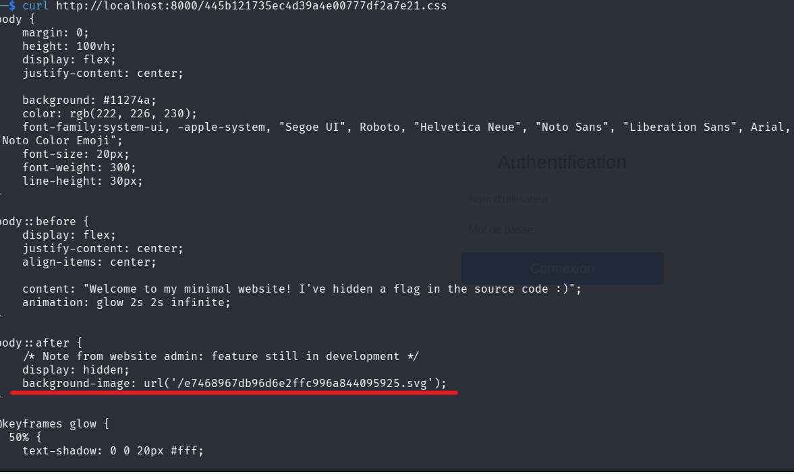
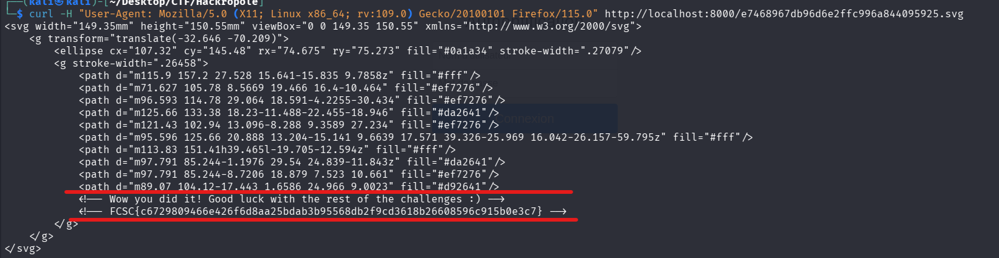

###  Informations sur le Challenge

- **Plateforme :** Hackropole (FCSC 2026)
    
- **Catégorie :** Web
    
- **Difficulté :** Introduction / Facile
    

###  Étape 1 : Analyse initiale de l'application

En interrogeant l'application à sa racine `http://localhost:8000/` avec la commande `curl -v`, le serveur renvoie un message bloquant :

`Please use Firefox!`

L'examen des en-têtes de la réponse HTTP révèle la présence d'un fichier de style CSS lié dynamiquement :

HTTP

```
link: <445b121735ec4d39a4e00777df2a7e21.css>; rel=stylesheet
server: Rocket
```

### Étape 2 : Analyse des feuilles de style (CSS)

L'inspection du fichier CSS mentionné (`/445b121735ec4d39a4e00777df2a7e21.css`) montre un commentaire laissé par l'administrateur système ainsi qu'une règle de style cachée :

CSS

```
body::after {
    /* Note from website admin: feature still in development */
    display: hidden;
    background-image: url('/e7468967db96d6e2ffc996a844095925.svg');
}
```

L'application charge une image vectorielle au format `.svg` nommée `/e7468967db96d6e2ffc996a844095925.svg`.



###  Étape 3 : Contournement du User-Agent et Extraction

Le serveur Web effectuant une vérification stricte du navigateur client (User-Agent), l'utilisation d'une commande `curl` standard échoue. Pour interroger la ressource cachée directement depuis le terminal, il est nécessaire de spécifier un en-tête `User-Agent` légitime imitant Firefox :

```bash
curl -H "User-Agent: Mozilla/5.0 (X11; Linux x86_64; rv:109.0) Gecko/20100101 Firefox/115.0" http://localhost:8000/e7468967db96d6e2ffc996a844095925.svg
```

L'affichage du code XML de l'image SVG révèle deux lignes de commentaires insérées à la fin des balises graphiques :



### 🏁 Résultat & Flag

Le secret se trouvait dissimulé dans les métadonnées textuelles de l'asset graphique :

```
FCSC{c6729809466e426f6d8aa25bdab3b95568db2f9cd3618b26608596c915b0e3c7}
```
