### Catégorie : web

## Méthode 1 
#### Outils
- **curl** 
- **gobuster**

### Résolution

#### Tâche 1- Accéder à la page web

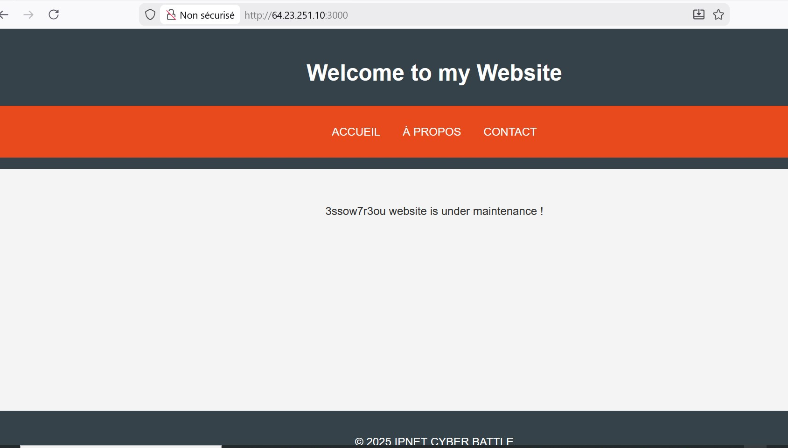

Au premier vue on a rien d'intéressant, les pages about et contact sont inaccessibles.

#### Tâche 2- découverte des fichiers cachés 

Généralement dans les sites web, il peut  y arriver qu'il ai des fichiers cachés que l'administrateur à oublier ou  autre. Ainsi nous allons utiliser l'outil gobuster pour le scan

**Commande:**
```
gobuster dir -u http://64.23.251.10:3000/ -w /usr/share/wordlists/dirb/common.txt 
```

On a un fichier intéressant qui est le robots.txt généralement utilisé pour indiquer les endpoints autorisés à  accéder ou non.

- **Consulter le fichier** **robots.txt**

Commande:
```
 curl http://64.23.251.10:3000/robots.txt
```

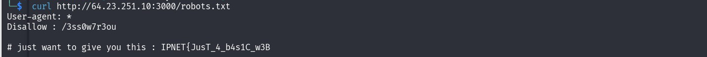

Le fichier robots.txt nous montre la première partie du flag et un Endpoint qui n'est pas pas autorisé à accéder **/3ss0w7r3ou**

Première partie:
```
IPNET{JusT_4_b4s1C_w3B 
```

- **Consulter l'Endpoint /3ss0w7r3ou**

Commande:
```
curl -v http://64.23.251.10:3000/3ss0w7r3ou
```

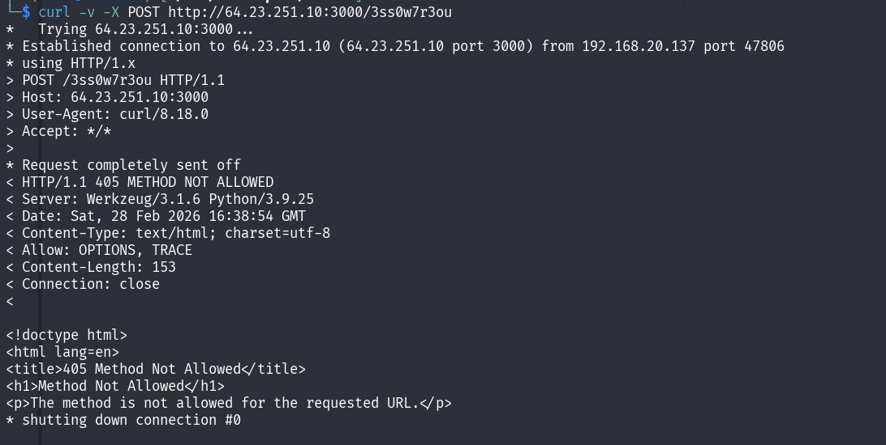

Intéressant, la page nous retourne **Method Not Allowed** ce qui nous indique que l'accès est possible mais avec une autre méthode.

**NB:**
La requête par défaut envoyé pour récupérer une page web est le  **GET** , ce qui n'est  pas autorisé dans notre cas.

#### Tâche 4- Accéder à  /3ss0w7r3ou

Du fait que la méthode GET, ainsi que le POST  sont refusé, nous allons utiliser l'option **OPTIONS** pour voir la méthode autorisée 

- Identifier la méthode autorisée

l'option **OPTIONS** permet d'identifier les méthodes que l'Endpoint prend en charge.

Commande:
```
curl -v -X OPTIONS http://64.23.251.10:3000/3ss0w7r3ou
```
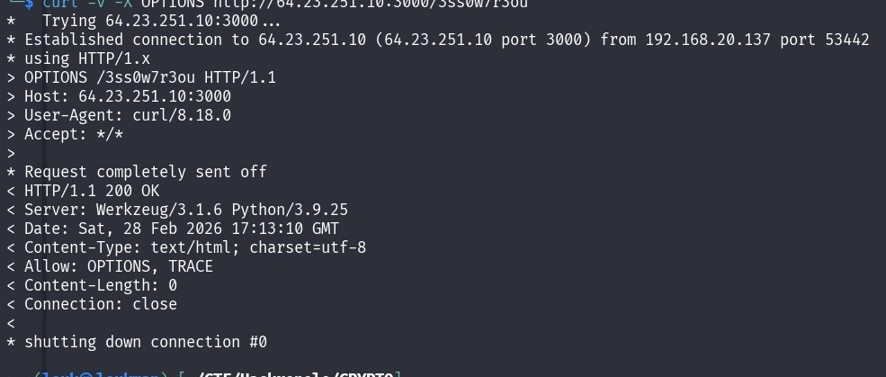

On voit ainsi que l'Endpoint ne prend en charge que l'option **OPTION**  et **TRACE**

NB: 
L'option **TRACE** demande au serveur d'envoyer la requête exacte qu'il a reçu.

Ainsi nous allons l'utiliser pour accéder à Endpoint.

Commande:
```
curl -v -X TRACE http://64.23.251.10:3000/3ss0w7r3ou
```

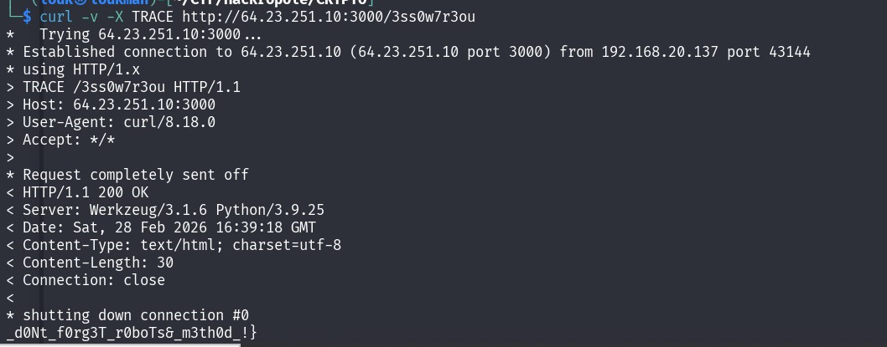

On a  ainsi la seconde partie du flag

Seconde partie :
```
_d0Nt_f0rg3T_r0boTs&_m3th0d_!}
```

### Flag 🚩:

```
IPNET{JusT_4_b4s1C_w3B_d0Nt_f0rg3T_r0boTs&_m3th0d_!}
```

## Méthode 2 : Burpsuite

#### Outil:
- proxy de burpsuite
- reapeter de burpsuite

### Tâche 1- Accéder à la page :

Avant toute chose nous allons intercepter la requête avec le proxy de burpsuite.

- Accéder à la page web

Dans le navigateur, nous allons essayer d'accéder à la page web.

- Intercepter la requête 

Dans votre proxy, vous pouvez ainsi voir votre requête interceptée. 

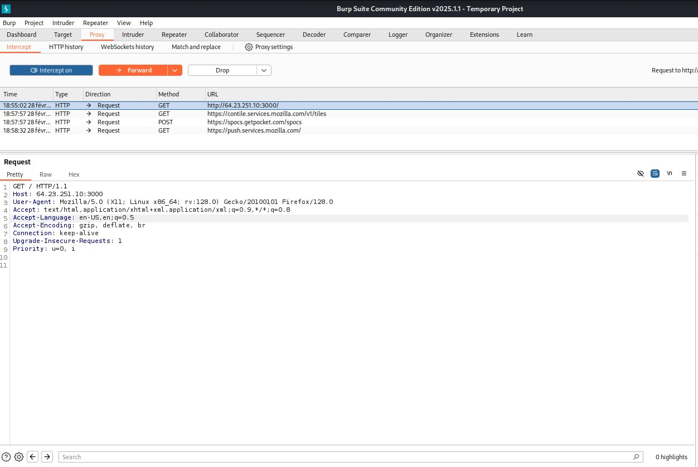

Cliquez tout droit  pour envoyer vers le **repeater** (un outil qui permet de modifier et envoyer les requêtes)

Cliquez sur send pour envoyer. 

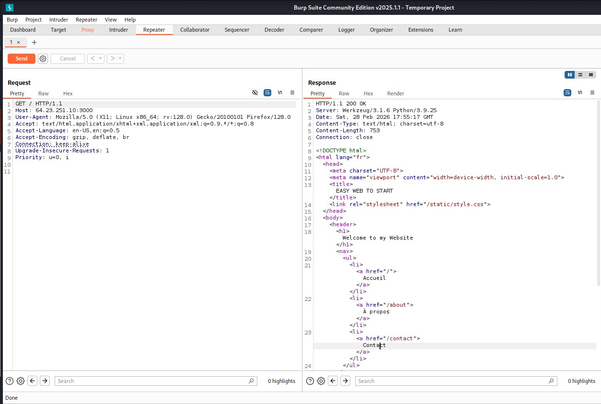

On peu ainsi voir le code source de la page d'acceuil.

### Tâche 2- Identifier les pages cachés 

Avant d'utiliser les outils de fuzzing des répertoires et fichiers cachés, nous savons que de façon général, les sites web utilisent les fichiers robots.txt pour indiquer les Endpoints qui sont autorisés a être accédé et les Endpoints qui ne sont pas autorisé à être accédé. 

Du coup toujours dans notre requête intercepté, nous allons modifier la requête pour essayer d'accéder à **robots.txt**.
dans la partie GET remplacer / par /robots.txt comme sur l'image ci-dessous

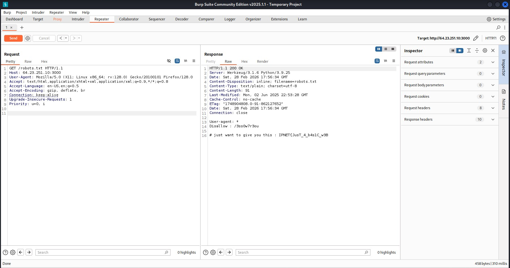

Intéressant, on peu voir la première partie du flag et aussi un endpoint qui n'est pas autorisé à être accédé ( **/3ss0w7r3ou**)

**Première partie du flag :**
```
IPNET{JusT_4_b4s1C_w3B 
```

### Tâche 3: Accéder à /3ss0w7r3ou

Malgré que le /3ss0w7r3ou n'est pas autorisé à être accédé, nous allons essayer d'accéder et voir le comportement.

toujours dans repeater, remplacer le **/robots.txt** par **/3ss0w7r3ou**

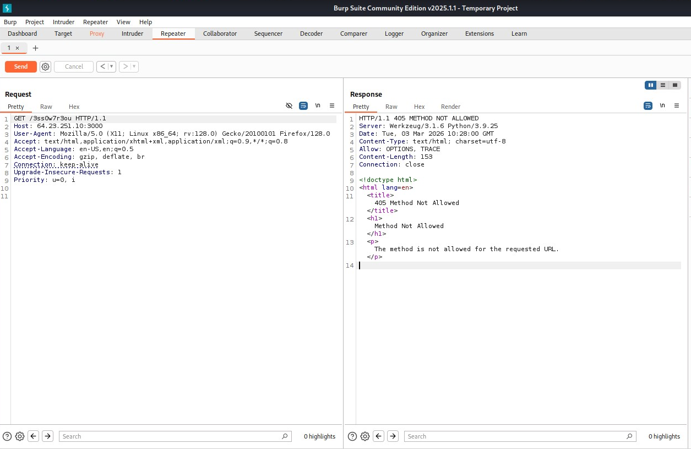

Cool, on reçoit un erreur de code 405 disant que la méthode qu'on a autorisé (Qui est la méthode GET ) n'est pas autorisée. 
Donc en réalité cette page est accessible mais uniquement avec une autre méthode autorisé. 

Du coup, nous allons utiliser la méthode OPTIONS (Une méthode pour les requêtes HTTP/HTTPS qui permet de demander à la page web les méthodes autorisées) pour voir la méthode autorisée. 

Dans repeater, remplacer la méthode **GET** par la méthode **OPTIONS**. comme sur l'image ci-dessous 
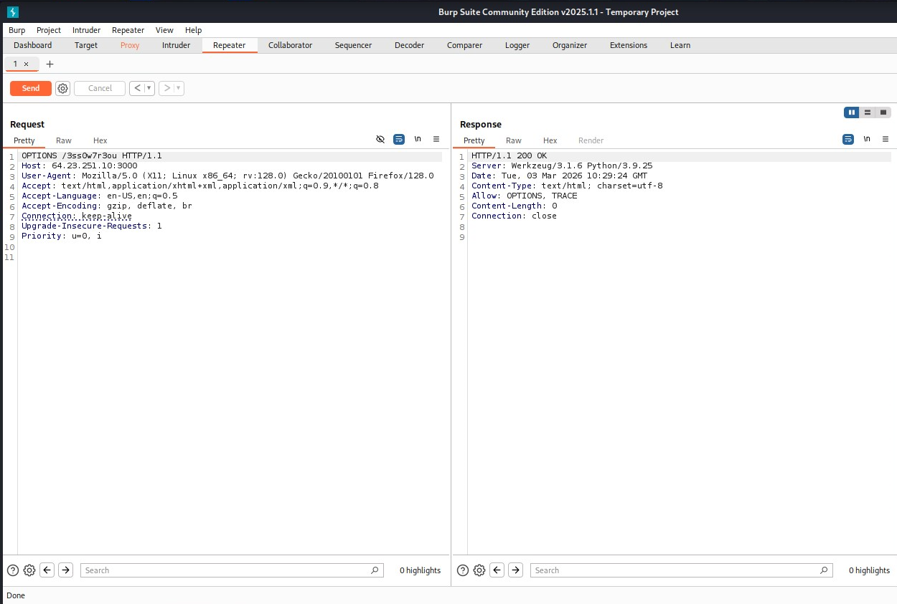

Boom on peut voir que la méthode autorisée est la méthode OPTIONS et TRACE. 

**Note :** 
La méthode TRACE est une méthode qui demande au serveur web de retourner exactement ce que le client à demandé 

Du coup , toujours dans repeater remplacer le OPTIONS par TRACE pour accéder a **/3ss0w7r3ou**

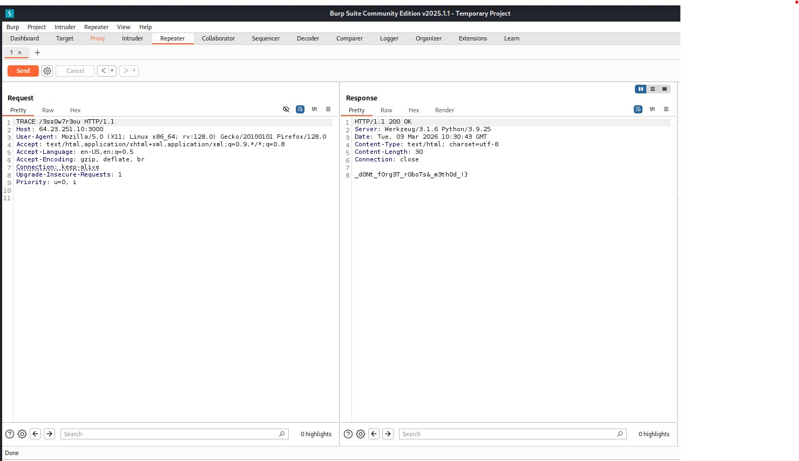

On a ainsi la seconde partie du flag : 
Seconde partie :
```
_d0Nt_f0rg3T_r0boTs&_m3th0d_!}
```

### Flag 🚩:

```
IPNET{JusT_4_b4s1C_w3B_d0Nt_f0rg3T_r0boTs&_m3th0d_!}
```
