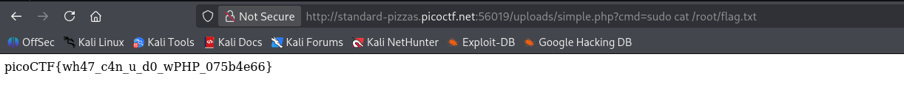

- **Catégorie :** Web Exploitation
    
- **Difficulté :** Easy
    
- **Points :** 100 pts
    
- **Plateforme :** PicoCTF
    
- **Auteur :** Prince Niyonshuti N.
    

## 📝 Description du Challenge

L'objectif est d'exploiter une fonctionnalité défaillante de téléversement de photo de profil (_Profile picture upload_) sur une application web afin d'obtenir une exécution de commande à distance (RCE). Le but final est de lire le fichier de flag situé dans le répertoire restreint `/root`.

## 🔍 Analyse & Vecteur d'Attaque

L'application web ne valide pas correctement les extensions ou le contenu des fichiers téléversés côté serveur (absence de vérification stricte du type MIME ou des Magic Bytes), ce qui permet d'envoyer un script arbitraire au lieu d'une simple image.

L'application tourne sous **PHP**, ce qui permet d'envoyer un fichier contenant un _Web Shell_ minimal pour interagir avec le système d'exploitation sous-jacent.

## 🛠️ Exploitation

### 1. Création et Upload du Web Shell

Un fichier nommé `simple.php` a été créé avec le code malveillant suivant permettant de passer des commandes système via le paramètre d'URL `cmd` :

Ce fichier a été téléversé avec succès via le formulaire du site et stocké dans le répertoire accessible `/uploads/`.

### 2. Élévation de Privilèges & Lecture du Flag

En tentant d'accéder au fichier `/root/flag.txt`, l'utilisateur du serveur web (`www-data`) ne possède normalement pas les privilèges nécessaires. Cependant, la configuration `sudo` du serveur permettait l'exécution de la commande `cat` avec les privilèges de l'administrateur sans exiger de mot de passe.

La charge utile finale envoyée via la méthode GET est : `sudo cat /root/flag.txt`

## 🚀 Requête d'Exploitation Finale

HTTP

```
http://standard-pizzas.picoctf.net:56019/uploads/simple.php?cmd=sudo%20cat%20/root/flag.txt
```

## 🏁 Flag

> ****Flag capturé** `picoCTF{wh47_c4n_u_d0_wPHP_075b4e66}`**


