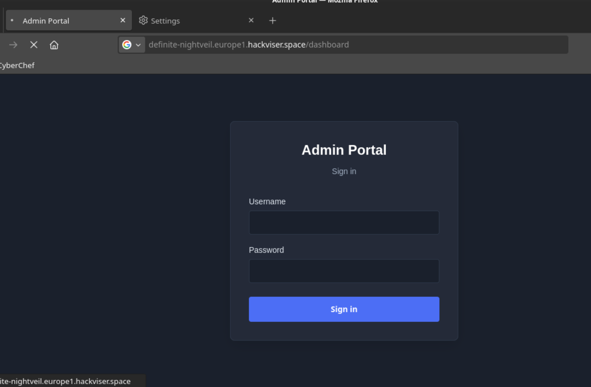
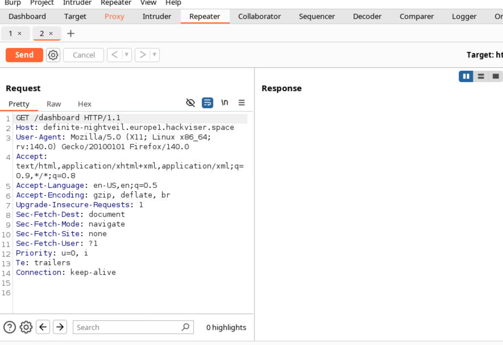
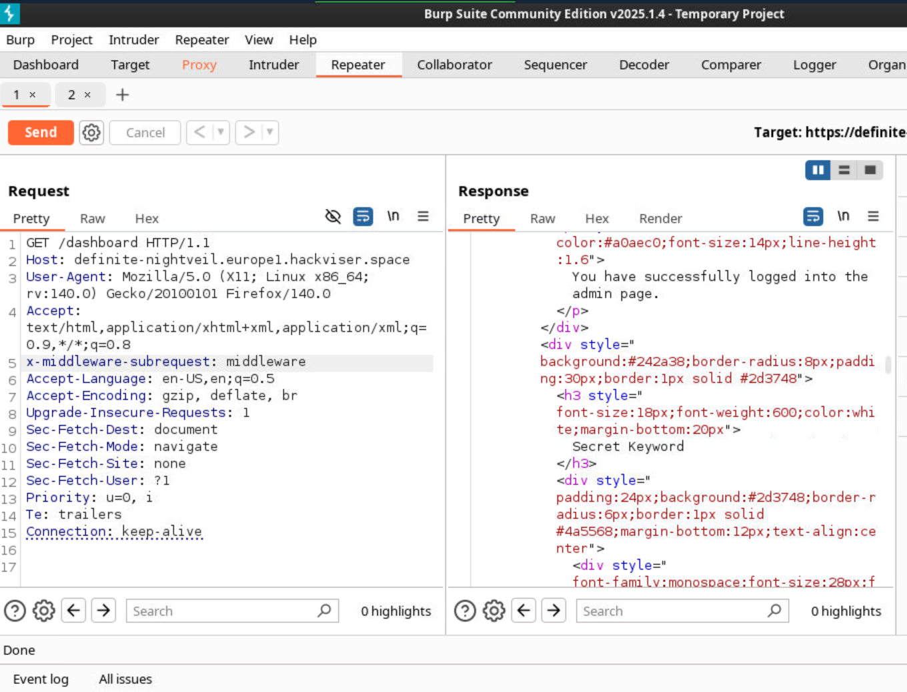

Next.js est un framework web open-source développé par Vercel qui alimente les applications basées sur React avec des fonctionnalités telles que le rendu côté serveur et statique.
## Explication de la Vulnérabilité CVE-2025-29927

#### 🧐 Qu'est-ce que c'est ?

Le **CVE-2025-29927** est une faille de sécurité critique dans le framework web **Next.js**.

*   **Type de faille :** Contournement des contrôles d'autorisation (Authentification Bypass) via le _middleware_.
*   **Score de criticité (CVSS) :** 9,1 (Critique).

### 💡 Principe de la faille

La vulnérabilité est liée à la gestion de l'en-tête HTTP interne `x-middleware-subrequest`.

1.  Cet en-tête est utilisé par Next.js pour empêcher les boucles infinies de _middleware_.
2.  Un attaquant peut falsifier cet en-tête dans une requête.
3.  L'application Next.js est trompée et ignore les contrôles de sécurité définis dans le _middleware_.
4.  **Conséquence :** Accès non autorisé à des routes protégées (ex: `/admin`, `/dashboard`).

### 🎯 Qui est affecté ?

Sont affectées les applications **auto-hébergées** qui utilisent :

*   `output: 'standalone'`
*   La commande `next start`
*   Le _middleware_ pour la gestion de l'authentification.

Les versions vulnérables s'étendent de `11.1.4` à `15.2.2`.

**Ne sont généralement pas affectés :** Les déploiements sur [Vercel](https://vercel.com) ou les sites générés statiquement (`next export`).

##### Exploitation 

Outil : BurpSuite pour l'intercepter les requêtes 
Dans la partie head : 

```
x-middleware-subrequest : midleware 
```
**Étape :** 
- Essayer d'accéder a une page qui nécessite une authentification 
- Modifier le head en ajoutant le midleware en utilisant Repeater de Burp 

**NB:** Ceci est particulièrement dangereux pour les applications qui dépendent du middleware pour le contrôle d'accès, les réécritures de chemin, les redirections de serveur et les en-têtes de sécurité tels que la politique de sécurité de contenu (CSP).



Comme on peu le voire on a essayé d'accéder directement au dashboard, ce qui nous redirige vers la page d'authentification 

Interception de la requête : 


Ajout de **middleware** dans l'entête 

payload : 
`x-middleware-subrequest : midleware` 



Comme on peu le voire , on est bien connecté sans saisir de mot de passe.
