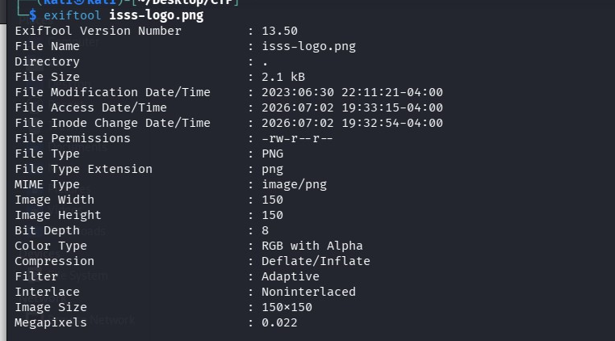
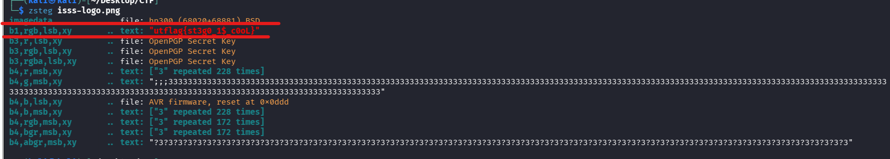

## 📝 Description du Challenge

> **Description :** They say a picture is worth a thousand words. Well, I certainly think the ISSS logo is saying more than it lets on. Why don't you take a look?
> 
> **Fichier :** `isss-logo.png` **Auteur :** Aya Abdelgawad

L'énoncé fait planer le doute sur ce que cache visuellement ou structurellement le logo de l'ISSS. Nous allons analyser le fichier pour voir ce qu'il dissimule sous la surface.

## 1. Analyse Classique (Reconnaissance)

Comme pour tout challenge de Forensic/Stéganographie, on commence par valider le type de fichier et inspecter les métadonnées basiques.

### Vérification du format

```
file isss-logo.png
```

**Résultat :**

```
isss-logo.png: PNG image data, 150 x 150, 8-bit/color RGBA, non-interlaced
```

Le fichier est bien une image au format **PNG** (avec canal alpha/transparence RGBA).

### Inspection des métadonnées

```
exiftool isss-logo.png
```

L'analyse des métadonnées standards ne retourne aucune information exploitable ou suspecte (pas de commentaire caché cette fois-ci).



## 💥 2. Analyse LSB avec `zsteg`

Le fichier étant un PNG et l'analyse basique n'ayant rien donné, la suite logique est de suspecter une dissimulation par **LSB (Least Significant Bit)**.

> **Rappel Théorique :** La stéganographie LSB consiste à modifier le bit de poids faible des composants de couleur (Rouge, Vert, Bleu, Alpha) d'une image pour y injecter des données. Ces modifications sont invisibles à l'œil nu car elles n'altèrent la couleur que de manière infime.

Pour détecter cela sur un fichier PNG ou BMP, l'outil de référence est **`zsteg`**. Il va scanner les différents canaux et ordres de pixels à la recherche de patterns textuels.

### Commande :

```
zsteg isss-logo.png
```

**Résultat :** Le scan détecte immédiatement une chaîne de caractères de type texte dans le canal `b1,rgb,lsb,xy` :

```
b1,rgb,lsb,xy       .. text: "utflag{st3g0_1$_c0oL}"
```



## 🏁 3. Capture du Flag

L'extraction automatique de `zsteg` nous livre le flag sur un plateau d'argent.

**Flag récupéré :**

```text
utflag{st3g0_1$_c0oL}
```

**_3ch0 training_**
