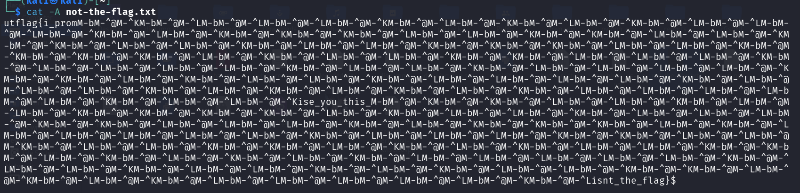
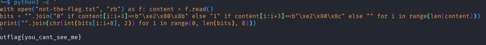
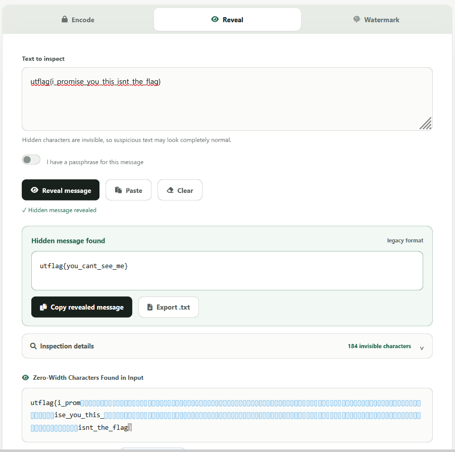

> **Informations sur le défi**
> - **Nom :** Nothing In Between
> - **Plateforme :** ISSS CTF (`forever.isss.io`)
> - **Catégorie :** Forensics / Stéganographie textuelle
> - **Auteur :** Aya Abdelgawad
> - **Flag final :** `utflag{you_cant_see_me}`

---

## 🛠️ Analyse & Décodage

Lorsqu'on ouvre le fichier texte, au premier abord, rien de particulier n'apparaît : il s'agit d'un message classique. Même en sélectionnant tout le contenu avec `CTRL+A` pour déceler d'éventuels caractères masqués, aucun élément suspect n'est visible à l'écran.

Pour analyser la structure exacte du fichier, nous pouvons utiliser la commande `cat` avec l'option `-A`. Cet indicateur permet d'afficher les caractères non imprimables et les séquences d'échappement (très utile en stéganographie sur des fichiers `.txt`).

### 1. Inspection des octets (`cat -A`)

L'exécution de `cat -A not-the-flag.txt` révèle la présence de séquences répétitives :

- `M-bM-^@M-^K` $\rightarrow$ Octets UTF-8 `\xe2\x80\x8b` (**Zero Width Space**)
- `M-bM-^@M-^L` $\rightarrow$ Octets UTF-8 `\xe2\x80\x8c` (**Zero Width Non-Joiner**)

Ces deux caractères invisibles sont employés pour encoder un message sous forme binaire :
- `\xe2\x80\x8b` = **0**
- `\xe2\x80\x8c` = **1**



---

### 2. Extraction du Flag

#### Méthode A : Script Python (One-Liner)

Le script suivant parcourt le fichier en mode binaire, associe chaque séquence d'octets invisibles à son bit correspondant (`0` ou `1`), puis convertit chaque bloc de 8 bits en caractère ASCII :

```bash
python3 -c '
with open("not-the-flag.txt", "rb") as f: content = f.read()
bits = "".join("0" if content[i:i+3]==b"\xe2\x80\x8b" else "1" if content[i:i+3]==b"\xe2\x80\x8c" else "" for i in range(len(content)))
print("".join(chr(int(bits[i:i+8], 2)) for i in range(0, len(bits), 8)))
'
````

**Résultat :**

```text
utflag{you_cant_see_me}
```



#### Méthode B : Outil en ligne (StegZero)

Il est également possible d'utiliser un décodeur automatisé de stéganographie Zero-Width tel que [StegZero](https://stegzero.com/) en y collant directement le contenu du fichier.



## 📘 Note Technique : La Stéganographie par Caractères Invisibles

> **Encodage Zero-Width**
> 
> La stéganographie textuelle basée sur les caractères de largeur nulle (_Zero-Width Characters_ ou ZWC) tire parti de caractères Unicode conçus pour la gestion typographique, sans rendu visuel à l'écran.

### Principaux caractères utilisés :

|**Caractère Unicode**|**Code UTF-8 (Hex)**|**Nom Unicode**|**Usage classique**|
|---|---|---|---|
|`U+200B`|`\xe2\x80\x8b`|Zero Width Space (ZWSP)|Représente le bit **0**|
|`U+200C`|`\xe2\x80\x8c`|Zero Width Non-Joiner (ZWNJ)|Représente le bit **1**|
|`U+200D`|`\xe2\x80\x8d`|Zero Width Joiner (ZWJ)|Séparateur / Délimiteur|
|`U+FEFF`|`\xef\xbb\xbf`|Zero Width No-Break Space / BOM|Variante d'encodage|

### Pourquoi cette technique est-elle efficace ?

1. **Invisibilité à l'œil nu :** Les éditeurs de texte standards (Notepad, VS Code, navigateurs Web) ne réservent aucun espace graphique à ces caractères.
    
2. **Intégrité du texte hôte :** Le texte dans lequel ils sont dissimulés reste lisible sans altération apparente.
    

### Détection et Mitigation :

- **Inspection brute :** Analyse via des utilitaires bas niveau (`xxd`, `hexdump`, `cat -A`).
    
- **Sanitisation :** Filtrage des plages Unicode `U+200B` à `U+200D` ou conversion stricte en format ASCII.
