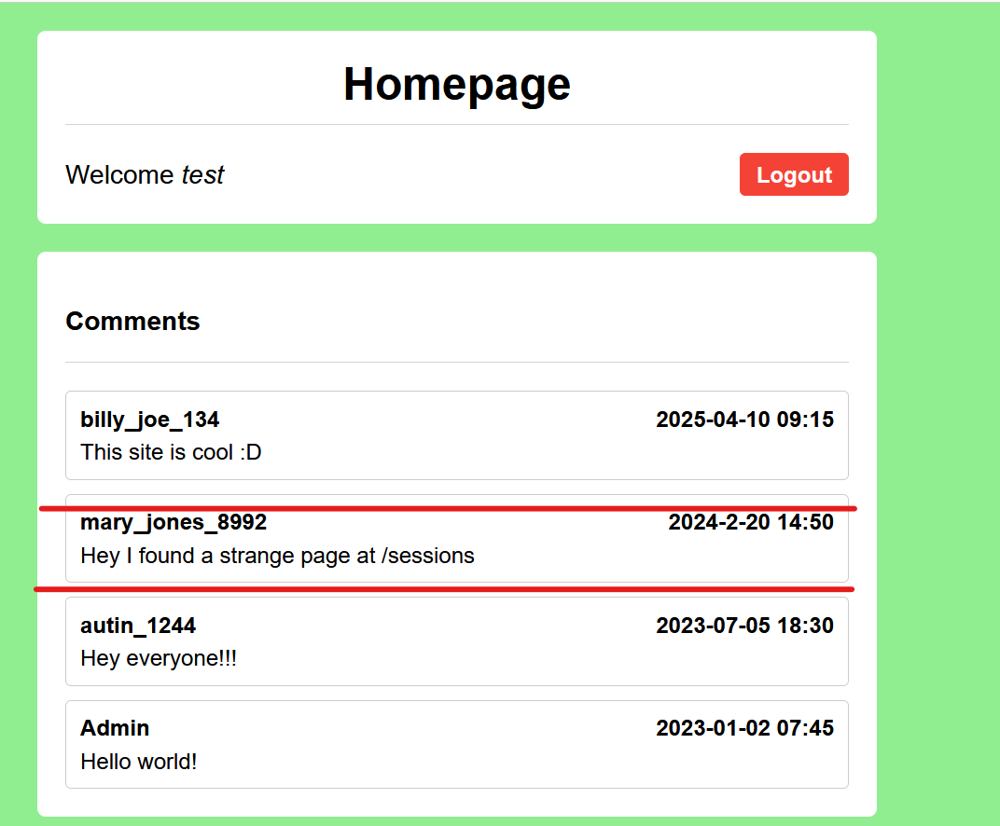
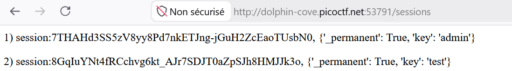
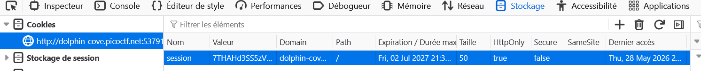
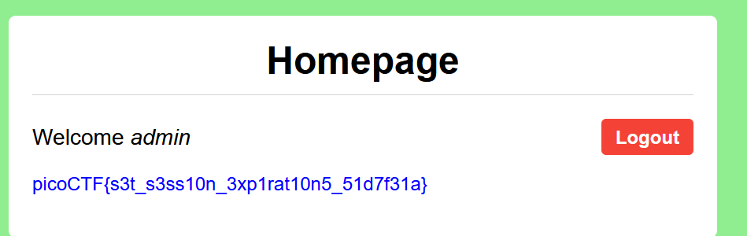

## Métadonnées

- **Catégorie :** Web-Exploitation Session-Management Session-Hijacking
    
- **Outils :** Navigateur DevTools (`F12` > Stockage / Cookies)
    
- **Auteur du challenge :** David Gaviria
    
- **Flag :** `picoCTF{s3t_s3ss10n_3xp1rat10n5_51d7f31a}`
    

## Description du challenge

La mauvaise configuration des délais d'expiration de session permet à des accès authentifiés de rester actifs indéfiniment. Le créateur de ce site d'évaluation a configuré sa plateforme pour qu'« une fois connecté, vous n'aurez plus jamais besoin de vous déconnecter ». L'objectif est d'usurper la session de l'administrateur afin de récupérer le flag.

## Étape 1 : Reconnaissance et création de compte

À l'arrivée sur l'application web, un formulaire nous invite à nous authentifier ou à créer un compte.

1. Nous créons un compte utilisateur de test avec les identifiants : `test / password`.
    
2. Une fois connecté sur l'interface principale (`Homepage`), nous découvrons une zone de commentaires.
    

Un message suspect laissé par l'utilisatrice `mary_jones_8992` attire immédiatement notre attention :

> _"Hey I found a strange page at /sessions"_



## Étape 2 : Inspection de la page cachée `/sessions`

En naviguant directement sur l'URL `http://<cible>:<port>/sessions`, l'application affiche la base de données brute des sessions actives stockées en mémoire côté serveur :

```
1) session:7THAHd3SS5zV8yy8Pd7nkETJng-jGuH2ZcEaoTUsbN0, {'_permanent': True, 'key': 'admin'}
2) session:8GqIuYNt4fRCchvg6kt_AJr7SDJT0aZpSJh8HMJJk3o, {'_permanent': True, 'key': 'test'}
```



> 💡 **Constat :** Nous repérons notre propre cookie lié au compte `test`, mais surtout le jeton de session permanent de l'utilisateur **`admin`** : `7THAHd3SS5zV8yy8Pd7nkETJng-jGuH2ZcEaoTUsbN0`.

## Étape 3 : Usurpation de Session (Session Hijacking)

Pour usurper l'identité de l'administrateur, nous modifions directement nos cookies locaux :

1. Ouvrir l'inspecteur du navigateur (`F12`) et aller dans l'onglet **Stockage** (ou **Application**) > **Cookies**.
    
2. Sélectionner le domaine du challenge.
    
3. Double-cliquer sur la valeur du cookie nommé `session` (qui contient notre jeton de test).
    
4. Remplacer cette valeur par le token de l'administrateur trouvé à l'étape précédente : `7THAHd3SS5zV8yy8Pd7nkETJng-jGuH2ZcEaoTUsbN0`.
    



## 🏁 Étape 4 : Capture du Flag

Après avoir modifié le cookie, nous rafraîchissons la page d'accueil (`F5`). L'application web nous reconnaît instantanément comme l'utilisateur `admin` et affiche le flag sur le tableau de bord.



**Flag :** `picoCTF{s3t_s3ss10n_3xp1rat10n5_51d7f31a}`

## Concept Clé : Gestion des Sessions et Expiration

Dans une application Web sécurisée, une session utilisateur doit obligatoirement posséder une date d'expiration stricte (ex: 15 à 30 minutes d'inactivité) appelée **Idle Timeout**, ainsi qu'une limite de vie absolue (**Absolute Timeout**).

Ici, l'activation de l'option `_permanent = True` (généralement liée aux sessions Flask) combinée à une absence totale de nettoyage des sessions expirées côté serveur crée une faille critique. Si un token de session est intercepté ou divulgué (comme c'était le cas sur la page publique `/sessions`), l'attaquant peut l'utiliser indéfiniment pour maintenir son accès sans jamais avoir besoin de connaître le mot de passe de sa victime.
