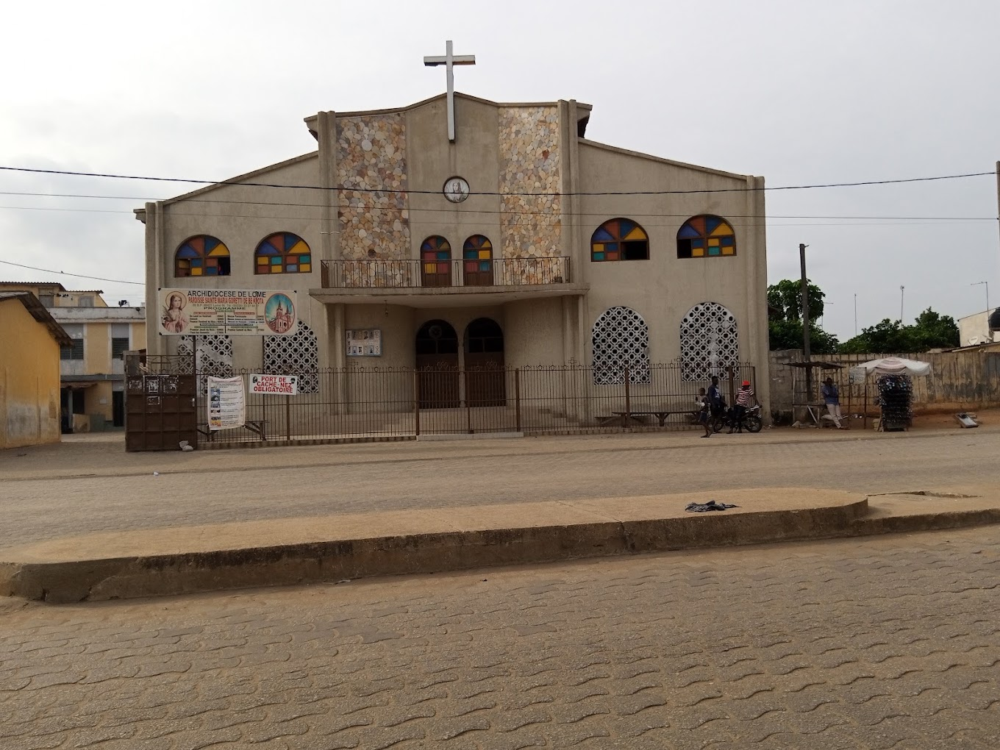

## 📌 Présentation du Challenge
* **Catégorie :** OSINT
* **Difficulté :** Medium
* **Description :** *Depuis les salles de TP de l'ESIG, en levant les yeux par la fenêtre, on contemple une Paroisse. Fondée initialement comme une simple station secondaire, elle est devenue une paroisse autonome bien des années plus tard. Le premier jour de cette érection en paroisse officielle est la clé qui déverrouille le serveur.*
* **Format du Flag :** `EthACTF{date_mois_annee}` (Exemple : `EthACTF{01_Janvier_2000}`)

---

## Résolution pas à pas

### Étape 1 : Localisation du point de départ (ESIG)
L'énoncé indique que l'on se trouve dans les "salles de TP de l'ESIG" et que l'on peut voir la paroisse par la fenêtre. 
1. Une recherche rapide sur Google Maps avec le mot-clé **ESIG** au Togo (contexte du CTF) mène à l'**École Supérieure d'Informatique et de Gestion (ESIG Global Success)** située à Lomé, plus précisément dans le quartier de **Bè-Kpota**.
2. En observant la carte aux alentours de l'établissement ou en utilisant la vue satellite, on repère immédiatement un édifice religieux majeur situé juste à proximité : la **Paroisse Sainte Maria Goretti de Bè-Kpota**.

### Étape 2 : Identification de l'historique de la paroisse
L'indice précise que l'église était au départ une **simple station secondaire** avant de devenir une **paroisse autonome bien des années plus tard**. 
* L'objectif est de trouver la date exacte de cette érection officielle.

### Étape 3 : Recherche de la date d'érection
En effectuant des recherches sur l'historique de la Paroisse Sainte Maria Goretti de Bè-Kpota (notamment via les archives de l'Archidiocèse de Lomé ou des publications commémoratives locales), on découvre la chronologie suivante :
* **1974 :** Fondation de la communauté en tant que station secondaire.
* **3 Mars 1992 :** Érection officielle de la station secondaire en paroisse autonome.

---

## 🚩 Flag
En respectant le format demandé (`EthACTF{date_mois_annee}`) avec les majuscules aux mois et les tirets de soulignement, on obtient :

`EthACTF{03_Mars_1992}`

_**— 3ch0**_
