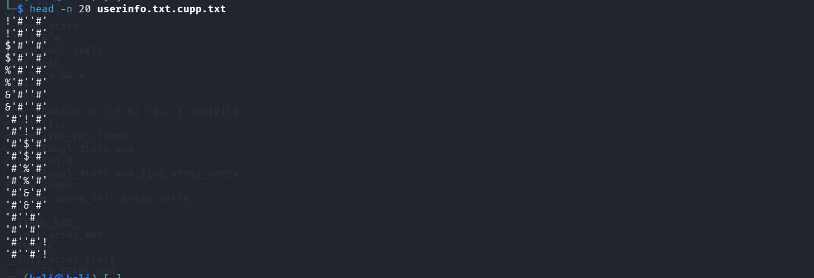
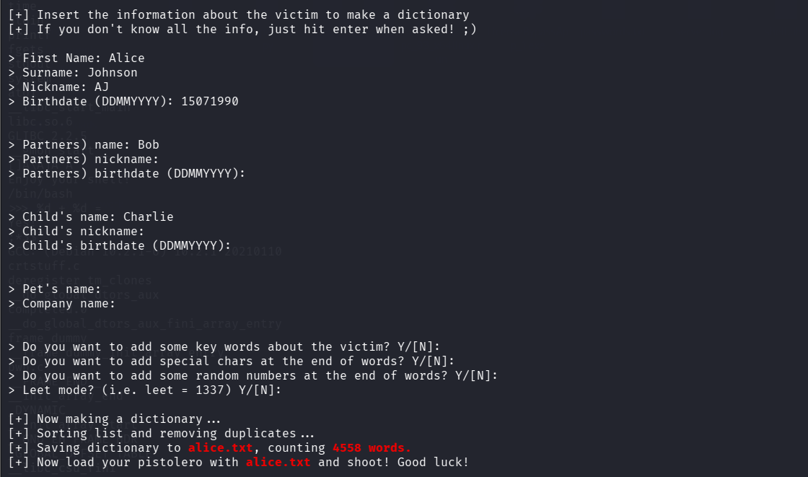
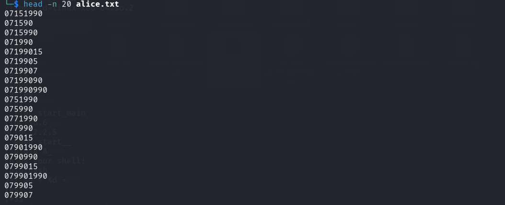

**Date :** 28 Juin 2026
**Catégorie :** OSINT / Cryptographie / Password Cracking
**Difficulté :** Facile / Intermédiaire
**Objectif :** Récupérer le mot de passe d'une cible à partir de ses données personnelles (OSINT) et d'un hash SHA-1 intercepté.

---

## 📄 Énoncé & Fichiers fournis

Nous avons intercepté un fichier suspect contenant le hash SHA-1 d'un mot de passe. Grâce à des techniques de reconnaissance (OSINT), des informations personnelles sur la cible ont été regroupées dans le fichier `userinfo.txt`.

Trois fichiers sont à notre disposition :
1. `userinfo.txt` : Détails personnels de la cible (Alice Johnson).
2. `hash.txt` : Le hash SHA-1 cible (`968c2349040273dd57dc4be7e238c5ac200ceac5`).
3. `check_password.py` : Un script Python chargé de tester une liste de mots de passe (`passwords.txt`) contre le hash.

---

## 🛠️ Analyse Initiale

### 1. Informations de la cible (`userinfo.txt`)
Le fichier contient les données suivantes :
- **Prénom :** Alice
- **Nom :** Johnson
- **Pseudonyme :** AJ
- **Date de naissance :** 15-07-1990
- **Partenaire :** Bob
- **Enfant :** Charlie

### 2. Le script de vérification (`check_password.py`)
Le script charge le hash depuis `hash.txt`, lit un dictionnaire nommé `passwords.txt`, calcule le hash SHA-1 de chaque ligne et le compare au hash cible. S'il y a correspondance, il affiche le flag au format `picoCTF{mot_de_passe}`.

```
#!/usr/bin/env python3
import hashlib

HASH_FILE = "hash.txt"
WORDLIST_FILE = "passwords.txt" # wordlist that was generated using CUPP

def load_hash():
    with open(HASH_FILE, "r") as f:
        return f.read().strip()

def crack_password(target_hash):
    with open(WORDLIST_FILE, "r", encoding="utf-8", errors="ignore") as f:
        for password in f:
            password = password.strip()
            if hashlib.sha1(password.encode()).hexdigest() == target_hash:
                return password
    return None

if __name__ == "__main__":
    target_hash = load_hash()
    result = crack_password(target_hash)
    if result:
        print(f"Password found: picoCTF{{{result}}}")
    else:
        print("No match found.")

```

---

##  Résolution du Challenge

### Étape 1 : Piège classique (Erreur à éviter)
En tentant d'utiliser l'option d'enrichissement de dictionnaire de CUPP (`cupp -w userinfo.txt`), l'outil traite le fichier comme un dictionnaire brut. Il combine des mots génériques présents dans le fichier comme `"First"`, `"Name"` ou `"Surname"`, ce qui génère un dictionnaire inefficace de plus de 20 000 mots erronés.



### Étape 2 : Génération d'un dictionnaire ciblé avec CUPP (Mode interactif)
Pour exploiter correctement les données OSINT, il faut utiliser le mode interactif de CUPP avec l'option `-i`.

```bash
cupp -i
````

En suivant les invites du terminal, nous insérons les données d'Alice :

- **First Name :** alice
    
- **Surname :** johnson
    
- **Nickname :** AJ
    
- **Birthdate :** 15071990
    

Nous activons ensuite les options de combinaisons de mots, l'ajout de caractères spéciaux et de chiffres, ainsi que le **mode Leet (1337)**. CUPP génère alors un fichier personnalisé performant : `alice.txt`.




### Étape 3 : Exécution et Capture du Flag

Nous préparons l'environnement pour le script Python en copiant notre dictionnaire sous le nom attendu :

```
cp alice.txt passwords.txt
```

Puis, nous exécutons le script de cracking :

```
python3 check_password.py
```

**Résultat :**

Le script trouve instantanément une correspondance !


**Flag trouvé :** `picoCTF{Aj_15901990}`

Le mot de passe final combine ingénieusement le pseudonyme de la cible (`Aj`), une variante de son année et jour de naissance (`15901990`), générée automatiquement par les algorithmes de CUPP.

## 💡 Note : L'outil CUPP

> ****Qu'est-ce que CUPP (Common User Passwords Profiler) ?****
> 
> **CUPP** est un outil de profilage OSINT écrit en Python, extrêmement utilisé lors des audits de sécurité (tests d'intrusion) ou des CTF. Son but est de générer des dictionnaires de mots de passe (wordlists) personnalisés et hautement ciblés.
> 
> En sécurité informatique, la majorité des utilisateurs définissent des mots de passe basés sur leur vie privée (nom du chien, date de naissance, prénom de l'enfant). CUPP automatise cette logique humaine en croisant toutes ces variables.

### ⚙️ Comment bien l'utiliser ?

1. **Le Mode Interactif (`cupp -i`) :** C'est l'utilisation principale et la plus efficace. Vous entrez manuellement les informations récoltées sur votre cible lors de votre phase d'OSINT (Prénom, nom, anniversaire, entreprise, passions, animaux de compagnie...).
    
2. **Le Mode d'Enrichissement (`cupp -w <fichier>`) :** À utiliser uniquement si vous possédez déjà une liste de mots-clés ou un ancien dictionnaire appartenant à la cible et que vous souhaitez que CUPP y ajoute des variantes (chiffres, caractères spéciaux, année en cours).
    
3. **Le Mode d'Amélioration (Options de fin) :**
    
    - **Leet Mode :** Remplace les lettres par des chiffres ressemblants (ex: `a` -> `4`, `e` -> `3`). Très efficace car c'est une habitude courante chez les utilisateurs.
        
    - **Caractères spéciaux :** Ajoute des `!`, `@`, `?` à la fin des combinaisons pour contourner les politiques de complexité des mots de passe.
